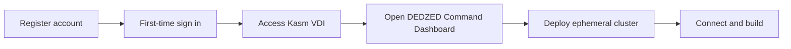

Before you start using DEDZED, review the prerequisites below and familiarize yourself with the onboarding process. This page covers everything you need to get up and running.

## Onboarding overview

The following diagram shows the end-to-end onboarding flow from registration through to your first cluster deployment.

<CardGroup cols={2}>
  <Card title="Self-registration" icon="user-plus" href="/getting-started/self-registration">
    Create your DEDZED account and complete first-time sign in.
  </Card>
  <Card title="Deploy a cluster" icon="server" href="/getting-started/deploying-cluster">
    Launch a pre-configured ephemeral Kubernetes cluster.
  </Card>
  <Card title="Connect to your cluster" icon="link" href="/kasm-workspaces/connect-cluster">
    Set up your kubeconfig and access your running cluster.
  </Card>
  <Card title="What is DEDZED?" icon="circle-info" href="/knowledge-base/what-is-dedzed">
    Learn about the platform, its purpose, and capabilities.
  </Card>
</CardGroup>

## Prerequisites

### Chromium-based browser

For the best performance, use a Chromium-based browser when interacting with the Kasm Virtual Desktop Infrastructure (VDI). **Edge** and **Chrome** work best. Other browsers may work but are not officially supported.

### Valid CAC (Common Access Card)

You need a valid, unexpired CAC plugged into your machine to complete registration and sign in. Your CAC is used for initial authentication through Ping Identity.

<Warning>
If you experience CAC-related issues during sign in, contact the SHE BASH team through the [support page](/support/contact) for assistance. In some cases, an alternative authentication method can be arranged.
</Warning>

### Kasm VDI access

After registration, you access DEDZED resources through the Kasm VDI at [https://kasm.icbm.dev](https://kasm.icbm.dev). Kasm provides a browser-based virtual desktop with all the tools you need pre-installed, so there is nothing to install on your local machine.

- Authenticate by selecting **Ping Identity** at the Kasm login page.
- See [Do I have to install anything locally?](/getting-started/local-install) for more details.

## Network access

All DEDZED services are protected by [AWS Verified Access](https://docs.aws.amazon.com/verified-access/latest/ug/what-is-verified-access.html), a clientless zero-trust network replacement for traditional VPNs. When you navigate to a DEDZED endpoint, Verified Access performs a DNS redirect to Ping Identity to authenticate and authorize you before connecting you to the service.

No VPN client installation is required. For a deeper look at the network security architecture, see the [zero trust](/knowledge-base/zero-trust) page.

## Recommended pre-reading

If you are new to DEDZED, review these pages before proceeding with registration:

- [What is DEDZED?](/knowledge-base/what-is-dedzed) -- understand the platform and its capabilities
- [Why are environments ephemeral?](/knowledge-base/ephemeral-environments) -- learn why clusters have a limited lifespan
- [Time required to provision a cluster](/getting-started/provision-time) -- plan your workflow around provisioning times

## Next step

Once you have reviewed the prerequisites, proceed to self-registration to create your account.

<Card title="Self-registration" icon="arrow-right" href="/getting-started/self-registration">
  Register your DEDZED account and complete first-time setup.
</Card>
