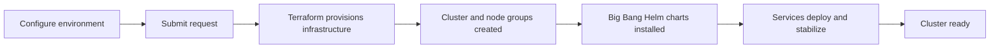

A key feature of DEDZED is the ability to rapidly deploy ephemeral Kubernetes clusters. These clusters come pre-configured with Big Bang applications, giving you a DevSecOps-compliant environment for testing Big Bang integrations and hands-on training in Kubernetes deployment.

## Cluster deployment lifecycle

The following diagram shows what happens when you request a new cluster.

---

## Step 1: Open the DEDZED Command Dashboard

1. Open your browser to [https://dedzed.dedzed.blacklabel.mil](https://dedzed.dedzed.blacklabel.mil) and authenticate with your Ping login.
2. You arrive at the DEDZED Command Dashboard, where you manage environments and access platform services.

<Info>
If you have not registered yet, complete the [self-registration](/getting-started/self-registration) process first.
</Info>

## Step 2: Configure your environment

1. Click **Environments** and select your target cloud provider (for example, **AKS**).
2. Customize the cluster components:
   - **Cluster name** -- choose a descriptive name for your environment.
   - **Applications** -- select which services to install. Available options include **ArgoCD**, **GitLab**, **Vault**, and others.
   - **Git repository access** -- enter a valid [github.icbm.dev](https://github.icbm.dev) account for accessing the Flux-monitored Git repository.
3. Choose whether to deploy a vanilla cluster or include **Big Bang** for additional DevSecOps components.
4. Set the **time to live** for the environment. The default is **7 hours**. After this period, the cluster is automatically destroyed.

<Warning>
Clusters are ephemeral by design. All resources are destroyed when the time-to-live expires. Save any work you need to keep in your Git repository before the cluster expires. See [why environments are ephemeral](/knowledge-base/ephemeral-environments) for more details.
</Warning>

## Step 3: Submit and monitor the deployment

1. Click **Submit** to start provisioning. The process takes approximately **15-20 minutes**.
2. Monitor progress in the environments table. You can track:
   - **GitHub Actions** status for pipeline execution
   - **Terraform workspaces** for infrastructure provisioning status

For a detailed breakdown of what happens during provisioning, see [provisioning time](/getting-started/provision-time).

## Step 4: Access your cluster

Once provisioning is complete, two icons appear next to your environment in the table:

- **Explore Cluster** -- opens a direct connection to your cluster
- **DEDZED AI** -- provides AI-assisted guidance for working with your environment

### View service endpoints

Click into your environment to view the **Service Endpoints** section. This lists the DNS hostnames for all web-based services deployed to your cluster, including ArgoCD, Vault, GitLab, and any other selected applications.

### Verify deployment health

To confirm all services are running correctly:

1. Open a Kasm workspace session (**SHE BASH Ubuntu** or **Windows 11**).
2. Use the **Explore Cluster** button to connect, or set up your kubeconfig manually by following the [connect to your cluster](/kasm-workspaces/connect-cluster) guide.
3. Run **k9s** or **kubectl** to inspect pod status.
4. Verify that all pods are in a **Running** state and show **Ready** status.
5. Wait for all selected services to fully stabilize before using them. Some services (such as GitLab) may take additional time to become fully available after initial pod readiness.

<Tip>
Use the [k9s cheat sheet](/knowledge-base/k9s-cheat-sheet) for a quick reference on navigating your cluster.
</Tip>

---

## What gets deployed

When you provision a cluster with Big Bang, the following infrastructure and services are created:

| Component | Description |
|-----------|-------------|
| **VPC** | An isolated Virtual Private Cloud for your resources |
| **Subnets** | Segmented network spaces within the VPC |
| **Kubernetes cluster** | Managed cluster with configured node groups |
| **Big Bang** | DevSecOps platform with Helm-managed services |
| **Selected applications** | Your chosen services (ArgoCD, Vault, GitLab, etc.) |

## Next steps

<CardGroup cols={2}>
  <Card title="Connect to your cluster" icon="link" href="/kasm-workspaces/connect-cluster">
    Set up kubeconfig and access your running cluster.
  </Card>
  <Card title="Provisioning time" icon="clock" href="/getting-started/provision-time">
    Understand what happens during the 15-minute provisioning window.
  </Card>
</CardGroup>
