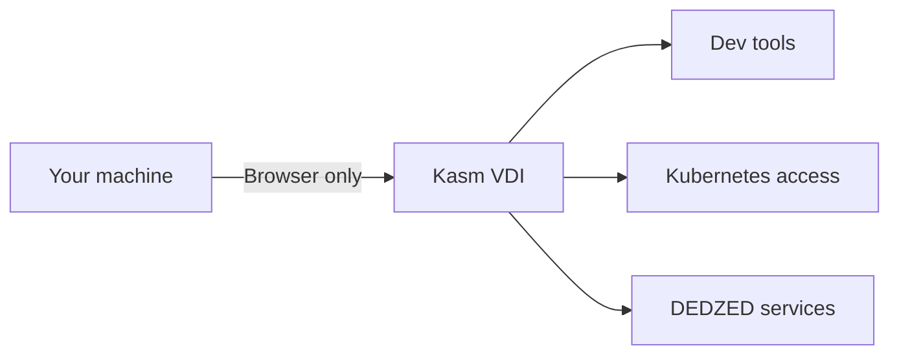

## No local installation required

DEDZED does not require you to install any software on your local machine. All development tools, Kubernetes utilities, and environments are provided through a browser-based Virtual Desktop Infrastructure (VDI) powered by Kasm Workspaces.

You access everything through your web browser -- no agents, plugins, or VPN clients needed.

## What you need

| Requirement | Details |
|---|---|
| **Browser** | A Chromium-based browser (Chrome or Edge) for the best experience. Other browsers work but may have reduced functionality. |
| **Valid CAC** | Required for initial authentication through Ping Identity. |
| **Network access** | Ability to reach [https://kasm.icbm.dev](https://kasm.icbm.dev). No VPN required -- [AWS Verified Access](/knowledge-base/zero-trust) handles secure connectivity. |

## How it works

When you log in to Kasm, a full desktop environment loads in your browser tab. This session includes pre-installed tools like `kubectl`, `k9s`, Docker, Git, and code editors. You interact with DEDZED services and your ephemeral clusters entirely from within this browser-based desktop.

## Pre-installed tools in Kasm

The Kasm VDI workspace comes with the following tools ready to use:

- **kubectl** and **k9s** -- Kubernetes cluster management and monitoring
- **Docker** -- container building and management
- **Git** -- version control for your repositories
- **Code editors** -- development environments for writing and editing code
- **Web browsers** -- for accessing DEDZED Command Dashboard and service endpoints

<Tip>
Start your Kasm session with **Persistent Profile** enabled to retain your files, settings, and customizations across sessions. If you need additional tools, see [installing software in Kasm](/kasm-workspaces/install-software).
</Tip>

## Get started

<CardGroup cols={2}>
  <Card title="Working within Kasm" icon="desktop" href="/kasm-workspaces/working-within-kasm">
    Learn how to create and use your Kasm virtual desktop session.
  </Card>
  <Card title="Before you begin" icon="list-check" href="/getting-started/before-you-begin">
    Review prerequisites and recommended pre-reading.
  </Card>
  <Card title="Self-registration" icon="user-plus" href="/getting-started/self-registration">
    Create your DEDZED account to get access.
  </Card>
  <Card title="Zero trust access" icon="shield" href="/knowledge-base/zero-trust">
    Understand how DEDZED secures access without a VPN.
  </Card>
</CardGroup>
