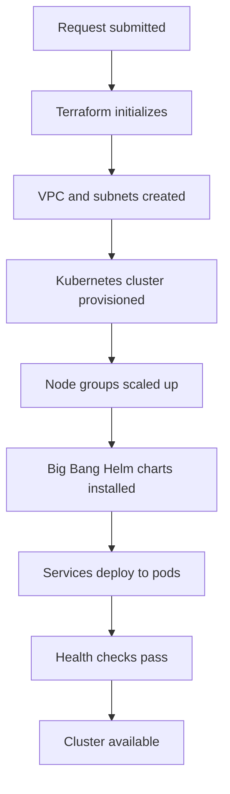

Provisioning a new ephemeral cluster in DEDZED takes approximately **10-15 minutes**. This page explains what happens during that time and how to plan your workflow around it.

## Provisioning pipeline

When you submit a cluster request, DEDZED creates your entire environment from scratch. The following diagram shows the stages of the provisioning pipeline.

## What gets provisioned

Every cluster starts from a net-zero baseline. Terraform provisions all infrastructure on demand, building a complete, isolated environment for your workload.

| Stage | Component | Description |
|-------|-----------|-------------|
| Network | **VPC** | An isolated Virtual Private Cloud for all your resources |
| Network | **Subnets** | Segmented network spaces within the VPC for security and routing |
| Compute | **Kubernetes cluster** | A managed Kubernetes cluster with configured control plane |
| Compute | **Node groups** | Worker nodes sized for your selected applications |
| Platform | **Big Bang** | Helm charts that install DevSecOps services and their dependencies |
| Platform | **Selected applications** | Your chosen services (ArgoCD, Vault, GitLab, etc.) |

## Why provisioning takes 10-15 minutes

The provisioning time reflects the full infrastructure lifecycle -- from creating network resources to deploying and stabilizing application pods. Each stage must complete before the next begins:

1. **Network creation (2-3 min)** -- Terraform creates the VPC, subnets, security groups, and networking rules.
2. **Cluster provisioning (5-7 min)** -- The Kubernetes cluster and node groups are created and configured.
3. **Application deployment (3-5 min)** -- Big Bang Helm charts install and services start up across the cluster.

This process cannot be shortened because each cluster is a fresh, isolated environment built to security specifications.

## Planning your workflow

Account for the 10-15 minute provisioning window when scheduling your work. Here are practical recommendations:

- **Request your cluster early.** Submit your environment request before you need it. Use the provisioning window to review documentation or prepare your development tasks.
- **Monitor progress in the dashboard.** Track Terraform workspace status and GitHub Actions in the DEDZED Command Dashboard environments table while you wait.
- **Plan pipeline integrations.** If you integrate DEDZED clusters into CI/CD pipelines, factor the provisioning time into your pipeline scheduling to avoid idle stages.
- **Familiarize yourself with the platform first.** Run a test deployment to understand timing before building workflows that depend on cluster availability.

<Tip>
You can use the provisioning wait time productively -- review the [k9s cheat sheet](/knowledge-base/k9s-cheat-sheet), set up your [cluster connection](/kasm-workspaces/connect-cluster), or prepare your application code.
</Tip>

## Related pages

<CardGroup cols={2}>
  <Card title="Deploy a cluster" icon="server" href="/getting-started/deploying-cluster">
    Step-by-step guide to launching an ephemeral cluster.
  </Card>
  <Card title="Why ephemeral?" icon="clock-rotate-left" href="/knowledge-base/ephemeral-environments">
    Understand the benefits of ephemeral environments.
  </Card>
</CardGroup>
