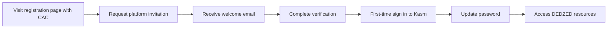

Welcome to the DEDZED beta program. This guide walks you through the three milestones required to register your account, initialize your credentials, and access DEDZED resources.

## Registration flow

<Note>
### Quick-start checklist

1. [Milestone 1](#milestone-1-register-a-dedzed-account) -- Register a DEDZED account
2. [Milestone 2](#milestone-2-first-time-sign-in) -- Complete first-time sign in
3. [Milestone 3](#milestone-3-access-your-dedzed-resources) -- Access your DEDZED resources
</Note>

---

## Milestone 1: Register a DEDZED account

In this milestone, you create your DEDZED account by visiting the registration page with your CAC and completing the invitation process.

### Step 1 -- Navigate to the registration page

<Warning>
Ensure your valid, unexpired CAC is plugged into your machine before proceeding.
</Warning>

1. Open your web browser and go to [https://dashboard.dedzed.blacklabel.mil](https://dashboard.dedzed.blacklabel.mil). AWS Verified Access redirects you to Ping Identity for authentication.
2. When the **Select a certificate** prompt appears, select your **DOD ID CA-XX** certificate and click **OK**.
3. You arrive at the **Request Platform Invitation** page.

### Step 2 -- Complete your platform invitation

1. Click the **REQUEST** button under the **Request Platform Invitation** option.
2. Enter your **First name**, **Last name**, and a valid **.mil email** address.
3. Click **REGISTER**. If all information is valid, you see a **Successfully Sent Invitation!** confirmation.

### Step 3 -- Complete registration from your welcome email

Check the .mil email address you registered for the **Welcome to D3DZ3D Beta** email. This email typically arrives within two minutes and contains three important items:

| Item | Description |
|------|-------------|
| **Verification link** | Click "the following link" to verify your email address and activate your account. |
| **Username** | Your DEDZED account username, provided by your Ping login. |
| **Temporary password** | A one-time password you will change during first-time sign in. |

<Tip>
Save your username somewhere accessible. You will need it for every sign in to DEDZED resources.
</Tip>

After clicking the verification link, proceed to Milestone 2.

---

## Milestone 2: First-time sign in

In this milestone, you sign in for the first time, verify your identity with your CAC, and set a permanent password.

<Warning>
Ensure your valid CAC is plugged into your machine before proceeding.
</Warning>

1. Navigate to [https://kasm.dedzed.blacklabel.mil](https://kasm.dedzed.blacklabel.mil) and click the **Ping Identity** option.
2. Enter your **Username** and **temporary password** from the welcome email.
3. When prompted to verify your identity, select **Use a certificate or smart card**.
4. Select your **DOD ID CA-XX** certificate and click **OK**.
5. On the password update screen:
   - Enter your temporary password as the current password.
   - Create a new password following best security practices.
   - Confirm your new password and click **Sign in**.
6. On the **More information required** page, click **Next**.
7. On the account security page, click the blue **Done** button.

You are now signed in and directed to the Kasm console. Proceed to Milestone 3.

---

## Milestone 3: Access your DEDZED resources

Now that your account is active, you can access all DEDZED resources through the Kasm VDI.

### Your standard authentication workflow

Every time you access DEDZED, follow these steps:

1. Plug your valid CAC into your machine.
2. Navigate to [https://kasm.dedzed.blacklabel.mil](https://kasm.dedzed.blacklabel.mil) and sign in with **Ping Identity**.
3. Start a Kasm VDI session.
4. Within the Kasm session, use your DEDZED username and password to access resources.

<Warning>
CAC passthrough does not currently work inside Kasm VDI sessions. Use your DEDZED username and password for authentication within Kasm.
</Warning>

### Access DEDZED from within Kasm

1. Start a Kasm session by clicking the **SHE BASH Ubuntu** workspace with **Persistent Profile** enabled.
2. Open a browser within the Kasm session and navigate to [https://dashboard.dedzed.blacklabel.mil](https://dashboard.dedzed.blacklabel.mil).
3. Sign in with **Ping Identity** using your DEDZED username and password.

You now have access to the DEDZED Command Dashboard and can deploy ephemeral clusters, manage environments, and access all platform services.

---

## Troubleshooting: CAC issues

<Warning>
This section applies only to users who cannot sign in with their registered CAC.
</Warning>

If you experience issues logging in with your CAC:

1. Contact the SHE BASH team through the [support page](/support/contact). The team will work with you to resolve the issue.
2. If the issue cannot be resolved, an admin can add you to the **CAC exclusion list**.
3. Once on the exclusion list, sign in with your DEDZED username, password, and an MFA method of your choice. You can also choose to skip MFA setup.

## Next steps

<CardGroup cols={2}>
  <Card title="Deploy a cluster" icon="server" href="/getting-started/deploying-cluster">
    Launch your first ephemeral Kubernetes cluster.
  </Card>
  <Card title="Working within Kasm" icon="desktop" href="/kasm-workspaces/working-within-kasm">
    Learn how to use the Kasm VDI environment effectively.
  </Card>
</CardGroup>
