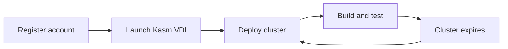

Welcome to the D3DZ3D field manual. This documentation walks you through the DEDZED platform, from account registration to deploying ephemeral Kubernetes clusters in secure, zero-trust environments.

## How DEDZED works

## Platform overview

A quick 5-minute walkthrough of the DEDZED platform and its capabilities.

<iframe
  src="https://www.loom.com/embed/c4e2ee9a2bab4e1f93ed95be8e1a1ddb"
  width="100%"
  height="400"
  frameBorder="0"
  allow="fullscreen"
/>

## Getting started

<CardGroup cols={2}>
  <Card title="Before you begin" icon="book" href="/getting-started/before-you-begin">
    Prerequisites and recommended pre-reading.
  </Card>
  <Card title="Self-registration" icon="user-plus" href="/getting-started/self-registration">
    Register your DEDZED account and access resources.
  </Card>
  <Card title="Deploy an ephemeral cluster" icon="server" href="/getting-started/deploying-cluster">
    Deploy a pre-configured ephemeral Kubernetes cluster.
  </Card>
  <Card title="Provision time" icon="clock" href="/getting-started/provision-time">
    Understand cluster provisioning timelines.
  </Card>
  <Card title="Local install" icon="laptop" href="/getting-started/local-install">
    Set up your local development environment.
  </Card>
</CardGroup>

## Kasm Workspaces

<CardGroup cols={2}>
  <Card title="Working within Kasm" icon="desktop" href="/kasm-workspaces/working-within-kasm">
    Navigate and use your browser-based Kasm desktop.
  </Card>
  <Card title="Connect to your cluster" icon="link" href="/kasm-workspaces/connect-cluster">
    Connect to your AKS or EKS cluster from Kasm.
  </Card>
  <Card title="Install software" icon="download" href="/kasm-workspaces/install-software">
    Install additional tools in your Kasm workspace.
  </Card>
</CardGroup>

## Common services

<CardGroup cols={2}>
  <Card title="Command Dashboard" icon="gauge" href="https://dedzed.icbm.dev/">
    Launch the DEDZED Command Dashboard.
  </Card>
  <Card title="Kasm VDI" icon="desktop" href="https://kasm.icbm.dev/">
    Access your zero-trust browser desktop.
  </Card>
  <Card title="GitHub" icon="github" href="https://github.icbm.dev/">
    Source code management and repositories.
  </Card>
  <Card title="SHREDDER" icon="shield-halved" href="https://shredder.icbm.dev/">
    Security platform for vulnerability management.
  </Card>
</CardGroup>

## Security and compliance tools

<CardGroup cols={3}>
  <Card title="STIGMATE" icon="clipboard-check" href="/stigmate/index">
    AI-powered STIG compliance scanning with real-time dashboard and CKL export.
  </Card>
  <Card title="RMF" icon="scale-balanced" href="/rmf/index">
    Risk Management Framework for NIST 800-53 control tracking and ATO workflow.
  </Card>
  <Card title="Operator State Lock" icon="lock" href="/operator-state-lock/index">
    Multi-operator coordination for safe infrastructure changes.
  </Card>
</CardGroup>

## Knowledge base

<CardGroup cols={2}>
  <Card title="What is DEDZED?" icon="circle-question" href="/knowledge-base/what-is-dedzed">
    Learn about the platform and its capabilities.
  </Card>
  <Card title="Zero-trust architecture" icon="lock" href="/knowledge-base/zero-trust">
    Understand the zero-trust network model behind DEDZED.
  </Card>
  <Card title="SHREDDER" icon="shield-halved" href="/knowledge-base/shredder">
    Security scanning and vulnerability management.
  </Card>
  <Card title="Ephemeral environments" icon="cloud" href="/knowledge-base/ephemeral-environments">
    How ephemeral clusters work and why they matter.
  </Card>
  <Card title="k9s cheat sheet" icon="terminal" href="/knowledge-base/k9s-cheat-sheet">
    Quick reference guide for the k9s Kubernetes tool.
  </Card>
  <Card title="Python development" icon="python" href="/knowledge-base/python-development">
    Get started with Python in your Kasm workspace.
  </Card>
  <Card title="DEDZED AI" icon="robot" href="/knowledge-base/dedzed-ai">
    Agentic AI capabilities across the DEDZED platform.
  </Card>
</CardGroup>

## Support

<CardGroup cols={2}>
  <Card title="Contact and support" icon="headset" href="/support/contact">
    Report issues or get help with DEDZED.
  </Card>
  <Card title="Terms and conditions" icon="file-contract" href="/support/terms-and-conditions">
    Review the platform terms of use.
  </Card>
  <Card title="Privacy policy" icon="user-shield" href="/support/privacy-policy">
    Learn how your data is handled.
  </Card>
</CardGroup>
