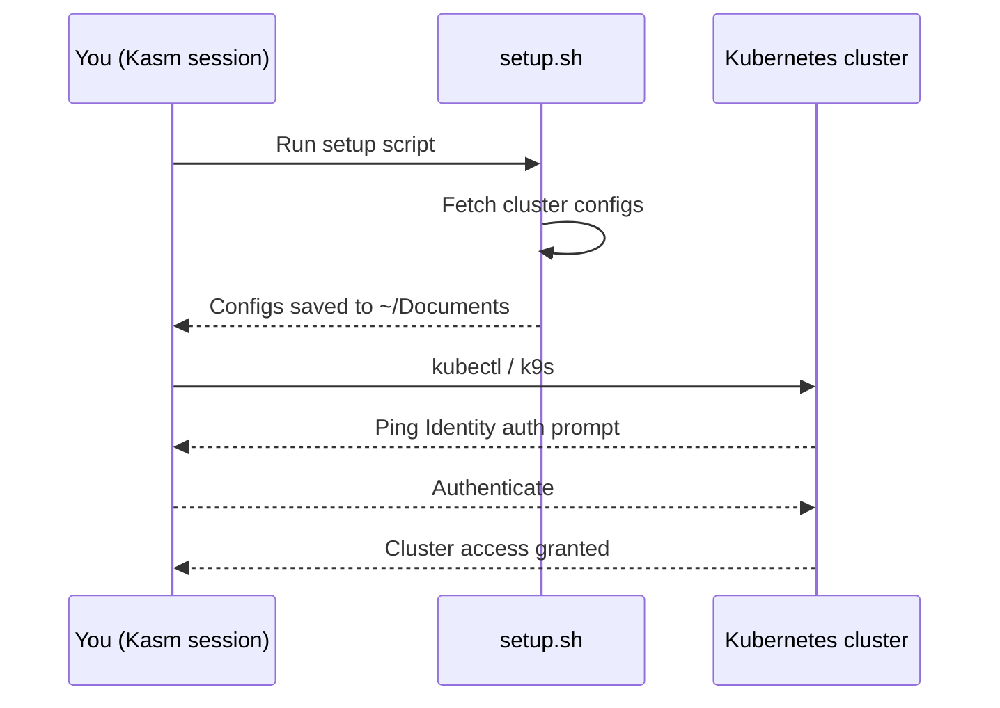

## Overview

After you deploy an ephemeral cluster through the DEDZED Command Dashboard, you connect to it from within your Kasm workspace session. The connection flow involves creating an API token, running an automatic sync script, and configuring `kubectl` access.




---

## Prerequisites

Before connecting to a cluster, verify that:

- You have an active Kasm workspace session running (see [Working within Kasm](/kasm-workspaces/working-within-kasm))
- You have already deployed a cluster through the DEDZED Command Dashboard (see [Deploying an ephemeral cluster](/getting-started/deploying-cluster))
- Your cluster status shows as **online** and ready to accept connections

<Warning>
For Azure Kubernetes (AKS) clusters, ensure you have an unexpired CAC plugged in to your machine before proceeding.
</Warning>

---

## Step 1: Sync your clusters

Your clusters are automatically synced when your Kasm workspace starts. A `setup.sh` script on your desktop handles the connection setup.

<Warning>
Before proceeding, verify that your requested cluster is online and available to accept incoming connections. If the cluster is still provisioning, the sync will fail because the endpoints are not yet reachable.

If you have not requested a cluster yet, see the [Deploying an ephemeral cluster](/getting-started/deploying-cluster) guide.
</Warning>

<Steps>
  <Step title="Start or restart a workspace session">
    If you already have a session open, you can run the `setup.sh` script manually from the desktop. Otherwise, start a new session — the script runs automatically on first launch.
  </Step>
  <Step title="Wait for the sync to complete">
    The script discovers your available clusters and downloads the kubeconfig files. If no clusters are available, you will see: `No clusters found or failed to fetch clusters`.
  </Step>
</Steps>

---

## Step 2: Set your KUBECONFIG

After the sync completes, kubeconfig files are saved to the `~/Documents` directory. Set the `KUBECONFIG` environment variable to point to the cluster you want to access:

```bash
export KUBECONFIG=~/Documents/<your-cluster-name>.yaml
```

Replace `<your-cluster-name>` with the actual filename of your cluster config. You can list available configs with:

```bash
ls ~/Documents/*.yaml
```

<Tip>
To make this persistent across terminal sessions, add the `export` line to your `~/.bashrc` or `~/.zshrc` file.
</Tip>

---

## Step 3: Access your cluster

With the `KUBECONFIG` set, use `kubectl` or `k9s` to interact with your cluster.

```bash
# Verify connectivity
kubectl get nodes

# Launch the k9s terminal UI
k9s
```

On the first command, you will be prompted to authenticate via **Ping Identity**. Complete the login to authorize access to the cluster. After authentication, you can interact with your cluster resources normally.

---

## Troubleshooting

| Symptom | Likely cause | Fix |
|---|---|---|
| `No clusters found or failed to fetch clusters` | Cluster not yet provisioned or still deploying | Check cluster status in the DEDZED Command Dashboard and wait for it to show as online |
| Authentication prompt loops | Expired Ping session or stale token | Re-run `setup.sh` |
| `connection refused` errors | Cluster endpoints not reachable | Verify the cluster is online and your Kasm session has network connectivity |
| Kubeconfig file not found in `~/Documents` | Sync script did not complete | Re-run `setup.sh` from the desktop and check for errors |

---

## Related resources

<CardGroup cols={2}>
  <Card title="k9s cheat sheet" icon="terminal" href="/knowledge-base/k9s-cheat-sheet">
    Quick reference guide for navigating and managing clusters with k9s.
  </Card>
  <Card title="Deploy a cluster" icon="cloud" href="/getting-started/deploying-cluster">
    Request and deploy a new ephemeral Kubernetes cluster.
  </Card>
  <Card title="Working within Kasm" icon="desktop" href="/kasm-workspaces/working-within-kasm">
    Learn how to create and use your Kasm virtual desktop session.
  </Card>
  <Card title="Install software" icon="download" href="/kasm-workspaces/install-software">
    Options for installing additional tools in your VDI environment.
  </Card>
</CardGroup>
