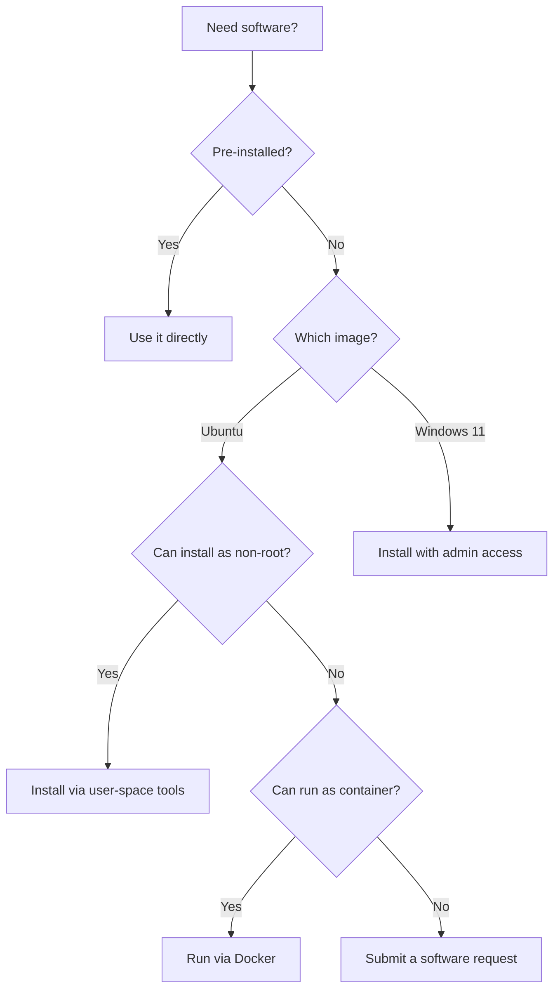

## Overview

The DEDZED VDI comes with a set of pre-installed tools for Kubernetes development, DevSecOps workflows, and general productivity. Depending on which desktop image you use, you have different options for adding software beyond what is pre-installed.



---

## SHE BASH Ubuntu

The Ubuntu image runs with a non-root user account. You cannot use `sudo` to install system-level packages, but you have several options for adding software.

### Pre-installed tools

The Ubuntu image includes commonly used tools out of the box:

- **kubectl**, **k9s**, and **Helm** for Kubernetes management
- **Docker** for running and building containers
- **Git** for version control
- **Python** and common development libraries
- **VS Code** and standard browsers

### Install software as a non-root user

You can install tools that do not require root access:

- **pip** — install Python packages to your user directory with `pip install --user <package>`
- **npm** — install Node.js packages locally with `npm install <package>`
- **Binary downloads** — download pre-built binaries to `~/bin` or `~/.local/bin` and add them to your `PATH`
- **Language-specific managers** — use tools like `rustup`, `nvm`, or `pyenv` that install to user-space directories

### Run software in Docker containers

If a tool requires root or system-level installation, you can run it as a Docker container instead:

```bash
# Example: run a tool available as a Docker image
docker run --rm -it <image-name>
```

This approach works well for testing tools, running one-off commands, or working with software that has complex dependencies.

---

## Windows 11

The Windows 11 image provides the same suite of pre-installed tools as Ubuntu, ensuring consistency across platforms. The key difference is that you have **administrative access** on Windows 11, which allows you to install additional software directly.

### What you can do

- Install applications using standard Windows installers (`.exe`, `.msi`)
- Use package managers like **winget** or **Chocolatey**
- Configure development environments and IDEs

### Usage guidelines

<Warning>
You are responsible for using administrative access appropriately. Do not install software that could compromise the security of the shared infrastructure or disrupt other users in the DEDZED VDI environment.
</Warning>

---

## Request additional software

If you need software that is not available through the methods above, submit a request to the DEDZED team. The team evaluates requests and adds popular tools to the base images for all users.

### How to submit a request

<Steps>
  <Step title="Open your VDI session">
    Launch a Kasm workspace from [https://kasm.icbm.dev](https://kasm.icbm.dev).
  </Step>
  <Step title="Submit via the Feedback widget (preferred)">
    Open TSEC within your session and use the **Feedback** widget to describe the software you need and your use case.
  </Step>
  <Step title="Alternative: use the Teams channel">
    Post your software request in the Beta Teams channel with details about what you need and why.
  </Step>
</Steps>

<Note>
The DEDZED team actively reviews feedback and has a track record of rapid implementation. For example, the Go compiler was added to the base image after a user request during alpha testing.
</Note>

---

## Related resources

<CardGroup cols={2}>
  <Card title="Working within Kasm" icon="desktop" href="/kasm-workspaces/working-within-kasm">
    Learn how to create, configure, and use your Kasm virtual desktop session.
  </Card>
  <Card title="Connect to your cluster" icon="link" href="/kasm-workspaces/connect-cluster">
    Set up kubectl access to your DEDZED ephemeral Kubernetes cluster.
  </Card>
  <Card title="Python development" icon="python" href="/knowledge-base/python-development">
    Get started with Python development in your Kasm workspace.
  </Card>
  <Card title="Contact support" icon="envelope" href="/support/contact">
    Reach the DEDZED team for help with software or environment issues.
  </Card>
</CardGroup>
