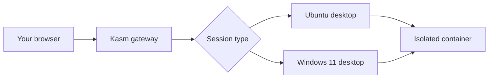

## How Kasm VDI works

Kasm Workspaces provides a browser-based virtual desktop infrastructure (VDI). You access a full desktop environment directly from your web browser with no client software required. Each session runs in an isolated container that streams the desktop to your browser in real time.

## Create your desktop

Navigate to [https://kasm.dedzed.blacklabel.mil](https://kasm.dedzed.blacklabel.mil) to start a new Kasm workspace session.

<Steps>
  <Step title="Authenticate">
    Click the **Ping Identity** option and sign in with your Ping credentials.
  </Step>
  <Step title="Select a desktop image">
    Choose between **SHE BASH Ubuntu** or **Windows 11** depending on your needs. Ubuntu is pre-configured for command-line workflows, while Windows 11 offers a familiar desktop environment with administrative access.
  </Step>
  <Step title="Choose a persistence profile">
    Before launching, select your persistence setting:
    - **Persistent Profile: Enabled** — your files, settings, and installed software carry over between sessions. Use this if you want a consistent workspace across logins.
    - **Persistent Profile: Disabled** — the session is fully ephemeral. Everything resets when the session ends. Use this for clean-slate testing or temporary work.
  </Step>
  <Step title="Launch the session">
    Click **Launch Session**. The desktop environment loads directly in your browser tab within a few moments.
  </Step>
</Steps>

## Working in your session

Once your desktop loads, you have access to a full desktop environment with pre-installed tools and browser access.

### Pre-installed tools

Both Ubuntu and Windows 11 images come with a common set of tools:

- **kubectl** and **k9s** for Kubernetes cluster management
- **Docker** for running containers within the VDI
- **Git** for version control
- **VS Code** or equivalent code editors
- **Standard browsers** for accessing DEDZED services and documentation

### Clipboard and file transfer

Kasm provides a sidebar control panel on the left side of the screen. Use it to:

- **Copy and paste** text between your local machine and the VDI session
- **Upload files** from your local machine into the VDI
- **Download files** from the VDI to your local machine

### Session management

- **Idle timeout** — sessions may time out after a period of inactivity. Save your work regularly.
- **Manual disconnect** — you can disconnect from the session without destroying it, then reconnect later to pick up where you left off.
- **End session** — when you are finished, end the session from the Kasm dashboard. If you have persistence disabled, all data is destroyed at this point.

## Next steps

<CardGroup cols={2}>
  <Card title="Connect to your cluster" icon="link" href="/kasm-workspaces/connect-cluster">
    Set up kubectl access to your DEDZED ephemeral Kubernetes cluster from within Kasm.
  </Card>
  <Card title="Install software" icon="download" href="/kasm-workspaces/install-software">
    Learn what software is available and how to request additional tools.
  </Card>
  <Card title="Python development" icon="python" href="/knowledge-base/python-development">
    Get started with Python development in your Kasm workspace.
  </Card>
  <Card title="Zero trust access" icon="shield" href="/knowledge-base/zero-trust">
    Understand how Kasm uses a dual-ingress architecture with AWS Verified Access.
  </Card>
</CardGroup>
