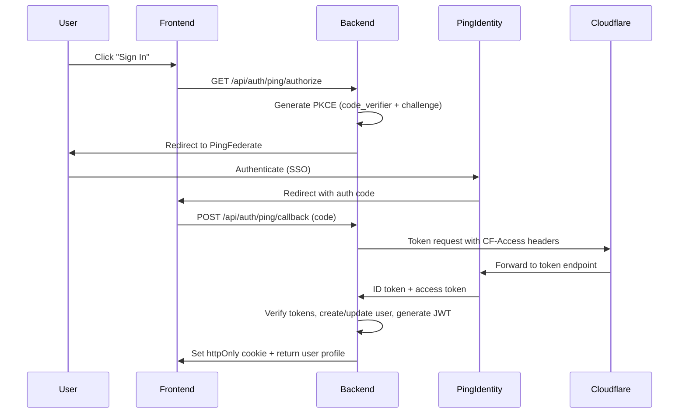

## Overview

The DEDZED Command Dashboard is the primary web interface for the platform. It provides environment lifecycle management, multi-cloud cost analytics, security monitoring, AI-powered Kubernetes operations, and user administration — all within a FIPS 140-2 compliant application deployed on EKS in AWS GovCloud.

The application is built as a full-stack monorepo in the [`shebashio/dedzed-dashboard`](https://github.icbm.dev/shebashio/dedzed-dashboard) repository.

## Tech stack

| Layer | Technology |
|---|---|
| Frontend | React 19, TypeScript, Vite, Tailwind CSS |
| Backend | Node.js, Express.js |
| Database | PostgreSQL 15 with Prisma ORM |
| Cache | Redis 7 |
| Authentication | Ping Identity (PingFederate OIDC with PKCE) |
| AI | Anthropic Claude API |
| Infrastructure | Docker, EKS, Cloudflare Tunnel |
| FIPS | Chainguard FIPS base images, OpenSSL 3.0.8 (CMVP #4282) |

## Features

### Environment management

Users create, extend, and destroy ephemeral Kubernetes environments directly from the dashboard. Under the hood, the backend dispatches GitHub workflows in the [`d3dz3d-infra`](https://github.icbm.dev/shebashio/d3dz3d-infra) repository via the GitHub API. A callback mechanism associates each workflow run with the requesting environment. Once clusters are provisioned in AWS, they are tracked by matching the `Email` tag on AWS resources to the authenticated user.

Environment pages show real-time cluster status, resource utilization, and provide direct links to connect via Kasm.

### Ki8s — AI Kubernetes assistant

Ki8s is an AI-powered Kubernetes management system with two components:

**Ki8s Operator** — a lightweight Node.js agent deployed on each Kubernetes cluster. It establishes an outbound WebSocket (Socket.io) connection back to the dashboard, authenticates with a cluster JWT token, and executes commands received from the AI service. The operator has full kubectl and shell access within the cluster.

**Ki8s AI Service** — uses the Anthropic Claude API with an `execute_command` tool definition. When a user sends a natural language message (e.g., "show me all failing pods in production"), the AI generates and executes shell/kubectl commands autonomously via the operator, returning results in real-time through the WebSocket.

```
User → Chat UI → Claude API → Command generation → WebSocket → Ki8s Operator → kubectl/shell → Results
```

The operator is deployable via Helm chart, kubectl manifests, or Docker. Configuration requires a `CLUSTER_TOKEN` and the `DEDZED_URL` WebSocket endpoint.

### Security monitoring

The security section aggregates findings from multiple sources:

- **AWS GuardDuty** — pulls findings per cloud account with severity filtering, archiving, and feedback
- **ACAS** — integrates with ACAS (Assured Compliance Assessment Solution / Nessus) servers in GovCloud via API key authentication over TLS 1.2
- **Binary scanner** — proxies requests to a FastAPI service at `scanner.dso.sh` that runs Syft (SBOM), Grype (vulnerabilities), Trivy (security), and CBOMkit-theia (cryptographic analysis) against uploaded binaries
- **Runtime monitoring** — real-time security event detection including XSS attempts, SQL injection, path traversal, brute force, and geo-IP anomaly detection
- **Security incidents** — tracked in PostgreSQL with full audit trail

### Cost analytics

The dashboard provides multi-cloud cost visibility across AWS, Azure, and GCP:

- **Developer cost dashboard** — per-user cost attribution and efficiency metrics
- **Multi-cloud costs** — unified view across cloud providers with breakdown by service, region, and tag
- **Budget thresholds** — configurable warning (75%) and critical (90%) alerts
- **Cost export** — downloadable reports for compliance and chargeback

Cloud account credentials are encrypted at rest using AES-256-GCM and stored in PostgreSQL.

### DORA metrics

The DORA dashboard tracks the four key DevOps Research and Assessment metrics by integrating with the GitHub API:

- Deployment frequency
- Lead time for changes
- Change failure rate
- Mean time to recovery (MTTR)

### User management

Administrators manage users, roles, and activity from the dashboard:

- **Roles:** SUPERADMIN, ADMIN, USER, VIEWER — with hierarchical permission inheritance
- **50+ granular permissions** organized by resource and action (e.g., `environments:delete:own`, `costs:view:all`, `security:incidents:manage`)
- **Activity tracking** — user activity heatmaps, engagement trends, and session monitoring
- **STIG compliance** — account lockout after failed attempts, password history enforcement, automatic disabling after inactivity (STIG V-204750, V-263549)

### Feedback system

A floating feedback widget is available on all pages. Submissions are stored in PostgreSQL, sent via AWS SES in GovCloud, and automatically create Linear tickets at `dedzed-tech@shebash.io` for triage.

### Operator State Lock

The dashboard integrates with Operator State Lock for managing Terraform state locks on ephemeral environments.

## Architecture

### Frontend

The React frontend uses a provider-based architecture:

| Provider | Purpose |
|---|---|
| `AuthProvider` | JWT authentication state, token refresh, Ping Identity SSO |
| `ThemeProvider` | SHEBASH brand theming (dark/light/system), configurable settings |
| `LicenseProvider` | License validity checks, grace period handling |
| `NotificationProvider` | In-app notifications with localStorage persistence |
| `FABProvider` | Page-specific floating action button actions |

All authenticated routes are wrapped in `ProtectedRoute`. The application renders a CUI (Controlled Unclassified Information) classification banner and a DoD consent banner before granting access.

**SHEBASH design system** — a component library (`components/shebash/`) implementing the brand identity: Hacker Green (#73EF4B) accent on black/white base, IBM Plex Sans typography, and consistent card/button/input/alert components.

### Backend

The Express backend mounts 24 route modules behind layered middleware:

<Steps>
  <Step title="Request logging">
    Assigns a unique request ID, logs method/URL/IP with Cloudflare Ray ID correlation.
  </Step>
  <Step title="Security monitoring">
    Detects and logs attack patterns (XSS, SQL injection, path traversal) with geo-IP enrichment.
  </Step>
  <Step title="Authentication">
    JWT verification from httpOnly cookies (preferred) or Bearer header, plus Personal Access Token support (`ddzd_` prefix).
  </Step>
  <Step title="RBAC">
    Permission-based access control with ownership qualifiers (`:own` vs `:any`).
  </Step>
  <Step title="Input validation">
    DOMPurify sanitization, SQL injection pattern filtering, express-validator rules.
  </Step>
  <Step title="Caching">
    Redis-backed response caching with stale-while-revalidate and request coalescing.
  </Step>
  <Step title="License check">
    Validates license on each request; blocks access when expired beyond grace period.
  </Step>
</Steps>

### API surface

| Route prefix | Description |
|---|---|
| `/api/auth` | Ping Identity OIDC login, callback, token refresh, logout |
| `/api/environments` | Environment CRUD, GitHub workflow dispatch, status tracking |
| `/api/users` | User management, activity, role assignment |
| `/api/cloud-usage` | AWS resource and usage monitoring |
| `/api/costs` | Multi-cloud cost analysis and trends |
| `/api/cloud-accounts` | Cloud account CRUD with encrypted credential storage |
| `/api/security` | Security incidents, vulnerabilities, audit logs |
| `/api/guardduty` | AWS GuardDuty findings per account |
| `/api/acas` | ACAS vulnerability scanner integration |
| `/api/binary-scan` | Binary scanner proxy (scanner.dso.sh) |
| `/api/ki8s` | Ki8s AI chat, cluster management, sessions |
| `/api/ai` | General AI assistant endpoints |
| `/api/mcp` | MCP protocol bridge for AI agent tool access |
| `/api/state-lock` | Operator State Lock integration |
| `/api/license` | License verification and status |
| `/api/tokens` | Personal Access Token management |
| `/api/feedback` | User feedback submission and management |
| `/api/audit` | Audit log viewer |
| `/api/github` | GitHub API integration, DORA metrics |
| `/api/runtime-monitoring` | Runtime security monitoring |
| `/api/subscription-patterns` | AWS account routing patterns |
| `/api/cache` | Redis cache management |
| `/api/kubernetes` | Direct Kubernetes cluster operations |

### Database

PostgreSQL with Prisma ORM. Key models:

- **User** — roles, STIG-compliant security fields (lockout, password history, inactivity disabling), OAuth mappings, sessions
- **Environment** — lifecycle state, cloud provider, GitHub workflow IDs, expiration, owner relationship
- **CloudAccount** — multi-cloud credentials (AES-256-GCM encrypted), region, status
- **Ki8sCluster / Ki8sCommand / Ki8sSession** — AI operator cluster registry, command history, session tracking
- **SecurityIncident / AuditLog** — security event and audit trail storage
- **DeveloperCostMetric** — per-user cost attribution
- **Feedback** — user submissions with email delivery status
- **PersonalAccessToken** — API tokens with scoped permissions and usage logging
- **SubscriptionPattern** — AWS account routing rules

### Caching

Redis 7 provides:

- Dashboard widget caching (5–15 minute TTL)
- User session storage (24-hour TTL)
- API response caching with stale-while-revalidate
- Request coalescing to prevent duplicate backend calls
- Rate limiting for API protection

## Authentication flow



Tokens auto-refresh 5 minutes before expiry. Personal Access Tokens (`ddzd_` prefix) provide an alternative auth method for API clients.

## External integrations

| Service | Usage |
|---|---|
| **AWS GovCloud** | EKS, GuardDuty, Cost Explorer, SES, Secrets Manager, STS |
| **Azure** | Cost APIs, credential management |
| **GCP** | Cost APIs |
| **Ping Identity** | PingFederate OIDC with PKCE for SSO |
| **Cloudflare** | Access service tokens for back-channel auth, tunnel for secure access |
| **GitHub Enterprise** | Workflow dispatch (environment lifecycle), DORA metrics, API integration |
| **Anthropic Claude** | Ki8s AI service for natural language Kubernetes management |
| **ACAS** | Nessus/Tenable vulnerability scanning |
| **Binary Scanner** | FastAPI at scanner.dso.sh (Syft, Grype, Trivy, CBOMkit-theia) |
| **Linear** | Feedback ticket creation via email integration |
| **AWS SES** | Email notifications from GovCloud |

## FIPS 140-2 compliance

All production images use Chainguard FIPS base images with OpenSSL 3.0.8 FIPS module (CMVP Certificate #4282).

| Operation | Algorithm | Standard |
|---|---|---|
| JWT signing | HS256 (HMAC-SHA256) | FIPS 198-1 |
| License verification | RSA-SHA256 (2048-bit) | FIPS 186-4 |
| Credential encryption | AES-256-GCM | FIPS 197 |

The backend verifies FIPS provider availability on startup. If `REQUIRE_FIPS=true` is set and the FIPS provider is not available, the application refuses to start.

## CI/CD

### Build pipeline

The `docker-build.yml` workflow triggers on pushes to `main` and version tags:

1. Builds backend, frontend, and Redis Docker images using Chainguard FIPS base images
2. Authenticates to ECR GovCloud via OIDC (`GHES_OIDC_ROLE`)
3. Pushes images to ECR in `us-gov-west-1`

### Test pipeline

The `ci-testing.yml` workflow runs on pushes to `main`, `develop`, and feature/fix branches:

- Backend tests with a Postgres service container
- Frontend tests with coverage reporting
- Artifacts uploaded for both

### Base image updates

The `update-base-images.yml` workflow manages Chainguard FIPS base image version pinning via `base-images.json`.

All workflows run on self-hosted runners (`d3dz3d-runner-set`).

## Deployment

### Development

```bash
# Start all services (frontend, backend, Postgres, Redis)
docker-compose -f docker/docker-compose.yaml up
```

| Service | URL |
|---|---|
| Frontend | http://localhost:5173 |
| Backend API | http://localhost:3001 |
| PostgreSQL | localhost:5432 |

The dev compose uses volume mounts for live reloading (Vite HMR for frontend, Nodemon for backend) and auto-runs Prisma migrations on startup.

### Production

Production deployment targets EKS with:

- Chainguard FIPS base images
- Read-only filesystem with tmpfs for logs
- `no-new-privileges` security option
- Resource limits (1G RAM / 0.5 CPU for backend)
- Tuned Postgres (shared_buffers=256MB, pg_stat_statements)
- Redis with append-only persistence and 512MB memory limit
- Cloudflare Tunnel for secure external access

## Repository structure

```
shebashio/dedzed-dashboard/
├── frontend/
│   ├── src/
│   │   ├── pages/              # 29 page components
│   │   ├── components/         # 70+ components
│   │   │   ├── ki8s/           # AI Kubernetes chat UI
│   │   │   ├── shebash/        # SHEBASH design system
│   │   │   ├── dashboard/      # Dashboard widgets
│   │   │   └── ...
│   │   ├── contexts/           # Auth, Theme, License, Notification, FAB
│   │   ├── services/           # 30 API service modules
│   │   ├── hooks/              # Token refresh, media queries
│   │   ├── rbac/               # Frontend permission checks
│   │   └── types/              # TypeScript type definitions
│   └── Dockerfile
├── backend/
│   ├── src/
│   │   ├── routes/             # 24 route modules
│   │   ├── services/           # 35 service modules
│   │   ├── controllers/        # 12 controllers
│   │   ├── middleware/         # Auth, RBAC, cache, CSRF, validation, monitoring
│   │   ├── rbac/               # Permission definitions and role mappings
│   │   ├── websocket/          # Socket.io for Ki8s
│   │   └── startup/            # Initialization scripts
│   ├── prisma/
│   │   ├── schema.prisma       # Database schema
│   │   └── migrations/
│   └── Dockerfile
├── ki8s/
│   ├── operator/               # Ki8s Kubernetes operator
│   │   ├── src/                # WebSocket client, shell interface, auth
│   │   └── Dockerfile
│   ├── helm/                   # Helm chart for operator deployment
│   └── manifests/              # Raw Kubernetes manifests
├── docker/
│   ├── docker-compose.yaml     # Development environment
│   ├── docker-compose.prod.yaml # Production environment
│   └── nginx.conf              # Frontend reverse proxy
├── e2e/                        # Playwright E2E tests
├── config/                     # AWS IAM policies
└── .github/workflows/
    ├── docker-build.yml        # Build and push to ECR
    ├── ci-testing.yml          # Backend + frontend tests
    └── update-base-images.yml  # Chainguard image pinning
```
