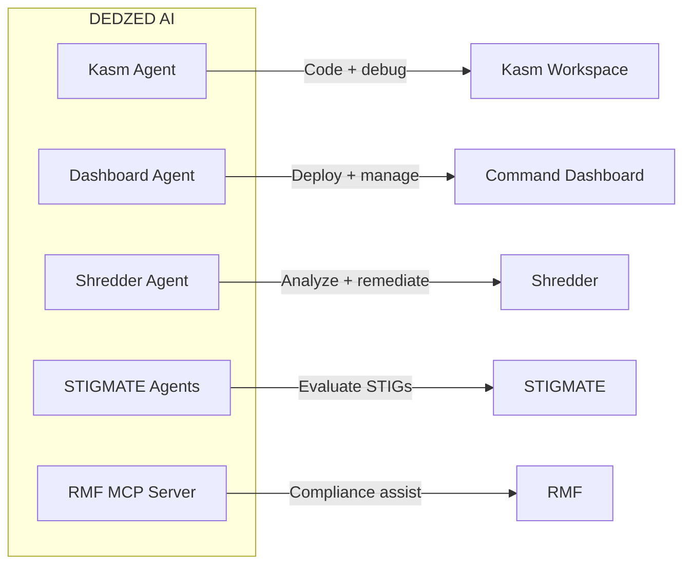

## Overview

DEDZED AI brings agentic AI capabilities across the DEDZED platform — from your Kasm workspace to the DEDZED Command Dashboard and the Shredder Security Platform. Each integration is purpose-built for its context, giving you AI assistance that understands the DEDZED environment and the task at hand.

## Kasm workspace agent

DEDZED AI is available as an agentic coding assistant in your Kasm workspace, powered by Claude Code. You can interact with it directly from your terminal to:

- Write, debug, and refactor code
- Manage Kubernetes clusters using `kubectl` and `k9s`
- Navigate project structures and explain unfamiliar codebases
- Generate tests and documentation
- Troubleshoot build and deployment issues

The agent runs in your terminal session and has access to the same tools and file system as you do. It operates within the security boundary of your Kasm workspace.

<Warning>
You must bring your own Claude subscription account or API key to use the DEDZED AI agent in your Kasm workspace.
</Warning>

## DEDZED Command Dashboard

DEDZED AI is integrated into the DEDZED Command Dashboard, where it performs dashboard operations on your behalf:

- Deploy and tear down ephemeral environments
- Manage cluster configurations and add-ons
- Monitor environment status and health
- Automate routine administrative tasks

The dashboard agent understands the DEDZED resource model and can orchestrate multi-step workflows that would otherwise require multiple manual actions.

## Shredder Security Platform

DEDZED AI is built into the [Shredder](/knowledge-base/shredder) Security Platform to analyze vulnerabilities discovered in application scans:

- Summarize scan findings into readable reports
- Prioritize vulnerabilities by risk and exploitability
- Provide actionable remediation guidance
- Investigate findings interactively via **AI Inspect** (see [Shredder](/knowledge-base/shredder#ai-inspect) for details)

<iframe
  src="https://www.loom.com/embed/84072a122c034b2eae9e1f67c77ed863"
  width="100%"
  height="400"
  frameBorder="0"
  allow="fullscreen"
/>

## STIGMATE compliance agents

[STIGMATE](/stigmate/index) uses Claude AI agents to automate STIG compliance scanning. Each agent receives a STIG check procedure, executes commands on target systems via AWS SSM, interprets the results, and determines compliance status — all without human intervention. Agents run in parallel (configurable concurrency) and broadcast results in real time to a kanban dashboard via WebSocket.

STIGMATE agents can evaluate 395+ STIGs across operating systems, databases, network devices, and cloud platforms. Results are classified as Open, Not a Finding, Not Applicable, or Not Reviewed, and can be exported as CKL checklists.

## RMF MCP integration

[RMF](/rmf/index) exposes a Model Context Protocol (MCP) server that enables AI-powered compliance assistance. The MCP server provides tools for analyzing evidence gaps, suggesting control implementations, and generating policy documents — all within the context of your RMF project data.

You can connect Claude Desktop or other MCP-compatible clients to the RMF MCP server to interact with your compliance data conversationally. See [MCP integration](/rmf/mcp-integration) for setup instructions.

## Related pages

<CardGroup cols={2}>
  <Card title="Shredder" icon="shield-halved" href="/knowledge-base/shredder">
    Unified security scanning with quality gates and AI analysis.
  </Card>
  <Card title="Working within Kasm" icon="desktop" href="/kasm-workspaces/working-within-kasm">
    Learn how to use the Kasm browser-based desktop environment.
  </Card>
  <Card title="Deploying a cluster" icon="server" href="/getting-started/deploying-cluster">
    Step-by-step guide to deploying your ephemeral cluster.
  </Card>
  <Card title="Connect to your cluster" icon="link" href="/kasm-workspaces/connect-cluster">
    Connect to your ephemeral cluster from Kasm.
  </Card>
  <Card title="STIGMATE" icon="clipboard-check" href="/stigmate/index">
    AI-powered STIG compliance scanning.
  </Card>
  <Card title="RMF MCP integration" icon="scale-balanced" href="/rmf/mcp-integration">
    AI-powered compliance assistance via MCP.
  </Card>
</CardGroup>
