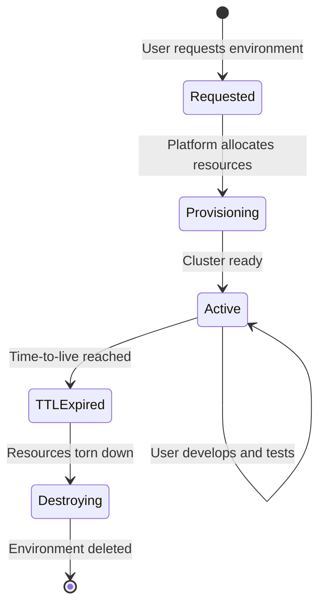

## Overview

Every environment in DEDZED is ephemeral — it is created on demand, used for a defined period, and then automatically destroyed. This is a deliberate architectural decision, not a limitation. Ephemeral environments eliminate configuration drift, reduce the attack surface, and keep infrastructure costs predictable.

## Lifecycle

When you request an environment through the DEDZED Command Dashboard, the platform provisions a fresh Kubernetes cluster with a pre-configured Big Bang stack. The environment remains active until its time-to-live (TTL) expires, at which point all resources are automatically destroyed.

## Benefits

### Security

Ephemeral environments limit the lifespan of sensitive data and running services. An attacker who gains access to an environment has a narrow window before the environment is destroyed along with any persisted state. Each new environment starts from a verified, known-good baseline with no residual artifacts from previous sessions.

### Cost efficiency

Resources are only running when actively needed. Automatic destruction prevents idle environments from accumulating cost. This model makes it practical to give every developer their own full-stack environment without overprovisioning shared infrastructure.

### Reproducibility

Each environment starts from the same base configuration. There is no accumulated drift from manual changes, ad-hoc patches, or forgotten experiments. If a test passes in one environment, you can be confident that a fresh environment will produce the same result.

### Isolation

Each user gets a dedicated environment that does not share state with other users. This prevents cross-contamination between projects and ensures that one team's testing cannot interfere with another's.

### Resource management

By limiting concurrent environments per user, DEDZED ensures fair allocation of cloud resources across the platform. Automatic destruction frees resources back to the pool promptly.

## How it works

| Phase | What happens |
|-------|-------------|
| **Request** | You select an environment type and configuration in the DEDZED Command Dashboard |
| **Provision** | The platform creates a Kubernetes cluster with Big Bang and your selected add-ons |
| **Use** | You access the cluster through your Kasm workspace and deploy, test, and iterate |
| **Destroy** | When the TTL expires, all cluster resources, persistent volumes, and networking are torn down |

<Tip>
Save your work to a Git repository before the TTL expires. Anything not pushed to a remote repository is lost when the environment is destroyed.
</Tip>

## Comparison with persistent environments

| Aspect | Ephemeral (DEDZED) | Persistent (traditional) |
|--------|-------------------|------------------------|
| Configuration drift | None — fresh every time | Accumulates over time |
| Security posture | High — short-lived, no residual state | Degrades without maintenance |
| Cost model | Pay only while active | Always running, always billing |
| Reproducibility | Guaranteed | Depends on maintenance discipline |
| Setup time | Minutes (automated) | Hours to days (manual or semi-automated) |

## Related pages

<CardGroup cols={2}>
  <Card title="What is DEDZED?" icon="circle-info" href="/knowledge-base/what-is-dedzed">
    Platform overview and core capabilities.
  </Card>
  <Card title="Deploying a cluster" icon="server" href="/getting-started/deploying-cluster">
    Step-by-step guide to deploying your ephemeral cluster.
  </Card>
  <Card title="Provision time" icon="clock" href="/getting-started/provision-time">
    What to expect during environment provisioning.
  </Card>
</CardGroup>
