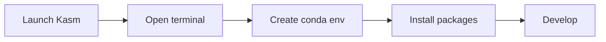

## Overview

DEDZED Kasm workspaces come with Anaconda (`conda`) pre-installed on both Ubuntu and Windows images. This gives you a ready-to-use Python environment with package management and virtual environment support out of the box.



<Tip>
Anaconda is pre-installed on the **SHE BASH Ubuntu** and **Windows 11** workspace images. You do not need to install it manually.
</Tip>

---

## Getting started: Ubuntu

1. Select **SHE BASH Ubuntu** from the Kasm workspace images.
2. Open **Terminal Emulator** from the Applications menu, or right-click the desktop and choose **Open Terminal Emulator Here**.
3. Create and activate a new conda environment:

```bash
# Create an isolated environment (adjust Python version as needed)
conda create --name my-project python=3.10

# Activate the environment
conda activate my-project
```

4. Install common development packages:

```bash
# Jupyter for notebook support
conda install jupyter

# python-dotenv for .env file support
conda install -c conda-forge python-dotenv
```

Follow the interactive prompts to confirm package installation.

### Using VS Code

You can open any project in VS Code directly from the terminal:

```bash
code /path/to/your/project
```

VS Code will prompt you to install the Python extension on first use. Once installed, you can run Jupyter Notebooks (`.ipynb` files) directly in the editor.

If you open a new terminal inside VS Code (`Ctrl+~`), you need to re-activate your conda environment in that terminal session:

```bash
conda activate my-project
```

### Example: AskSage repository

To test your setup with an example project that uses LLM APIs:

```bash
git clone https://github.com/Ask-Sage/AskSage-Open-Source-Community.git
cd AskSage-Open-Source-Community
code .
```

Then install the project dependencies:

```bash
pip install -r requirements.txt
```

<Info>
A paid AskSage subscription is required for API access when using this example repository.
</Info>

---

## Getting started: Windows 11

1. From the **Start** menu, search for **Anaconda**.
2. Open **Anaconda Prompt**.
3. Create and activate a new environment:

```bash
conda create --name my-project python=3.10
conda activate my-project
```

4. Follow the on-screen prompts and press `Y` to confirm package installation.

---

## Common conda commands

| Command | Purpose |
|---------|---------|
| `conda create --name <env> python=<ver>` | Create a new environment |
| `conda activate <env>` | Activate an environment |
| `conda deactivate` | Deactivate the current environment |
| `conda list` | List installed packages |
| `conda install <package>` | Install a package |
| `conda install -c conda-forge <package>` | Install from conda-forge |
| `conda env list` | List all environments |
| `conda env remove --name <env>` | Delete an environment |

<Warning>
Kasm environments are ephemeral. Save your code to a Git repository before your session expires. Conda environments and installed packages are not persisted across sessions.
</Warning>

---

## Related pages

<CardGroup cols={2}>
  <Card title="Working within Kasm" icon="desktop" href="/kasm-workspaces/working-within-kasm">
    Learn how to use the Kasm browser-based desktop environment.
  </Card>
  <Card title="Install software" icon="download" href="/kasm-workspaces/install-software">
    How to install additional tools in your Kasm workspace.
  </Card>
  <Card title="DEDZED AI" icon="robot" href="/knowledge-base/dedzed-ai">
    Use AI-powered coding assistance in your workspace.
  </Card>
  <Card title="Ephemeral environments" icon="clock" href="/knowledge-base/ephemeral-environments">
    Why DEDZED environments are temporary by design.
  </Card>
</CardGroup>
