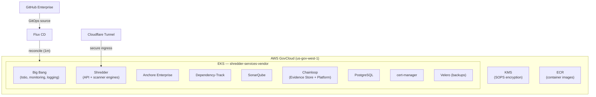

## Overview

The [`shebashio/d3dz3d-shredder-infra`](https://github.icbm.dev/shebashio/d3dz3d-shredder-infra) repository contains the infrastructure-as-code and GitOps configuration for the [Shredder](/knowledge-base/shredder) security scanning platform. It provisions an EKS cluster in AWS GovCloud (`us-gov-west-1`), deploys Big Bang as the DevSecOps baseline, and layers on the scanning engines, supply chain tooling, and supporting services that make up Shredder.

Everything is managed through **Flux CD** — changes pushed to `main` are automatically reconciled to the cluster within one minute.

## Architecture



## Deployed services

The repository manages 15 applications via Kustomize overlays under `apps/`:

| Application | Namespace | Purpose |
|---|---|---|
| **Shredder** | `shredder` | Core scanning API and scanner engine containers |
| **Big Bang** | `bigbang` | DevSecOps baseline (Istio, monitoring, logging, policies) |
| **Anchore Enterprise** | `anchore` | Container image analysis and policy enforcement |
| **SonarQube** | `sonarqube` | Static code analysis and quality metrics |
| **Dependency-Track** | `dependency-track` | Continuous SBOM analysis and vulnerability monitoring |
| **Chainloop Evidence Store** | `chainloop-evidence-store` | Controlplane and content-addressable storage for attestations |
| **Chainloop Platform** | `chainloop-platform` | Frontend UI, backend API, and NATS event bus |
| **PostgreSQL** | `postgres` | Shared database (dev, staging, and prod instances) |
| **cert-manager** | `cert-manager` | Automatic TLS certificate provisioning |
| **Flux** | `flux-system` | GitOps reconciliation engine |
| **Velero** | `velero` | Kubernetes backup and disaster recovery |
| **Kubernetes Event Exporter** | — | Forwards cluster events for observability |
| **Certificates** | — | TLS certificate resources |
| **Flux Bootstrap** | `flux-system` | Initial Flux installation manifests |

### Shredder application

The Shredder app is deployed via **Flux HelmRelease** with the Helm chart sourced from the application code repository ([`shebashio/shredder`](https://github.icbm.dev/shebashio/shredder)). The chart lives alongside the application code so it versions with the app.

The deployment follows a **staging → production** promotion model:

1. New builds on `master` of the Shredder code repo push images to ECR
2. The `update-staging-images` workflow detects the new tag and updates `apps/shredder/staging/configmap.yaml`
3. Flux deploys the new tag to staging automatically
4. After validation, the `promote-to-prod` workflow copies the tag to `apps/shredder/prod/configmap.yaml`

Each environment has its own Kustomize overlay with environment-specific values, encrypted secrets (SOPS), PostgreSQL instance, and Cloudflare Tunnel configuration (staging uses a tunnel for external access).

### Chainloop

Chainloop provides supply chain attestation for Shredder scan results. It consists of two components deployed in order:

- **Evidence Store** — the Controlplane and CAS (Content Addressable Storage) that store attestation data
- **Platform** — the frontend UI and backend API for managing attestations

Both are deployed via Flux HelmRelease from OCI charts at `chainloop.azurecr.io`. The Platform backend connects to the Evidence Store via Kubernetes DNS cross-namespace communication.

## Terraform infrastructure

Infrastructure provisioning uses Terraform organized into modules and environment-specific configurations.

### Environment: `shredder-services-vendor`

| Layer | Path | Resources |
|---|---|---|
| `base_core_infra` | `terraform/environments/shredder-services-vendor/base_core_infra/` | VPC, EKS cluster, node groups, OIDC provider, RDS (Anchore), KMS, Velero S3 bucket, Cloudflare Tunnel, autoscaler, IAM roles (IRSA), Gateway API CRDs |
| `base_core_k8s` | `terraform/environments/shredder-services-vendor/base_core_k8s/` | Cilium CNI, Kubernetes providers, in-cluster configuration |

### Modules

| Module | Purpose |
|---|---|
| `day1` | Base cluster bootstrapping — Big Bang, Flux, cert-manager, certificates, Cilium, external-dns, external-secrets, MinIO, PostgreSQL, Reloader, Velero, storage classes |
| `rds-anchore` | RDS PostgreSQL instance for Anchore Enterprise |

### Key Terraform resources

- **EKS cluster** with managed node groups and cluster autoscaler
- **IRSA** (IAM Roles for Service Accounts) for fine-grained pod-level AWS access
- **KMS key** (`alias/eks/shredder-services-vendor`) for SOPS secret decryption with a dedicated IAM role (`kustomize-controller-shredder`) scoped to this cluster only
- **Velero S3 bucket** for Kubernetes backup storage
- **Cloudflare Tunnel** for secure external access without public load balancers
- **RDS PostgreSQL** for Anchore Enterprise

## Secrets management

All secrets are encrypted with **SOPS** using a cluster-specific AWS KMS key before being committed to the repository. Flux decrypts them at reconciliation time using an IAM role attached to the `kustomize-controller` service account.

The KMS key for the shredder cluster is isolated from other DEDZED clusters (e.g., d3dz3d-core) so that a compromise of one cluster cannot decrypt secrets from another.

```
.sops.yaml              → KMS key configuration
apps/*/prod/secrets.enc.yaml   → Encrypted production secrets
apps/*/staging/*.enc.yaml      → Encrypted staging secrets
```

## CI/CD pipelines

All workflows run on self-hosted runners (`d3dz3d-runner-set`).

### Update staging images

**Workflow:** `update-staging-images.yml`

Runs every 30 minutes and on `repository_dispatch` from Shredder builds. Checks the latest successful `build-and-push` workflow run on the Shredder code repo's `master` branch, extracts the image tag (format: `master-<7-char-sha>`), and updates the staging configmap if the tag has changed.

### Promote to production

**Workflow:** `promote-to-prod.yml`

Manually triggered (workflow_dispatch) with an optional tag override. Reads the current staging tag (or the override) and writes it to the production configmap. Requires the `D3DZED-GOV-PROD` environment approval.

### Renovate

**Workflow:** `renovate.yml`

Runs weekly (Monday 8am MT) to update dependency versions across the repository. Uses a GitHub App token for authenticated access.

## Repository structure

```
shebashio/d3dz3d-shredder-infra/
├── apps/
│   ├── shredder/                  # Shredder scanning platform
│   │   ├── base/                  # Base Kustomize (HelmRelease, GitRepo)
│   │   ├── staging/               # Staging overlay + Cloudflare Tunnel
│   │   └── prod/                  # Production overlay
│   ├── bigbang/                   # Big Bang DevSecOps platform
│   │   ├── base/
│   │   └── prod/
│   ├── anchore-enterprise/        # Container image analysis
│   ├── sonarqube/                 # Static analysis
│   ├── dependency-track/          # SBOM analysis (v4.11.3)
│   ├── chainloop-evidence-store/  # Attestation storage
│   ├── chainloop-platform/        # Attestation UI
│   ├── postgres/                  # PostgreSQL (dev/staging/prod)
│   ├── cert-manager/              # TLS certificates
│   ├── certificates/              # Certificate resources
│   ├── flux-bootstrap/            # Flux installation
│   ├── flux/                      # Flux manifests
│   ├── kubernetes-event-exporter/ # Event forwarding
│   └── velero/                    # Backup and recovery
├── terraform/
│   ├── environments/
│   │   └── shredder-services-vendor/
│   │       ├── base_core_infra/   # VPC, EKS, RDS, KMS, IAM
│   │       └── base_core_k8s/    # Cilium, in-cluster config
│   └── modules/
│       ├── day1/                  # Cluster bootstrap module
│       └── rds-anchore/           # Anchore RDS module
├── docs/                          # Internal deployment guides
├── hooks/                         # Git hooks
├── .sops.yaml                     # SOPS KMS configuration
├── renovate.json                  # Renovate bot configuration
└── .github/workflows/
    ├── update-staging-images.yml  # Auto-update staging tags
    ├── promote-to-prod.yml        # Manual production promotion
    └── renovate.yml               # Dependency updates
```

## Related pages

<CardGroup cols={2}>
  <Card title="Shredder" icon="shield-halved" href="/knowledge-base/shredder">
    Scanning engines, quality gates, and AI-powered analysis.
  </Card>
  <Card title="Image build process" icon="box" href="/knowledge-base/image-build-process">
    How DEDZED builds and publishes container images.
  </Card>
  <Card title="DEDZED Command Dashboard" icon="grid-2" href="/knowledge-base/command-dashboard">
    The main portal for environment and security management.
  </Card>
  <Card title="What is DEDZED?" icon="circle-info" href="/knowledge-base/what-is-dedzed">
    Platform overview and core capabilities.
  </Card>
</CardGroup>
