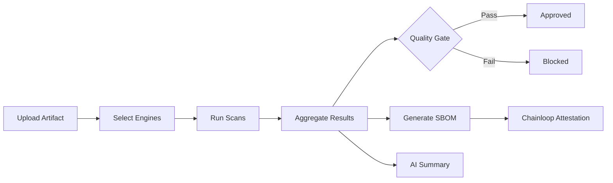

## Overview

Shredder is the DEDZED security scanning platform. It aggregates multiple open-source and commercial scanning engines into a single interface, giving you a unified view of vulnerabilities, license risks, and compliance issues across your artifacts. Shredder is accessible at [https://shredder.icbm.dev](https://shredder.icbm.dev) from within a [Kasm session](/kasm-workspaces/working-within-kasm).

<Info>
Shredder is an internal service and can only be reached from within an active Kasm session. See [Zero trust access](/knowledge-base/zero-trust) for details on the DEDZED network access model.
</Info>

## Scanning workflow

You upload an artifact (container image, source archive, or filesystem snapshot), select which scanning engines to run, and Shredder executes them in parallel. Results are aggregated into a single report, evaluated against your quality gates, and attached to a Chainloop attestation.

## Scanning engines

Shredder integrates the following tools to provide comprehensive coverage across scan types:

| Engine | Category | Purpose |
|--------|----------|---------|
| **Grype** | SCA | Identifies known vulnerabilities in dependencies |
| **Trivy** | Container / filesystem | Scans for CVEs, misconfigurations, and secrets |
| **Semgrep** | SAST | Pattern-based source code analysis |
| **SonarQube** | Code quality | Security and quality analysis with language-specific rulesets |
| **Ghidra** | Binary analysis | Reverse engineering for compiled artifacts |
| **Syft** | SBOM | Software bill of materials generation |
| **Dependency-Track** | Supply chain | Continuous SBOM analysis and vulnerability monitoring |
| **Chainloop** | Attestation | Supply chain attestation and evidence collection |

### Coverage by scan type

| Scan type | Engines |
|-----------|---------|
| Vulnerability detection (CVE) | Grype, Trivy |
| Static code analysis (SAST) | Semgrep, SonarQube |
| Container image scanning | Trivy |
| Binary analysis | Ghidra |
| SBOM generation | Syft |
| Supply chain monitoring | Dependency-Track, Chainloop |
| Secrets detection | Trivy |
| License compliance | Grype, Dependency-Track |

## Quality gates

Shredder allows you to define custom pass/fail criteria that form **quality gates** for scanned artifacts. Gates evaluate scan results against your defined thresholds and determine whether an artifact is approved or blocked.

Different environments can enforce different gates. For example:

- A **development** gate may allow artifacts with known CVEs to pass, enabling rapid iteration without blocking builds on every finding.
- A **production** gate may enforce strict limits on CVE count, severity thresholds, or license types — blocking any artifact that does not meet compliance requirements.

| Gate parameter | Description | Example |
|---------------|-------------|---------|
| Max critical CVEs | Maximum number of critical-severity vulnerabilities allowed | 0 for production, 5 for development |
| Max high CVEs | Maximum number of high-severity vulnerabilities allowed | 0 for production, 20 for development |
| Blocked licenses | License types that cause an automatic failure | GPL-3.0, AGPL-3.0 |
| Required SBOM | Whether an SBOM must be generated | Required for production |
| Secrets detected | Whether any detected secrets cause failure | Always fail |

This gives teams the flexibility to shift security left without slowing down development, while still enforcing hard requirements before production deployment.

## Attestation and CBOM

Shredder generates a cryptographic bill of materials (CBOM) for cryptographic asset findings discovered during scans. All scan outputs are attached to a Chainloop attestation, providing a verifiable record of what was scanned, what was found, and what cryptographic assets are in use across your artifacts.

The attestation workflow:

1. Shredder completes all selected scans on the artifact
2. Syft generates an SBOM capturing all components and dependencies
3. Shredder identifies cryptographic assets and produces a CBOM
4. Scan results, SBOM, and CBOM are bundled into a Chainloop attestation
5. The attestation is signed and stored for audit and verification

## AI summary

Shredder uses a large language model to review completed scans and generate a report summarizing findings. The AI report highlights key vulnerabilities, prioritizes them by risk, and provides actionable remediation guidance — giving you a readable overview without manually triaging every finding.

## AI Inspect

For deeper analysis, Shredder offers **AI Inspect** — a web service that spawns a Claude Code container with a web interface to examine scanned code more closely. You provide your own Anthropic API key, and Shredder launches an interactive Claude Code session against the codebase so you can investigate findings, trace vulnerabilities to their root cause, and generate fixes.

<Warning>
AI Inspect requires your own Anthropic API key. Usage costs are billed to your account.
</Warning>

## Related pages

<CardGroup cols={2}>
  <Card title="DEDZED AI" icon="robot" href="/knowledge-base/dedzed-ai">
    AI-powered vulnerability analysis and remediation guidance.
  </Card>
  <Card title="Zero trust access" icon="shield" href="/knowledge-base/zero-trust">
    How DEDZED secures access to platform services.
  </Card>
  <Card title="What is DEDZED?" icon="circle-info" href="/knowledge-base/what-is-dedzed">
    Platform overview and core capabilities.
  </Card>
</CardGroup>
