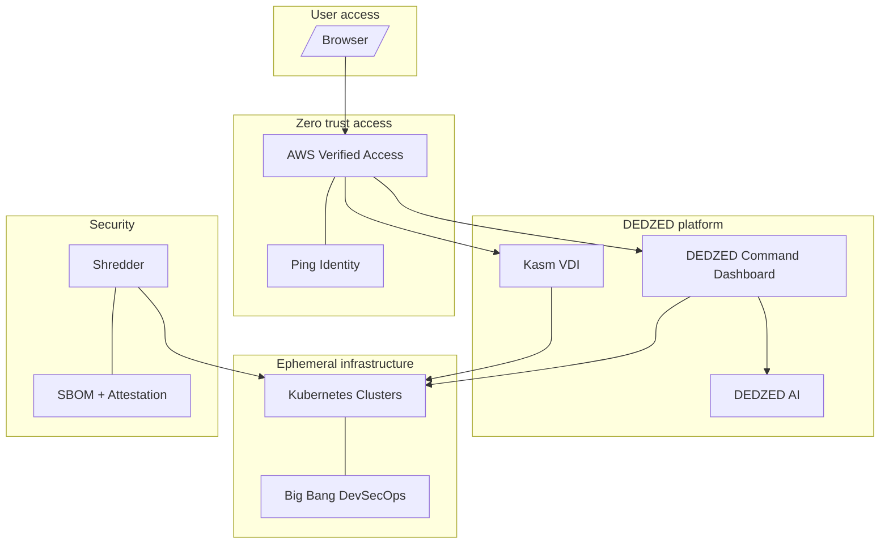

## Overview

DEDZED is an Impact Level 5 (IL5) platform designed for rapid, secure technology assessment and software development. It provides ephemeral development environments backed by Kubernetes, browser-based virtual desktops, zero trust network access, and integrated security scanning — all within a FedRAMP-aligned cloud infrastructure.

DEDZED accelerates development velocity while enforcing the security and compliance requirements of high-impact government workloads.

## Platform architecture

## Core capabilities

### Ephemeral Kubernetes environments

DEDZED provisions on-demand Kubernetes clusters that are destroyed after use. Each environment starts from a clean, known-good state — eliminating configuration drift, reducing the attack surface, and ensuring reproducible test results. See [Why are DEDZED environments ephemeral?](/knowledge-base/ephemeral-environments) for details.

### Browser-based virtual desktops

[Kasm](/kasm-workspaces/working-within-kasm) provides secure, browser-based desktops that give you a full development environment without installing anything on your local machine. Each Kasm session runs in an isolated container with pre-installed tools including VS Code, terminal emulators, and language runtimes.

### Zero trust network access

All access to DEDZED services is mediated by [AWS Verified Access](/knowledge-base/zero-trust) and Ping Identity. There is no VPN. Every connection is authenticated and authorized before access is granted, and no user or device is implicitly trusted.

### Integrated security scanning

[Shredder](/knowledge-base/shredder) aggregates multiple scanning engines (Grype, Trivy, Semgrep, SonarQube, and more) into a single interface with customizable quality gates. Scan results are attached to cryptographic attestations for supply chain verification.

### AI-powered development

[DEDZED AI](/knowledge-base/dedzed-ai) brings agentic AI capabilities across the platform — from coding assistance in your Kasm workspace to automated operations in the DEDZED Command Dashboard and vulnerability analysis in Shredder.

### GitOps integration

DEDZED supports GitOps-driven deployment workflows across AWS and Azure Government environments. Application configurations are stored in Git, and changes are automatically reconciled to the target cluster.

## Who uses DEDZED

DEDZED is built for software development teams working in regulated and high-security environments who need to:

- Rapidly prototype and test software against IL5 compliance requirements
- Evaluate third-party software in a controlled, isolated environment
- Produce security-scanned, attested artifacts ready for production deployment
- Collaborate on development without managing local tool installations or VPN configurations

## Key technologies

| Component | Technology | Purpose |
|-----------|-----------|---------|
| Orchestration | Kubernetes | Container orchestration for ephemeral clusters |
| DevSecOps | Big Bang | Hardened Kubernetes platform with security tooling |
| VDI | Kasm | Browser-based virtual desktop infrastructure |
| Identity | Ping Identity | Authentication and single sign-on |
| Network | AWS Verified Access | Zero trust access without VPN |
| Security | Shredder | Multi-engine vulnerability scanning and attestation |
| AI | DEDZED AI | Agentic coding, operations, and analysis |
| Cloud | AWS / Azure GovCloud | IL5-authorized cloud infrastructure |

## Related pages

<CardGroup cols={2}>
  <Card title="Before you begin" icon="circle-check" href="/getting-started/before-you-begin">
    Prerequisites and requirements for accessing DEDZED.
  </Card>
  <Card title="Ephemeral environments" icon="clock" href="/knowledge-base/ephemeral-environments">
    Why DEDZED environments are temporary by design.
  </Card>
  <Card title="Zero trust access" icon="shield" href="/knowledge-base/zero-trust">
    How DEDZED secures access to platform services.
  </Card>
  <Card title="Shredder" icon="shield-halved" href="/knowledge-base/shredder">
    Unified security scanning with quality gates.
  </Card>
</CardGroup>
