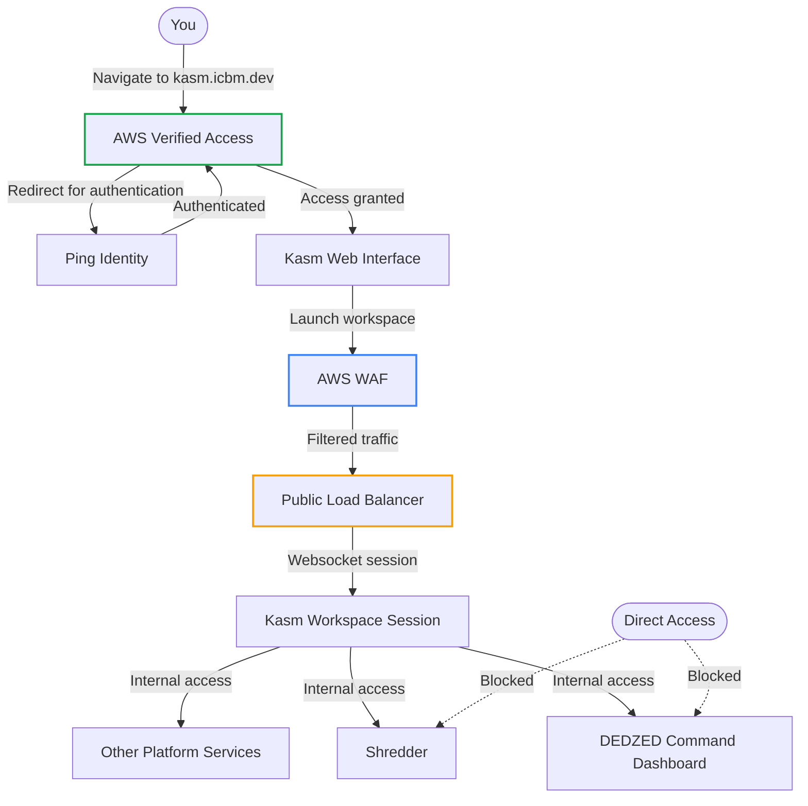

## Overview

DEDZED enforces a zero trust access model — no user or device is implicitly trusted, and every connection is authenticated and authorized before access is granted. Instead of a traditional VPN, DEDZED uses [AWS Verified Access](https://aws.amazon.com/verified-access/) to protect service endpoints without requiring any client software installation.

Not all DEDZED services sit behind Verified Access directly. Kasm VDI (`kasm.icbm.dev`) is the Verified Access-protected entry point. Once authenticated into a Kasm session, you can reach internal services like DEDZED Command Dashboard and Shredder from within that session. Direct access to these internal services from outside Kasm is not available.

## How it works

When you navigate to [https://kasm.icbm.dev](https://kasm.icbm.dev), the following occurs:

1. **AWS Verified Access** intercepts the request and redirects you to **Ping Identity**, the DEDZED identity provider.
2. Ping Identity authenticates your identity and evaluates your authorization.
3. After successful authentication, Verified Access grants access and connects you to the **Kasm VDI** web interface.
4. When you launch a workspace, your browser opens a websocket connection to the Kasm session service through an **AWS WAF** and **public load balancer** — this leg does not pass through Verified Access (see [Current limitations](#current-limitations) below). The WAF provides rate limiting, bot protection, and request filtering on this exposed path.
5. From within your Kasm session, you can reach internal services such as **DEDZED Command Dashboard** (`dedzed.icbm.dev`), **Shredder** (`shredder.icbm.dev`), and other platform tools.

<Info>
Kasm is the jumping-off point for all DEDZED services. You must be in an active Kasm session to access internal tools like Command Dashboard and Shredder. Direct navigation to these services from outside Kasm will not work.
</Info>

## Current limitations

The access path has a split routing model. Initial authentication to `kasm.icbm.dev` is fully protected by AWS Verified Access, but once you launch a Kasm workspace, the desktop session connects over a websocket through a public load balancer. This websocket connection is not covered by Verified Access. An AWS WAF sits in front of the public load balancer to mitigate this exposure with rate limiting, IP reputation filtering, and managed rule sets.

<Warning>
AWS Verified Access does not currently support TCP endpoints in GovCloud. Until that capability is available, the Kasm workspace websocket session routes through a public load balancer rather than through Verified Access. A future mitigation using JIT provisioning with Lambda is under consideration but has not been tested.
</Warning>

## Why zero trust?

Traditional perimeter-based security assumes that anything inside the network is trusted. Zero trust eliminates that assumption. Every request is verified regardless of where it originates. AWS Verified Access enforces this by evaluating identity and device posture on each connection attempt, providing clientless access without the overhead of a VPN.

## Related pages

<CardGroup cols={2}>
  <Card title="Before you begin" icon="circle-check" href="/getting-started/before-you-begin">
    Prerequisites and requirements for accessing DEDZED.
  </Card>
  <Card title="Working within Kasm" icon="desktop" href="/kasm-workspaces/working-within-kasm">
    Learn how to use the Kasm browser-based desktop environment.
  </Card>
</CardGroup>
