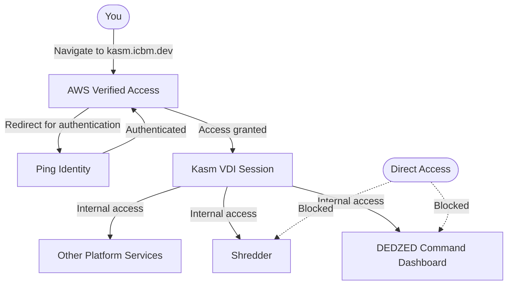

## Overview

DEDZED enforces a zero trust access model — no user or device is implicitly trusted, and every connection is authenticated and authorized before access is granted. Instead of a traditional VPN, DEDZED uses [AWS Verified Access](https://aws.amazon.com/verified-access/) to protect service endpoints without requiring any client software installation.

Not all DEDZED services sit behind Verified Access directly. Kasm VDI (`kasm.icbm.dev`) is the Verified Access-protected entry point. Once authenticated into a Kasm session, you can reach internal services like DEDZED Command Dashboard and Shredder from within that session. Direct access to these internal services from outside Kasm is not available.

## How it works

When you navigate to [https://kasm.icbm.dev](https://kasm.icbm.dev), the following occurs:

1. **AWS Verified Access** intercepts the request and redirects you to **Ping Identity**, the DEDZED identity provider.
2. Ping Identity authenticates your identity and evaluates your authorization.
3. After successful authentication, Verified Access grants access and connects you to the **Kasm VDI**.
4. From within your Kasm session, you can reach internal services such as **DEDZED Command Dashboard** (`dedzed.icbm.dev`), **Shredder** (`shredder.icbm.dev`), and other platform tools.

<Info>
Kasm is the jumping-off point for all DEDZED services. You must be in an active Kasm session to access internal tools like Command Dashboard and Shredder. Direct navigation to these services from outside Kasm will not work.
</Info>

## Why zero trust?

Traditional perimeter-based security assumes that anything inside the network is trusted. Zero trust eliminates that assumption. Every request is verified regardless of where it originates. AWS Verified Access enforces this by evaluating identity and device posture on each connection attempt, providing clientless access without the overhead of a VPN.

## Related pages

<CardGroup cols={2}>
  <Card title="Before you begin" icon="circle-check" href="/getting-started/before-you-begin">
    Prerequisites and requirements for accessing DEDZED.
  </Card>
  <Card title="Working within Kasm" icon="desktop" href="/kasm-workspaces/working-within-kasm">
    Learn how to use the Kasm browser-based desktop environment.
  </Card>
</CardGroup>
