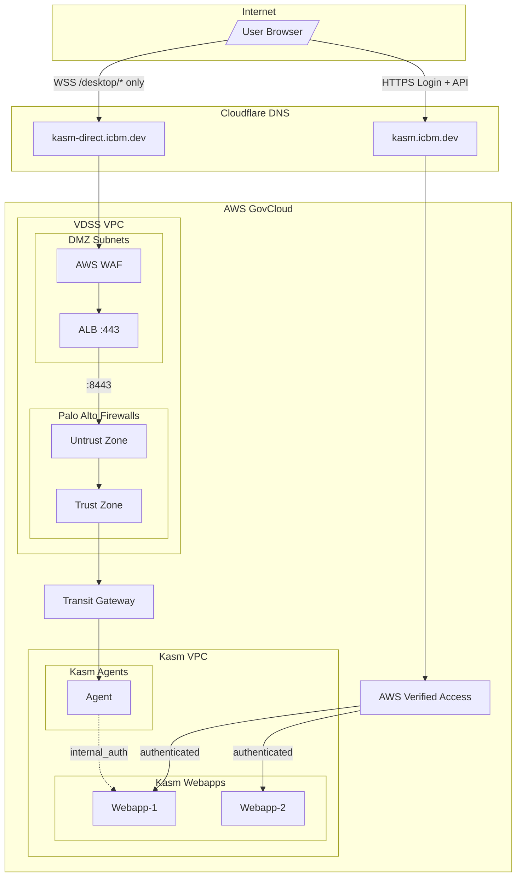
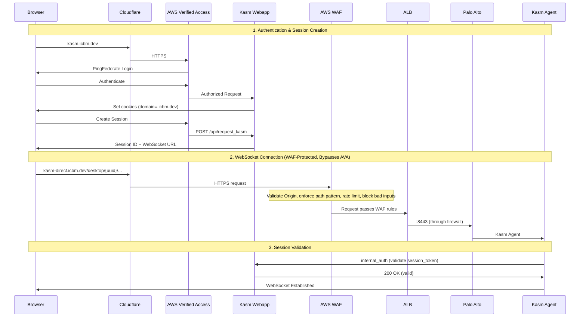

## Overview

DEDZED enforces a zero trust access model — no user or device is implicitly trusted, and every connection is authenticated and authorized before access is granted. Instead of a traditional VPN, DEDZED uses [AWS Verified Access](https://aws.amazon.com/verified-access/) to protect service endpoints without requiring any client software installation.

Kasm VDI uses a **dual-ingress architecture** to work around AWS Verified Access (AVA) not supporting WebSockets:

- **kasm.icbm.dev** — AVA-protected endpoint for authentication and API calls
- **kasm-direct.icbm.dev** — WAF-protected endpoint for WebSocket desktop connections (bypasses AVA)

The `kasm-direct` endpoint is a **controlled public endpoint**. While it is internet-facing by design (users must reach it after authenticating through AVA), it is protected by multiple layers of defense that reduce the attack surface to a narrow aperture: only well-formed WebSocket upgrade requests, with the correct Origin, to a valid UUID path, carrying a valid session token, from a non-rate-limited IP can reach the backend.

---

## Architecture diagram

---

## Traffic flow sequence

---

## Endpoints

| Domain | Type | Purpose | Path restrictions |
|--------|------|---------|-------------------|
| `kasm.icbm.dev` | AWS Verified Access | Authentication, API, session management | None (full access) |
| `kasm-direct.icbm.dev` | WAF + ALB | WebSocket desktop connections | `/desktop/{uuid}` (enforced at WAF + ALB) |

---

## Defense-in-depth layers

The `kasm-direct` path is protected by 8 layers. Layers 1–6 reduce noise and block unsophisticated attacks. Layers 7–8 are the hard authentication boundary — even if an attacker crafts a perfect request that passes all WAF and ALB rules, they cannot establish a WebSocket without a valid, user-bound session token.

| Layer | Component | Enforcement | Spoofable via CLI? |
|-------|-----------|-------------|-------------------|
| 1 | **AWS WAF** | Origin header = `https://kasm.icbm.dev` | Yes (curl/scripts can set any Origin) |
| 2 | **AWS WAF** | Path must match `/desktop/{uuid}` regex | Yes (but UUID is unpredictable) |
| 3 | **AWS WAF** | Rate limit 100 req/5min per source IP | Slows brute-force enumeration |
| 4 | **AWS WAF** | Managed rules (OWASP, bad inputs, bots) | Blocks known exploit patterns |
| 5 | **ALB Rules** | Path restricted to `/desktop/*`, else 403 | Redundant path enforcement |
| 6 | **Palo Alto** | Zone-based policy (Untrust to Trust) | Network-level filtering |
| 7 | **Kasm Agent** | `internal_auth` validates `session_token` cookie | Cannot bypass without valid session |
| 8 | **Kasm Agent** | Session ownership — UUID bound to user | Cannot bypass without owning the session |

---

## AWS WAF rule chain

The WAF Web ACL uses the following rule chain:

| Priority | Rule | Type | Action | Purpose |
|----------|------|------|--------|---------|
| 1 | Origin header validation | Custom | Block | Only allow `Origin: https://kasm.icbm.dev` |
| 2 | Path pattern enforcement | Custom | Block | Strict `/desktop/{uuid}` regex enforcement |
| 3 | Rate limit per IP | Rate-based | Block | 100 req/5min per source IP |
| 4 | `AWSManagedRulesCommonRuleSet` | Managed | Block | OWASP top-10 protections |
| 5 | `AWSManagedRulesKnownBadInputsRuleSet` | Managed | Block | Log4j, path traversal, etc. |
| 6 | `AWSManagedRulesBotControlRuleSet` | Managed | Block | Bot detection and blocking |
| Default | — | — | Block | Deny all non-matching requests |

### Origin header validation

Blocks any request where the `Origin` header is not exactly `https://kasm.icbm.dev`. In browsers, Origin is a forbidden header (cannot be spoofed by JavaScript), which eliminates all browser-based attacks including direct navigation, cross-origin scripts, and CSRF.

### Path pattern enforcement

Blocks any request where the URI path does not match `/desktop/{uuid}/...` with a strict UUID v4 regex. This is stricter than the ALB's `/desktop/*` rule — it ensures the second path segment is a valid UUID format, not arbitrary input.

### Rate limiting

Blocks source IPs exceeding 100 requests in a 5-minute window. Prevents brute-force UUID enumeration attempts and basic DoS.

---

## ALB configuration

| Setting | Value |
|---------|-------|
| Certificate | `*.icbm.dev` (ACM) |
| Idle timeout | 3600s (for WebSocket) |
| Sticky sessions | Enabled |

### Listener rules

| Priority | Path | Action |
|----------|------|--------|
| 10 | `/desktop/*` | Forward to target group |
| 100 | `/*` | Return 403 "Access denied" |

---

## Palo Alto firewall rules

| Rule name | Source zone | Dest zone | Service | Action |
|-----------|------------|-----------|---------|--------|
| Allow-NLB-to-Kasm | Untrust | Trust | tcp-8443 | Allow |
| Allow-Kasm-to-DMZ | Trust | Untrust | any | Allow |

---

## Kasm configuration

### Global settings

| Setting | Value | Purpose |
|---------|-------|---------|
| Kasm Auth Domain | `.icbm.dev` | Share cookies across subdomains |

### Zone settings

| Setting | Value | Purpose |
|---------|-------|---------|
| Upstream Auth Address | `kasm.icbm.dev` | Agent validates sessions via webapp |
| Proxy Hostname | `kasm-direct.icbm.dev` | WebSocket connection hostname |
| Proxy Port | `443` | HTTPS port |
| Proxy Path | `desktop` | URL path prefix |

---

## DNS configuration

| Record | Type | Target |
|--------|------|--------|
| `kasm.icbm.dev` | — | AWS Verified Access endpoint |
| `kasm-direct.icbm.dev` | CNAME | Application Load Balancer |

---

## Troubleshooting

| Symptom | Cause | Fix |
|---------|-------|-----|
| 403 from WAF | Origin header missing or incorrect | Verify browser sends `Origin: https://kasm.icbm.dev` |
| 403 from WAF | Path doesn't match UUID regex | Verify URL is `/desktop/{uuid}/...` format |
| 403 from WAF | Rate limited | Check WAF CloudWatch metrics, adjust threshold if needed |
| 403 "Access denied" (plain text) | ALB blocking non-desktop path | Check if path matches `/desktop/*` |
| 403 Forbidden (nginx HTML) | Kasm agent auth failing | Check `session_token` cookie is being sent |
| No cookies sent to kasm-direct | Wrong cookie domain | Set Kasm Auth Domain to `.icbm.dev` |
| Agent internal_auth fails | Wrong Upstream Auth Address | Set to `kasm.icbm.dev` (not kasm-direct) |
| WebSocket timeout | ALB idle timeout too low | Increase to 3600s |

### Verify cookie sharing

Check browser dev tools (Network tab, Request Headers):

- Request to `kasm-direct.icbm.dev` should include `Cookie: session_token=...`
- Request to `kasm-direct.icbm.dev` should include `Origin: https://kasm.icbm.dev`
- If either is missing, check the Kasm Auth Domain setting

---

## Why zero trust?

Traditional perimeter-based security assumes that anything inside the network is trusted. Zero trust eliminates that assumption. Every request is verified regardless of where it originates. AWS Verified Access enforces this by evaluating identity and device posture on each connection attempt, providing clientless access without the overhead of a VPN.

<Warning>
AWS Verified Access does not currently support WebSocket or TCP endpoints in GovCloud. Until that capability is available, the Kasm workspace WebSocket session routes through a WAF-protected public load balancer rather than through Verified Access.
</Warning>

## Related pages

<CardGroup cols={2}>
  <Card title="Before you begin" icon="circle-check" href="/getting-started/before-you-begin">
    Prerequisites and requirements for accessing DEDZED.
  </Card>
  <Card title="Working within Kasm" icon="desktop" href="/kasm-workspaces/working-within-kasm">
    Learn how to use the Kasm browser-based desktop environment.
  </Card>
</CardGroup>
