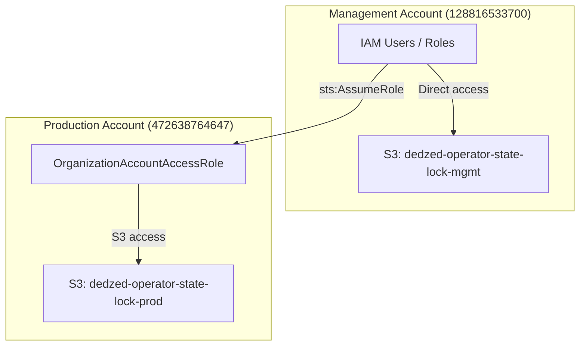

## Overview

Operator State Lock stores all state in AWS S3 buckets hosted in GovCloud. This page covers the multi-account topology, IAM policy requirements, cross-account role configuration, and encryption settings.

## Multi-account topology

Operator State Lock operates across two AWS GovCloud accounts:



- **Management account** — Operators authenticate directly with IAM credentials in this account. The management S3 bucket is accessed directly.
- **Production account** — Operators access the production S3 bucket by assuming the `OrganizationAccountAccessRole` in the production account via `sts:AssumeRole`.

## AWS credential handling

### Management environment

For the management environment, Operator State Lock uses your configured AWS credentials directly. No role assumption is needed.

```bash
# Verify your management credentials
aws sts get-caller-identity --profile management
```

### Production environment

For the production environment, Operator State Lock automatically assumes the `OrganizationAccountAccessRole` in the production account. Your management account credentials must have permission to assume this role.

```bash
# Verify you can assume the production role
aws sts assume-role \
  --role-arn arn:aws-us-gov:iam::472638764647:role/OrganizationAccountAccessRole \
  --role-session-name osl-test \
  --profile management
```

<Info>
Operator State Lock handles the role assumption automatically. You do not need to manually assume roles or manage temporary credentials.
</Info>

## IAM policies

### Operator policy (management account)

Attach this policy to IAM users or roles that need to operate Operator State Lock in the management environment:

```json
{
  "Version": "2012-10-17",
  "Statement": [
    {
      "Sid": "OSLManagementBucketAccess",
      "Effect": "Allow",
      "Action": [
        "s3:GetObject",
        "s3:PutObject",
        "s3:ListBucket",
        "s3:DeleteObject"
      ],
      "Resource": [
        "arn:aws-us-gov:s3:::dedzed-operator-state-lock-mgmt",
        "arn:aws-us-gov:s3:::dedzed-operator-state-lock-mgmt/*"
      ]
    },
    {
      "Sid": "OSLIdentityResolution",
      "Effect": "Allow",
      "Action": "sts:GetCallerIdentity",
      "Resource": "*"
    },
    {
      "Sid": "OSLAssumeProductionRole",
      "Effect": "Allow",
      "Action": "sts:AssumeRole",
      "Resource": "arn:aws-us-gov:iam::472638764647:role/OrganizationAccountAccessRole"
    }
  ]
}
```

### Cross-account role trust policy (production account)

The `OrganizationAccountAccessRole` in the production account must trust the management account:

```json
{
  "Version": "2012-10-17",
  "Statement": [
    {
      "Sid": "TrustManagementAccount",
      "Effect": "Allow",
      "Principal": {
        "AWS": "arn:aws-us-gov:iam::128816533700:root"
      },
      "Action": "sts:AssumeRole",
      "Condition": {}
    }
  ]
}
```

### Cross-account role permissions (production account)

The `OrganizationAccountAccessRole` needs access to the production S3 bucket:

```json
{
  "Version": "2012-10-17",
  "Statement": [
    {
      "Sid": "OSLProductionBucketAccess",
      "Effect": "Allow",
      "Action": [
        "s3:GetObject",
        "s3:PutObject",
        "s3:ListBucket",
        "s3:DeleteObject"
      ],
      "Resource": [
        "arn:aws-us-gov:s3:::dedzed-operator-state-lock-prod",
        "arn:aws-us-gov:s3:::dedzed-operator-state-lock-prod/*"
      ]
    }
  ]
}
```

## S3 bucket configuration

### Bucket creation

Create the S3 buckets in the appropriate GovCloud accounts:

```bash
# Management account
aws s3 mb s3://dedzed-operator-state-lock-mgmt \
  --region us-gov-west-1 \
  --profile management

# Production account (via assumed role)
aws s3 mb s3://dedzed-operator-state-lock-prod \
  --region us-gov-west-1 \
  --profile production
```

### Encryption

Both buckets should use server-side encryption with AWS KMS:

```json
{
  "Rules": [
    {
      "ApplyServerSideEncryptionByDefault": {
        "SSEAlgorithm": "aws:kms",
        "KMSMasterKeyID": "alias/osl-encryption-key"
      },
      "BucketKeyEnabled": true
    }
  ]
}
```

Apply the encryption configuration:

```bash
aws s3api put-bucket-encryption \
  --bucket dedzed-operator-state-lock-mgmt \
  --server-side-encryption-configuration file://encryption.json \
  --profile management
```

### Versioning

Enable versioning on both buckets to protect against accidental deletions:

```bash
aws s3api put-bucket-versioning \
  --bucket dedzed-operator-state-lock-mgmt \
  --versioning-configuration Status=Enabled \
  --profile management
```

### Public access block

Ensure all public access is blocked:

```bash
aws s3api put-public-access-block \
  --bucket dedzed-operator-state-lock-mgmt \
  --public-access-block-configuration \
    BlockPublicAcls=true,IgnorePublicAcls=true,BlockPublicPolicy=true,RestrictPublicBuckets=true \
  --profile management
```

## Bucket policy

Apply a bucket policy that restricts access to the operator IAM entities:

```json
{
  "Version": "2012-10-17",
  "Statement": [
    {
      "Sid": "EnforceEncryptedTransport",
      "Effect": "Deny",
      "Principal": "*",
      "Action": "s3:*",
      "Resource": [
        "arn:aws-us-gov:s3:::dedzed-operator-state-lock-mgmt",
        "arn:aws-us-gov:s3:::dedzed-operator-state-lock-mgmt/*"
      ],
      "Condition": {
        "Bool": {
          "aws:SecureTransport": "false"
        }
      }
    }
  ]
}
```

<Warning>
All S3 access must use HTTPS. The bucket policy above denies any request made over unencrypted HTTP.
</Warning>

## Troubleshooting

### Access denied errors

If you receive `AccessDenied` errors:

1. Verify your identity with `osl whoami`
2. Confirm your IAM user or role has the operator policy attached
3. For production, verify you can assume the `OrganizationAccountAccessRole`
4. Check that the S3 bucket policy does not block your principal

### Cross-account role assumption failures

If `sts:AssumeRole` fails for the production account:

1. Verify the trust policy on `OrganizationAccountAccessRole` includes your management account
2. Confirm your management account IAM entity has `sts:AssumeRole` permission for the production role ARN
3. Check for any SCP (Service Control Policy) restrictions in your AWS Organization

### Region configuration

Operator State Lock expects buckets in `us-gov-west-1`. If your AWS CLI defaults to a different region, set it explicitly:

```bash
export AWS_DEFAULT_REGION=us-gov-west-1
```

## Related pages

<CardGroup cols={2}>
  <Card title="Overview" icon="book" href="/operator-state-lock/index">
    What Operator State Lock is and how it works.
  </Card>
  <Card title="Getting started" icon="rocket" href="/operator-state-lock/getting-started">
    Install and run your first lock cycle.
  </Card>
  <Card title="CLI reference" icon="terminal" href="/operator-state-lock/commands">
    Complete reference for all 11 CLI commands.
  </Card>
  <Card title="Zero trust access" icon="shield" href="/knowledge-base/zero-trust">
    How DEDZED secures access to platform services in GovCloud.
  </Card>
</CardGroup>
