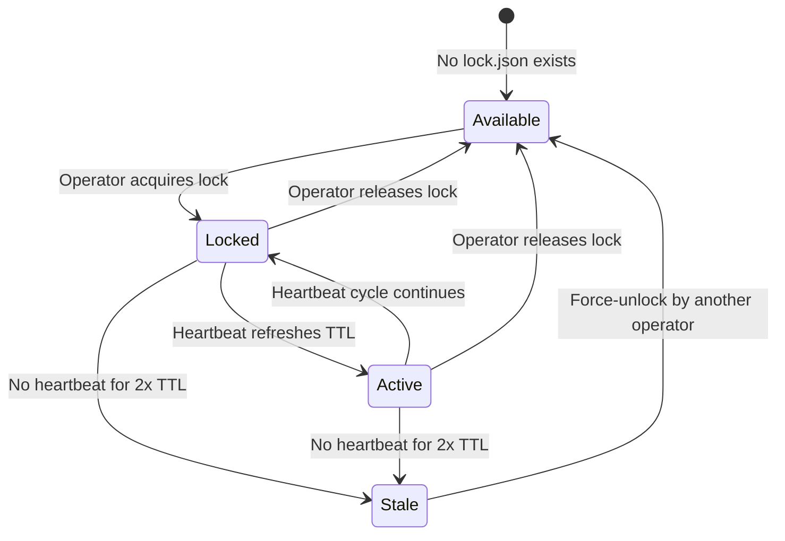

## Overview

Operator State Lock solves a coordination problem: multiple operators (human or AI) working on the same cloud infrastructure need a way to prevent conflicting changes, share context, and build institutional knowledge. This page explains the core concepts that make that possible.

## State locking

State locking is a concurrency control mechanism borrowed from Terraform. When an operator acquires a lock on an environment, no other operator can make changes to that environment until the lock is released. This prevents race conditions where two operators modify the same resources simultaneously.

### Lock data

Each lock is stored as a `lock.json` file in the environment's S3 prefix. The lock contains:

| Field | Type | Description |
|-------|------|-------------|
| `lock_id` | string | Unique identifier for this lock acquisition |
| `operator` | string | Human-readable operator name |
| `operator_arn` | string | AWS IAM ARN of the lock holder |
| `account` | string | AWS account ID |
| `environment` | string | Environment name (`management` or `production`) |
| `purpose` | string | Free-text description of intended work |
| `acquired_at` | ISO 8601 | Timestamp when the lock was acquired |
| `ttl_seconds` | integer | Time-to-live in seconds (default: 300) |

### Lock lifecycle



A lock transitions through these states:

1. **Available** — No `lock.json` exists. Any operator can acquire the lock.
2. **Locked** — An operator holds the lock. The heartbeat process keeps it alive.
3. **Active** — The heartbeat has refreshed the TTL at least once, confirming the operator is still working.
4. **Stale** — No heartbeat has been received for longer than 2x the TTL (default: 10 minutes). The lock can be force-released.

### TTL and expiration

The default TTL is **300 seconds** (5 minutes). The heartbeat process refreshes this TTL every **60 seconds**. If the heartbeat stops (operator disconnects, process crashes), the lock becomes stale after **2x TTL** (10 minutes by default).

<Warning>
A stale lock does not automatically release. Another operator must explicitly run `force-unlock` to reclaim the environment. This prevents accidental release of locks held by operators experiencing temporary network issues.
</Warning>

## Heartbeat mechanism

When you acquire a lock, Operator State Lock spawns a background subprocess that sends heartbeat signals to S3 every 60 seconds. The heartbeat updates the lock's timestamp, proving the operator is still active.

The heartbeat subprocess:

- Starts automatically when you run `osl lock`
- Runs in the background for the duration of your session
- Updates the lock file in S3 every 60 seconds
- Is automatically killed when you run `osl unlock`
- Can be manually checked with `osl heartbeat`

If the heartbeat stops, other operators can detect the stale lock via `osl status` and reclaim the environment with `osl force-unlock`.

## Change tracking

Every infrastructure modification must be recorded in the append-only change log, regardless of whether it succeeded or failed. This creates an audit trail that future operators can review before starting their own work.

### Change log format

Changes are stored as JSONL (JSON Lines) in `changes.jsonl` within each environment's S3 prefix. Each line is a self-contained JSON object:

```json
{
  "id": "chg_a1b2c3d4",
  "timestamp": "2025-03-15T14:30:00Z",
  "operator": "jane.smith",
  "environment": "management",
  "action": "Updated Big Bang Helm values",
  "description": "Bumped Istio to 1.20.3 for CVE-2024-1234 fix",
  "files_touched": ["bigbang/values.yaml"],
  "tags": ["bigbang", "istio", "cve"],
  "status": "success",
  "lock_id": "lock_x9y8z7"
}
```

### Change entry fields

| Field | Type | Description |
|-------|------|-------------|
| `id` | string | Unique change identifier |
| `timestamp` | ISO 8601 | When the change was recorded |
| `operator` | string | Who made the change |
| `environment` | string | Which environment was modified |
| `action` | string | Short description of the action |
| `description` | string | Detailed description of what changed |
| `files_touched` | array | List of files or resources modified |
| `tags` | array | Categorization tags for filtering |
| `status` | string | `success` or `failed` |
| `lock_id` | string | Lock ID under which this change was made |

<Info>
The change log is append-only. Entries are never modified or deleted. This ensures a complete audit trail for compliance and operational review.
</Info>

### Why record failures

Recording failed changes is just as important as recording successful ones. A future operator who sees that a particular change failed can avoid repeating the same mistake or can investigate why it failed before attempting a similar operation.

## Lessons learned

The lessons learned system captures operational knowledge that persists across operator sessions. When you discover something important — a workaround, a gotcha, a best practice — you record it as a lesson so future operators benefit from your experience.

### Lesson structure

```json
{
  "lesson": "Istio upgrade requires gateway restart after Helm sync",
  "tags": ["istio", "upgrade", "gateway"],
  "severity": "high",
  "related_changes": ["chg_a1b2c3d4"],
  "environment": "management"
}
```

### Severity levels

| Severity | When to use |
|----------|-------------|
| `info` | General tips, preferences, or observations that may be helpful |
| `high` | Important operational knowledge that could prevent errors or save significant time |
| `critical` | Must-know information that could cause outages, data loss, or security issues if ignored |

Lessons are stored in two locations:

- **Environment-specific** — `environments/{env}/lessons.jsonl` for lessons that apply to a single environment
- **Global** — `global/lessons.jsonl` for cross-environment lessons

### Reading lessons before acting

The Operator State Lock workflow requires reading lessons before acquiring a lock. This ensures you are aware of any critical knowledge from previous operators before you start modifying infrastructure.

<Tip>
Always filter lessons by relevant tags before starting work. For example, if you plan to modify Istio configuration, run `osl lessons --tags istio` to see what previous operators learned.
</Tip>

## S3 bucket structure

All Operator State Lock data is stored in S3 buckets in AWS GovCloud. The bucket structure is:

```
s3://{bucket}/
├── environments/
│   ├── management/
│   │   ├── lock.json          # Current lock holder
│   │   ├── changes.jsonl      # Append-only change log
│   │   └── lessons.jsonl      # Environment-specific lessons
│   └── production/
│       ├── lock.json
│       ├── changes.jsonl
│       └── lessons.jsonl
├── global/
│   ├── lessons.jsonl          # Cross-environment lessons
│   └── operators.json         # Auto-populated operator registry
└── config.json
```

The `operators.json` file is auto-populated as operators interact with the system. Each time an operator runs `osl whoami` or acquires a lock, their identity is recorded in the registry.

## Operator identity

Operator State Lock uses AWS STS to resolve operator identity. When you run `osl whoami`, it calls `sts:GetCallerIdentity` to determine your IAM ARN, account ID, and user or role name. This identity is automatically attached to every lock acquisition, change record, and lesson.

No manual registration is required. Your AWS credentials are your identity.

## Related pages

<CardGroup cols={2}>
  <Card title="Getting started" icon="rocket" href="/operator-state-lock/getting-started">
    Install Operator State Lock and complete your first lock cycle.
  </Card>
  <Card title="CLI reference" icon="terminal" href="/operator-state-lock/commands">
    Complete reference for all 11 CLI commands.
  </Card>
  <Card title="Lessons learned" icon="graduation-cap" href="/operator-state-lock/lessons-learned">
    Best practices for writing and querying lessons.
  </Card>
  <Card title="AWS configuration" icon="cloud" href="/operator-state-lock/aws-configuration">
    GovCloud S3 setup and IAM configuration.
  </Card>
</CardGroup>
