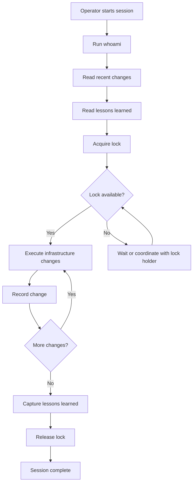

## Overview

Operator State Lock provides Terraform-style state locking for multi-operator Claude sessions running against shared cloud infrastructure. When multiple operators work on the same DEDZED environment, Operator State Lock prevents conflicting changes by enforcing exclusive access, recording every modification, and capturing lessons learned for future operators.

Operator State Lock is a Go CLI binary backed by AWS S3 in GovCloud. It requires no web UI, no database, and no running server — just an S3 bucket and valid AWS credentials.

<Info>
Operator State Lock is designed for DEDZED platform operators managing infrastructure in AWS GovCloud. It coordinates human and AI operators (Claude sessions) working on the same environment.
</Info>

## How it works



Every operator session follows the same workflow: identify yourself, review what others have done, acquire the lock, make changes, record what you did, share what you learned, and release the lock.

## Capabilities

| Capability | Description |
|------------|-------------|
| **State locking** | Exclusive environment locks with automatic TTL expiration and heartbeat monitoring |
| **Change tracking** | Append-only JSONL log of every infrastructure modification with operator attribution |
| **Lessons learned** | Structured knowledge base of operational insights shared across all operators |
| **Multi-account support** | Coordinate across AWS GovCloud management and production accounts |
| **Operator identity** | Automatic identity resolution via AWS STS — no manual registration required |
| **Stale lock recovery** | Force-unlock capability for abandoned sessions with full audit trail |
| **Heartbeat monitoring** | Background heartbeat process detects and flags stale locks |

## Supported environments

Operator State Lock manages two DEDZED environments in AWS GovCloud:

| Environment | AWS account | S3 bucket |
|-------------|-------------|-----------|
| Management | `128816533700` | `dedzed-operator-state-lock-mgmt` |
| Production | `472638764647` | `dedzed-operator-state-lock-prod` |

Each environment maintains its own lock state, change log, and lessons learned. A global store holds cross-environment lessons and the auto-populated operator registry.

## Quick start

```bash
# Check your identity
osl whoami

# Review recent changes before starting
osl changes --env management --last 10

# Read lessons from previous operators
osl lessons --env management

# Acquire the lock
osl lock --env management --purpose "Updating Big Bang Helm values"

# Do your work, then record what you did
osl record --env management \
  --action "Updated Big Bang Helm values" \
  --description "Bumped Istio to 1.20.3 for CVE-2024-1234 fix" \
  --files "bigbang/values.yaml" \
  --tags "bigbang,istio,cve"

# Share what you learned
osl learn --env management \
  --lesson "Istio upgrade requires gateway restart after Helm sync" \
  --tags "istio,upgrade" \
  --severity high

# Release the lock
osl unlock --env management
```

## Related pages

<CardGroup cols={2}>
  <Card title="Concepts" icon="lightbulb" href="/operator-state-lock/concepts">
    State locking theory, change tracking, and heartbeat mechanism.
  </Card>
  <Card title="Getting started" icon="rocket" href="/operator-state-lock/getting-started">
    Install Operator State Lock and run your first lock cycle.
  </Card>
  <Card title="CLI reference" icon="terminal" href="/operator-state-lock/commands">
    Complete reference for all 11 CLI commands.
  </Card>
  <Card title="AWS configuration" icon="cloud" href="/operator-state-lock/aws-configuration">
    GovCloud S3 setup and multi-account IAM configuration.
  </Card>
</CardGroup>
