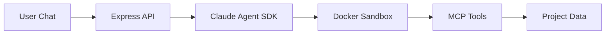

## Overview

ezRMF includes an AI agent powered by the Claude Agent SDK that runs in isolated Docker containers. The agent has access to your project files, controls, evidence, and the full NIST 800-53 catalog through MCP tools. It operates within session-scoped, ephemeral sandboxes that never touch your host system.

## How the agent works

When you interact with the agent through the chat interface, ezRMF spins up an isolated Docker container for the session. The agent can read your project data, query controls, classify evidence, and take action — all within the sandbox.



| Component | Description |
|-----------|-------------|
| **Chat UI** | Real-time streaming chat with message bubbles, tool blocks, and ask/answer flow |
| **Agent SDK** | Session management, streaming, tool dispatch, and ask/answer blocking |
| **Docker sandbox** | Isolated container with filesystem access to project files |
| **MCP tools** | 30+ tools for querying controls, evidence, NIST catalog, and project data |

## Agent capabilities

The agent can perform six core operations on your compliance data:

| Step | What it does |
|------|-------------|
| **Parse and extract** | Read SSPs, policies, and evidence to extract control implementations and CCI references |
| **Map controls and CCIs** | Match extracted text to NIST 800-53 controls and DISA CCI definitions, assign baselines |
| **Classify evidence** | Auto-classify uploaded files by document type, RMF phase, and linked controls |
| **Identify gaps** | Surface controls without implementation, evidence, or CCI results and generate POAM items |
| **Generate documents** | Draft SSPs, SARs, SCTMs, policies, SOPs, authorization memos, test results, and architecture diagrams |
| **Export and package** | Generate eMASS-formatted Excel, CCI test results, and POAM reports |

## Chat interface

The project chat panel provides an interactive conversation with the agent. The interface includes:

- **MessageBubble** — Renders agent responses with rich formatting
- **ToolBlock** — Shows when the agent uses MCP tools, with inputs and results
- **AskUserForm** — Prompts when the agent needs clarification or approval
- **InputArea** — Text input with file attachment support
- **DocumentPreviewModal** — Preview agent-generated document proposals before applying

### SSE streaming

The agent streams responses in real time through Server-Sent Events (SSE). You see the agent's thinking, tool usage, and response as they happen — no waiting for the full response to complete.

### Human-in-the-loop

The agent uses an ask/answer flow to keep you in control. When the agent wants to make changes (e.g., update control statuses, link evidence, create POAM items), it proposes the changes and waits for your approval before applying them.

## Sandbox isolation

Each agent session runs in its own Docker container with the following isolation properties:

| Property | Description |
|----------|-------------|
| **Session-scoped** | Each conversation gets its own container |
| **Ephemeral** | Container is destroyed when the session ends |
| **Filesystem access** | Read access to project files within `/tmp/{project}/{user}/{session}` |
| **No host access** | Container cannot access the host filesystem or network beyond the API |
| **Resource limits** | CPU and memory limits prevent runaway processes |

<Info>
The agent reads data from your ezRMF instance through MCP tools but does not make changes directly. All proposed changes go through the ask/answer flow for your approval.
</Info>

## Conversations

Agent conversations are persisted per project and per user. You can:

- Continue a previous conversation where you left off
- Start a new conversation for a different topic
- Review conversation transcripts in the **Agents** panel

Conversation history is stored in the database and associated with the project for audit purposes.

## Example interactions

### Import an SSP

```
User: I uploaded our System Security Plan. Can you parse it and map
      the controls to NIST 800-53?

Agent: [reads uploaded SSP document]
       [calls parse_document tool]
       [calls map_controls tool]

I've parsed your SSP and found 47 control implementation statements.
Here's a summary of the mappings:

- 32 controls fully mapped to NIST 800-53 Rev 5
- 12 controls partially mapped (need clarification)
- 3 controls not found in the catalog

Would you like me to apply the 32 fully mapped controls to your project?
```

### Identify evidence gaps

```
User: We have an assessment next week. What evidence gaps
      should we address first?

Agent: [calls analyze_evidence_gaps tool]

I found 12 controls with no evidence and 8 with partial coverage.
The highest priority gaps are:

1. AC-2 (Account Management) — No evidence. Upload account
   provisioning documentation or STIGMATE scan results.
2. AU-2 (Event Logging) — No evidence. Export your logging
   configuration and attach sample audit logs.
3. CM-6 (Configuration Settings) — Missing 2 of 3 expected artifacts.

Want me to draft implementation statements for any of these?
```

### Generate a policy document

```
User: Generate an access control policy for our project.

Agent: [calls generate_document tool with type="policy", family="AC"]

Here's a draft Access Control Policy covering the AC family.
[shows document preview]

The policy covers:
- Purpose and scope
- Roles and responsibilities
- Account management procedures
- Least privilege enforcement
- Remote access controls

Review the document preview and let me know if you'd like any changes
before I save it to the project.
```

## Related pages

<CardGroup cols={2}>
  <Card title="Skills" icon="wand-magic-sparkles" href="/rmf/skills">
    Extend the agent with custom Markdown-based workflows.
  </Card>
  <Card title="MCP integration" icon="plug" href="/rmf/mcp-integration">
    Browse the 30+ MCP tools available to the agent.
  </Card>
  <Card title="Controls" icon="list-check" href="/rmf/controls">
    Manage the controls the agent maps and analyzes.
  </Card>
  <Card title="Evidence management" icon="file-circle-check" href="/rmf/evidence">
    Upload evidence for the agent to classify and link.
  </Card>
</CardGroup>
