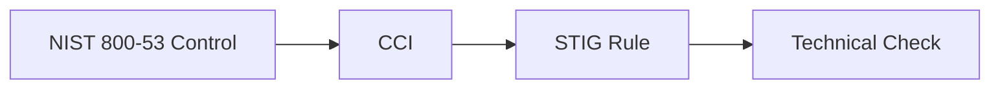
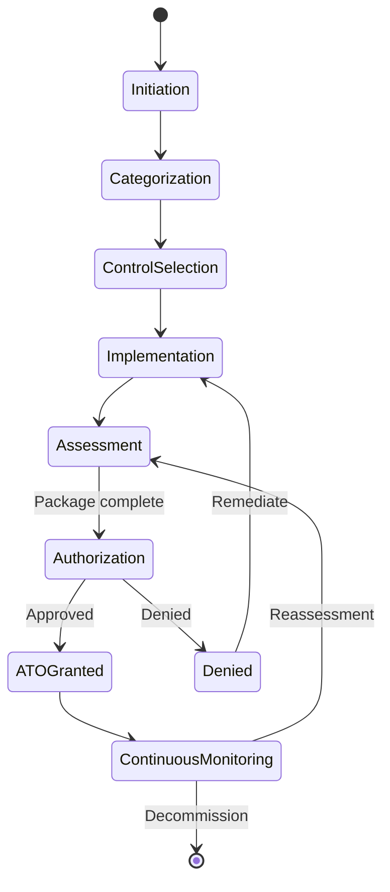

## Risk Management Framework

The Risk Management Framework (RMF) is a structured process defined by NIST for managing security and privacy risk across federal information systems. RMF provides the methodology, and RMF (the DEDZED platform) implements it as a digital workflow — replacing spreadsheets, shared drives, and manual tracking with a purpose-built system.

RMF applies specifically to DoD systems seeking an Authority to Operate (ATO). An ATO is the formal declaration by an Authorizing Official that a system meets the required security posture and is approved for operation.

## NIST 800-53 Rev 5

NIST Special Publication 800-53 Revision 5 defines the catalog of security and privacy controls that federal systems must implement. RMF uses this catalog as the foundation for all control tracking.

Controls are organized into 20 families, each addressing a specific area of security:

| Family ID | Family name | Example controls |
|-----------|-------------|------------------|
| **AC** | Access Control | AC-1 (Policy), AC-2 (Account Management), AC-6 (Least Privilege) |
| **AT** | Awareness and Training | AT-1 (Policy), AT-2 (Literacy Training), AT-3 (Role-Based Training) |
| **AU** | Audit and Accountability | AU-1 (Policy), AU-2 (Event Logging), AU-6 (Audit Review) |
| **CA** | Assessment, Authorization, and Monitoring | CA-1 (Policy), CA-2 (Assessments), CA-6 (Authorization) |
| **CM** | Configuration Management | CM-1 (Policy), CM-2 (Baseline Config), CM-6 (Config Settings) |
| **CP** | Contingency Planning | CP-1 (Policy), CP-2 (Plan), CP-9 (System Backup) |
| **IA** | Identification and Authentication | IA-1 (Policy), IA-2 (User ID/Auth), IA-5 (Authenticator Mgmt) |
| **IR** | Incident Response | IR-1 (Policy), IR-4 (Incident Handling), IR-6 (Reporting) |
| **MA** | Maintenance | MA-1 (Policy), MA-2 (Controlled Maintenance) |
| **MP** | Media Protection | MP-1 (Policy), MP-2 (Media Access), MP-6 (Media Sanitization) |
| **PE** | Physical and Environmental Protection | PE-1 (Policy), PE-2 (Physical Access), PE-6 (Monitoring) |
| **PL** | Planning | PL-1 (Policy), PL-2 (System Security Plan) |
| **PM** | Program Management | PM-1 (Program Plan), PM-9 (Risk Strategy) |
| **PS** | Personnel Security | PS-1 (Policy), PS-3 (Personnel Screening) |
| **RA** | Risk Assessment | RA-1 (Policy), RA-3 (Risk Assessment), RA-5 (Vulnerability Monitoring) |
| **SA** | System and Services Acquisition | SA-1 (Policy), SA-4 (Acquisition Process), SA-11 (Developer Testing) |
| **SC** | System and Communications Protection | SC-1 (Policy), SC-7 (Boundary Protection), SC-8 (Transmission Confidentiality) |
| **SI** | System and Information Integrity | SI-1 (Policy), SI-2 (Flaw Remediation), SI-4 (System Monitoring) |
| **SR** | Supply Chain Risk Management | SR-1 (Policy), SR-3 (Supply Chain Controls) |
| **PT** | PII Processing and Transparency | PT-1 (Policy), PT-2 (Authority to Process) |

Each control has a unique identifier (e.g., `AC-2`), a title, and one or more control enhancements (e.g., `AC-2(1)`, `AC-2(2)`). RMF tracks the implementation status of each control and its enhancements individually.

## Control Correlation Identifiers (CCI)

CCIs are the bridge between NIST 800-53 controls and DISA STIGs. Each CCI maps a single NIST control statement to one or more STIG requirements, providing traceability from high-level policy to technical implementation checks.

For example:
- NIST control `AC-2` (Account Management) maps to multiple CCIs
- Each CCI maps to specific STIG rules that validate account management configurations
- STIGMATE scans evaluate those STIG rules and produce results

This chain means you can trace a scan finding in [STIGMATE](/stigmate/index) all the way back to the NIST control it satisfies, and attach the scan result as evidence in RMF.

<Info>
CCI mapping is maintained by DISA (Defense Information Systems Agency). RMF includes the full CCI catalog and keeps it synchronized with NIST 800-53 Rev 5.
</Info>

## ATO lifecycle

An ATO project in RMF moves through a series of phases from initiation to continuous monitoring. The Authorizing Official makes the final authorization decision based on the security package assembled during the process.

| Phase | Activities | Key outputs |
|-------|-----------|-------------|
| **Initiation** | Define system boundaries, assign team roles, establish project | System description, team roster |
| **Categorization** | Determine impact levels (confidentiality, integrity, availability) | FIPS 199 categorization |
| **Control selection** | Select applicable NIST 800-53 controls based on categorization | Control baseline |
| **Implementation** | Deploy controls and document implementation details | Implementation statements |
| **Assessment** | Evaluate control effectiveness, review evidence | Security Assessment Report (SAR) |
| **Authorization** | AO reviews security package and makes risk-based decision | ATO letter or denial |
| **Continuous monitoring** | Ongoing monitoring, periodic reassessment | POA&M, updated SSP |

## Evidence and artifacts

RMF manages the evidence artifacts that support your ATO package. Evidence can include:

- **Scan results** — CKL files from STIGMATE, vulnerability scan reports
- **Configuration documentation** — System security plans, network diagrams
- **Policy documents** — Organizational policies mapped to controls
- **Screenshots** — UI evidence of control implementation
- **Audit logs** — Records demonstrating continuous monitoring

Each piece of evidence is linked to one or more controls and goes through an approval workflow before it is included in the authorization package.

## Related pages

<CardGroup cols={2}>
  <Card title="Controls" icon="list-check" href="/rmf/controls">
    Work with the NIST 800-53 Rev 5 control catalog in RMF.
  </Card>
  <Card title="Evidence management" icon="file-circle-check" href="/rmf/evidence">
    Upload and manage evidence artifacts for your ATO package.
  </Card>
  <Card title="STIGMATE concepts" icon="clipboard-check" href="/stigmate/concepts">
    Understand STIGs, CCIs, and how scan results map to controls.
  </Card>
  <Card title="Roles and permissions" icon="users" href="/rmf/roles-and-permissions">
    Learn about RMF's five DoD-aligned access roles.
  </Card>
</CardGroup>
