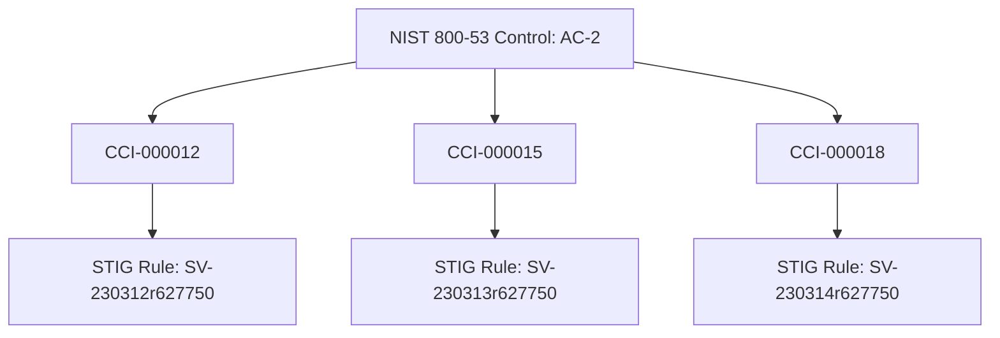

## Overview

Controls are the core building blocks of an ATO package. ezRMF includes the complete NIST 800-53 Rev 5 catalog with 1,189 controls and automatically selects the applicable controls when you create a project based on its impact level. You track the implementation status of each control, document how it is satisfied, configure Organization-Defined Parameters (ODPs), and link evidence to demonstrate compliance.

## Control catalog

ezRMF provides the full NIST 800-53 Rev 5 catalog organized by control family. When you create a project and select an impact level (Low, Moderate, or High), ezRMF populates the project with the corresponding control baseline.

### Browse controls

Navigate to the **Controls** panel within a project to see all selected controls. You can:

- **Filter by family** — Show only controls from a specific family (e.g., AC, AU, CM)
- **Filter by status** — Show controls by implementation status
- **Search** — Find controls by ID, title, or keyword

Each control entry displays:

- **Control ID** — The NIST identifier (e.g., `AC-2`)
- **Title** — The control name (e.g., "Account Management")
- **Family** — The control family
- **Implementation status** — Current tracking status
- **Evidence count** — Number of linked evidence artifacts
- **CCI count** — Number of mapped CCIs

## Baselines and tailoring

ezRMF supports four baseline profiles:

| Baseline | Description |
|----------|-------------|
| **Low** | Minimum controls for low-impact systems |
| **Moderate** | Standard controls for most DoD systems |
| **High** | Maximum controls for high-value assets |
| **Custom** | User-defined control set |

You can tailor any baseline by adding or removing individual controls. Navigate to the **Framework** panel to view and modify the active baseline for a project.

### Organization-Defined Parameters (ODPs)

Many NIST 800-53 controls contain parameters that the organization must define (e.g., "lock the account after [organization-defined number] of failed login attempts"). ezRMF tracks ODPs per control, allowing you to set and document these values within the control detail view.

## Implementation status

You track each control through a set of implementation statuses that reflect how far along the control is in the deployment and validation process.

| Status | Description |
|--------|-------------|
| **Not Started** | Control has not been addressed |
| **Planned** | Implementation is planned but not yet begun |
| **Partially Implemented** | Some aspects of the control are in place |
| **Implemented** | Control is fully deployed and operational |
| **Not Applicable** | Control does not apply to this system (requires justification) |

To update a control's status:

1. Open the control detail view
2. Select the new status from the **Implementation Status** dropdown
3. Add an **implementation statement** describing how the control is satisfied
4. Click **Save**

<Info>
Implementation statements should describe the specific mechanisms, configurations, or processes that satisfy the control. You can also ask the [AI agent](/rmf/agent) to draft implementation statements based on your system context.
</Info>

### Control enhancements

Many controls have enhancements (e.g., `AC-2(1)`, `AC-2(2)`) that provide additional specificity. ezRMF tracks enhancements as separate items with their own implementation status and evidence links. Enhancements appear nested under their parent control in the controls list.

## CCI mapping

Each NIST 800-53 control maps to one or more Control Correlation Identifiers (CCIs). CCIs bridge the gap between high-level NIST controls and the technical checks defined in DISA STIGs.



### View CCI mappings

Within a control's detail view, the **CCI Mappings** section lists all associated CCIs. Each CCI entry shows:

- **CCI ID** — The identifier (e.g., `CCI-000012`)
- **Definition** — What the CCI requires
- **STIG rules** — The technical checks that validate this CCI
- **STIGMATE results** — If STIGMATE scan results are available, they appear here

<Tip>
When you import CKL files from [STIGMATE](/stigmate/index), ezRMF automatically maps the scan results to the corresponding CCIs and controls. This gives you instant visibility into which controls have technical validation evidence.
</Tip>

### CCI coverage report

The CCI coverage report shows how many CCIs across your project have associated STIG results or evidence. Navigate to **Assess Combined** to see:

- Total CCIs mapped to selected controls
- CCIs with STIGMATE scan results
- CCIs with manually uploaded evidence
- CCIs with no evidence (gaps)

## AI-assisted control mapping

The AI agent can automatically map controls from imported documents. When you upload an SSP or policy document, the agent:

1. Reads the document and extracts control implementation language
2. Matches extracted text to NIST 800-53 controls and CCI definitions
3. Proposes control status updates and implementation statements
4. Waits for your review and approval before applying changes

See [AI agent](/rmf/agent) for details on agent-assisted workflows.

## Bulk operations

For projects with hundreds of controls, ezRMF provides bulk operations to update multiple controls at once.

### Bulk status update

1. Navigate to the **Controls** panel
2. Select multiple controls using the checkboxes
3. Click **Bulk Actions** > **Update Status**
4. Select the new status
5. Click **Apply**

### Bulk evidence linking

You can link a single evidence artifact to multiple controls simultaneously:

1. Navigate to the **BoE** panel
2. Open the evidence detail view
3. Click **Link to Controls**
4. Search and select multiple controls
5. Click **Link**

This is useful for policy documents that address multiple control families.

### Import control data

ezRMF supports importing control implementation data from external sources:

```bash
curl -X POST https://rmf.dedzed.blacklabel.mil/api/projects/{id}/data/controls/import \
  -H "Authorization: Bearer $TOKEN" \
  -H "Content-Type: multipart/form-data" \
  -F "file=@controls-export.csv"
```

The import expects a CSV with columns for control ID, status, and implementation statement.

## Control assessment

During the assessment phase, the Security Control Assessor (SCA) or SCAR reviews each control to determine whether it is implemented correctly and operating as intended.

| Assessment result | Description |
|-------------------|-------------|
| **Satisfied** | Control is implemented correctly and operating effectively |
| **Other Than Satisfied** | Control has deficiencies that need remediation |
| **Not Assessed** | Control has not yet been evaluated |

The SCA records findings and recommendations for each control. Controls marked as **Other Than Satisfied** generate [POAM](/rmf/poam) items that track remediation.

## Related pages

<CardGroup cols={2}>
  <Card title="Evidence management" icon="file-circle-check" href="/rmf/evidence">
    Upload evidence and link it to controls.
  </Card>
  <Card title="POAM" icon="clipboard-list" href="/rmf/poam">
    Track remediation items generated from assessments.
  </Card>
  <Card title="AI agent" icon="robot" href="/rmf/agent">
    Use AI to map controls and suggest implementations.
  </Card>
  <Card title="Concepts" icon="book" href="/rmf/concepts">
    Understand NIST 800-53 control families and CCI mapping.
  </Card>
</CardGroup>
