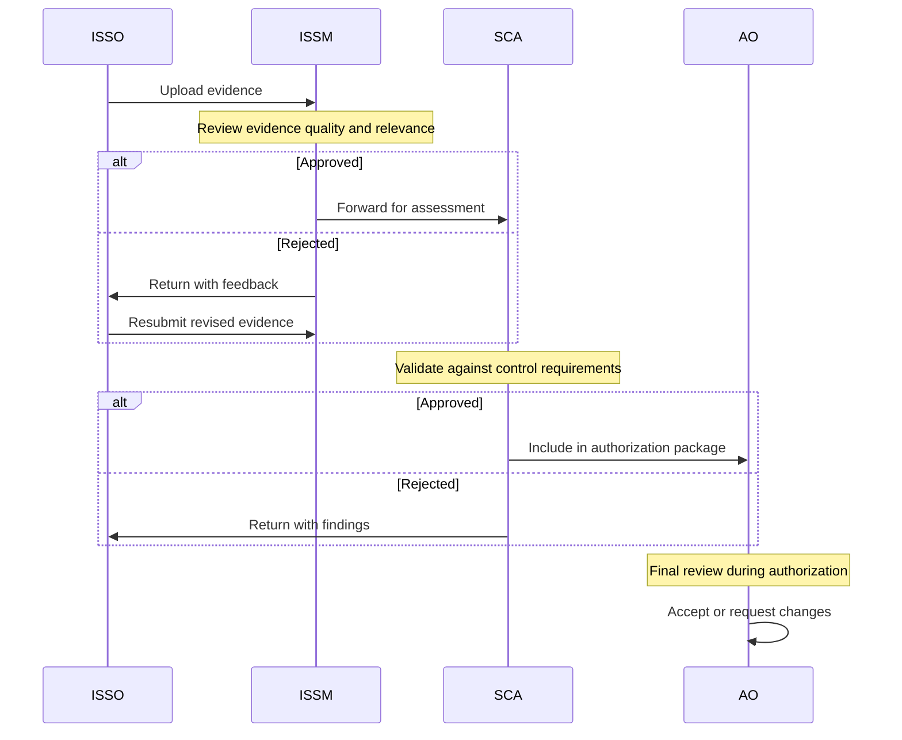

## Overview

Evidence artifacts are the documentation that proves your security controls are implemented and operating correctly. RMF provides a structured workflow for uploading evidence, linking it to controls, and routing it through a multi-role approval chain. Every piece of evidence in your ATO package must be approved before it is included in the authorization submission.

## Upload evidence

You can upload evidence through the UI or the API.

### Upload through the UI

1. Open your project and navigate to the **Evidence** tab
2. Click **Upload Evidence**
3. Select the file from your local machine
4. Enter a title and description for the evidence
5. Select the control(s) this evidence supports
6. Click **Upload**

### Upload through the API

```bash
curl -X POST https://rmf.icbm.dev/api/v1/projects/{id}/evidence \
  -H "Authorization: Bearer $TOKEN" \
  -H "Content-Type: multipart/form-data" \
  -F "file=@scan-results.ckl" \
  -F "title=RHEL 8 STIG Scan Results" \
  -F "description=STIGMATE scan results for production RHEL 8 servers"
```

The API returns the evidence ID, which you can use to link the evidence to controls:

```bash
curl -X POST https://rmf.icbm.dev/api/v1/projects/{id}/evidence/{eid}/link \
  -H "Authorization: Bearer $TOKEN" \
  -H "Content-Type: application/json" \
  -d '{"control_ids": ["AC-2", "AC-6", "AU-2"]}'
```

### Supported file types

RMF accepts any file type as evidence. Common formats include:

| File type | Extension | Use case |
|-----------|-----------|----------|
| STIG checklist | `.ckl` | STIGMATE scan exports |
| PDF | `.pdf` | Policy documents, signed memos |
| Screenshot | `.png`, `.jpg` | UI evidence of configurations |
| Spreadsheet | `.xlsx`, `.csv` | Compliance matrices, inventory lists |
| Text/Markdown | `.txt`, `.md` | Implementation narratives |
| Archive | `.zip` | Bundled evidence packages |

## Approval workflow

Evidence follows a structured approval chain that ensures multiple roles review and validate each artifact before it becomes part of the authorization package.



### Approval states

| State | Description | Who acts |
|-------|-------------|----------|
| **Pending** | Evidence uploaded, awaiting initial review | ISSO uploads |
| **ISSM Review** | ISSM reviewing evidence quality and relevance | ISSM approves or rejects |
| **SCA Review** | SCA validating evidence against control requirements | SCA approves or rejects |
| **Approved** | Evidence accepted for the authorization package | Included in submission |
| **Rejected** | Evidence returned with feedback for revision | ISSO revises and resubmits |

<Info>
Each approval or rejection is recorded in the activity log with the reviewer's identity, timestamp, and any comments. This creates a complete chain of custody for every evidence artifact.
</Info>

## STIGMATE CKL import

If you use [STIGMATE](/stigmate/index) for automated STIG scanning, you can import CKL (Checklist) files directly into RMF as evidence. RMF automatically processes the CKL and maps scan results to the appropriate controls through CCI mapping.

### Import a CKL file

1. Navigate to the **Evidence** tab
2. Click **Import CKL**
3. Select the `.ckl` file exported from STIGMATE
4. RMF parses the file and displays a summary of findings
5. Review the automatic control mappings
6. Click **Import**

### What happens during import

When you import a CKL file, RMF:

1. Parses the XCCDF results from the checklist
2. Maps each STIG rule to its corresponding CCI
3. Maps each CCI to the NIST 800-53 control in your project
4. Creates evidence links between the CKL and the mapped controls
5. Updates the CCI coverage report with the new scan data

<Tip>
Import CKL files regularly as you run STIGMATE scans throughout the ATO process. Each import creates a point-in-time snapshot that demonstrates your progress toward compliance.
</Tip>

### Automatic vs. manual mapping

RMF handles CCI-to-control mapping automatically for all standard mappings. If a CKL contains STIG rules that map to controls not currently in your project baseline, RMF flags them for manual review:

- **Mapped** — CCI maps to a control in your project (linked automatically)
- **Unmapped** — CCI maps to a control not in your project (requires manual review)
- **Unknown** — CCI not found in the catalog (may indicate a newer STIG version)

## Evidence linking

A single evidence artifact can support multiple controls, and a single control can have multiple evidence artifacts. This many-to-many relationship lets you build comprehensive evidence packages efficiently.

### Link evidence to controls

From the evidence detail view:

1. Click **Link to Controls**
2. Search for controls by ID or title
3. Select the controls this evidence supports
4. Click **Link**

### View evidence by control

From any control's detail view, the **Evidence** section shows all linked artifacts with their current approval status. This gives you immediate visibility into evidence coverage.

## Evidence search and filtering

Use the evidence list filters to find specific artifacts:

- **Status** — Filter by approval state (Pending, ISSM Review, SCA Review, Approved, Rejected)
- **Control** — Show evidence linked to a specific control
- **Type** — Filter by file type
- **Date range** — Show evidence uploaded within a specific period
- **Uploader** — Filter by the user who uploaded the evidence

## Related pages

<CardGroup cols={2}>
  <Card title="Controls" icon="list-check" href="/rmf/controls">
    Track control implementation and CCI mappings.
  </Card>
  <Card title="STIGMATE CKL export" icon="file-export" href="/stigmate/ckl-export">
    Export scan results from STIGMATE for RMF import.
  </Card>
  <Card title="Roles and permissions" icon="users" href="/rmf/roles-and-permissions">
    Understand who can approve evidence at each stage.
  </Card>
  <Card title="Projects" icon="folder-open" href="/rmf/projects">
    Manage ATO projects and workflow states.
  </Card>
</CardGroup>
