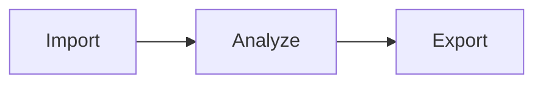
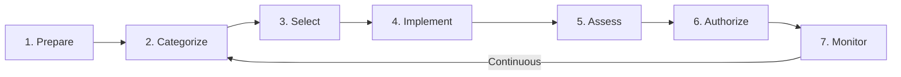

## Overview

ezRMF is the DEDZED AI-powered Risk Management Framework platform. It replaces the spreadsheet-driven compliance workflow with an agentic platform where AI does the heavy lifting — importing your System Security Plan, mapping controls to NIST 800-53 Rev 5 and DoD CCIs, classifying evidence, identifying implementation gaps, and tracking remediation through POAM. When audit day comes, export eMASS-ready packages with one click.

<Info>
ezRMF is accessible at [https://rmf.dedzed.blacklabel.mil](https://rmf.dedzed.blacklabel.mil) from within a [Kasm session](/kasm-workspaces/working-within-kasm). See [Zero trust access](/knowledge-base/zero-trust) for details on the DEDZED network access model.
</Info>

## How it works

ezRMF combines a structured compliance workspace with an AI agent that runs in isolated Docker sandboxes — reading your files, mapping controls, surfacing gaps, and tracking remediation automatically.

| Step | What happens |
|------|-------------|
| **Import** | Upload your SSP, policies, and evidence. Drag and drop or bulk import from existing systems. |
| **Analyze** | AI maps controls to NIST 800-53 and CCIs, links evidence, and identifies implementation gaps. |
| **Export** | Track remediation, generate POAM reports, and export eMASS-ready audit packages with one click. |

## RMF lifecycle

ezRMF tracks the seven-phase NIST RMF lifecycle defined by NIST SP 800-37 per project, with structured workflows at each phase.

| Phase | Description |
|-------|-------------|
| **Prepare** | Define system boundaries, assign team roles, establish the project |
| **Categorize** | Determine the system's impact level (Low, Moderate, High) based on confidentiality, integrity, and availability |
| **Select** | Choose the appropriate NIST 800-53 security controls based on the categorization |
| **Implement** | Deploy and configure the selected controls across the system |
| **Assess** | Evaluate whether controls are implemented correctly and operating as intended |
| **Authorize** | The Authorizing Official reviews the security package and grants or denies the ATO |
| **Monitor** | Continuously track control effectiveness and system changes after authorization |

## Capabilities

| Capability | Description |
|------------|-------------|
| **AI control mapping** | Import SSPs and policy documents. Claude AI extracts controls, maps them to NIST 800-53 Rev 5 and DoD CCIs, and links to your evidence automatically. |
| **Body of Evidence manager** | Upload, classify, and preview evidence in-browser. PDFs, DOCX, XLSX, images, and Markdown all render natively. Link artifacts directly to controls. |
| **POAM tracking and eMASS export** | Track remediation items with severity levels, milestones, and due dates. Export CUI-marked, eMASS-formatted Excel packages ready for your authorization boundary. |
| **Sandboxed AI agent** | Claude runs in isolated Docker containers with filesystem access to your project files. It reads your data, queries your controls, and takes action — all session-scoped and ephemeral. |
| **Skills system** | Drop a Markdown file into your project to add custom automation workflows. No code changes, no deployments. The agent loads new skills automatically. |
| **Continuous compliance integrations** | Pull findings from AWS Security Hub, GuardDuty, and third-party scanners. Findings are auto-mapped to NIST controls and tracked in real time. |
| **Role-based access control** | Seven DoD-aligned roles (PM, ISSM, ISSO, SCA, SCAR, AO, Engineer) with project-level access controls. |
| **Activity tracking** | Every user action logged with full audit trail, user attribution, and timestamps. |

## Architecture

ezRMF runs as a containerized four-tier application stack.

| Component | Technology | Purpose |
|-----------|-----------|---------|
| **Frontend** | Vue 3, Vite, Pinia, Vue Router | 14 project panels with SSE streaming and composable-driven state |
| **API server** | Express, TypeScript, Node.js | REST API with OIDC auth middleware, session management, and RBAC |
| **AI engine** | Claude Agent SDK, MCP tools | Sandboxed agent execution with 30+ MCP tools and skills system |
| **Database** | PostgreSQL 16 with pgvector | 20+ tables for projects, controls, evidence, sessions, and audit log |
| **File storage** | MinIO (S3-compatible) or AWS S3 | Three buckets: private, shared, and public for BoE files, skills, and agents |
| **Authentication** | OIDC, Cloudflare Access, SSO | User authentication and identity |

### Deployment options

| Option | Description |
|--------|-------------|
| Docker Compose | Development and testing |
| Kubernetes / EKS | Production at scale |
| AWS GovCloud | FedRAMP-compatible infrastructure |
| Air-gapped | No internet required after setup |

Self-hosted by default. Your compliance data stays in your infrastructure. No SaaS dependency. No external data flows.

## Getting started

To begin using ezRMF, you need access to the DEDZED platform and appropriate role assignment. See [Getting started](/rmf/getting-started) for deployment instructions and your first project walkthrough.

<Tip>
If you are already using [STIGMATE](/stigmate/index) for STIG scanning, you can import CKL exports directly into ezRMF as evidence artifacts. See [Evidence management](/rmf/evidence) for details.
</Tip>

## Related pages

<CardGroup cols={2}>
  <Card title="Concepts" icon="book" href="/rmf/concepts">
    Understand the RMF framework, NIST 800-53, and CCI mapping.
  </Card>
  <Card title="Getting started" icon="rocket" href="/rmf/getting-started">
    Deploy ezRMF and create your first ATO project.
  </Card>
  <Card title="AI agent" icon="robot" href="/rmf/agent">
    Learn how the sandboxed AI agent works.
  </Card>
  <Card title="Zero trust access" icon="shield" href="/knowledge-base/zero-trust">
    How DEDZED secures access to platform services.
  </Card>
</CardGroup>
