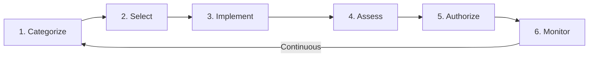

## Overview

RMF is the DEDZED Risk Management Framework platform. It provides a comprehensive system for managing DoD Authority to Operate (ATO) processes, from initial system categorization through continuous monitoring. RMF implements the NIST 800-53 Rev 5 control catalog and maps controls to CCIs (Control Correlation Identifiers), giving you full traceability between security requirements and implementation evidence.

<Info>
RMF is accessible at [https://rmf.icbm.dev](https://rmf.icbm.dev) from within a [Kasm session](/kasm-workspaces/working-within-kasm). See [Zero trust access](/knowledge-base/zero-trust) for details on the DEDZED network access model.
</Info>

## RMF lifecycle

The Risk Management Framework follows a six-step lifecycle defined by NIST SP 800-37. RMF guides you through each step with structured workflows, tracking, and evidence collection.

| Step | Description |
|------|-------------|
| **Categorize** | Determine the system's impact level (Low, Moderate, High) based on confidentiality, integrity, and availability |
| **Select** | Choose the appropriate NIST 800-53 security controls based on the categorization |
| **Implement** | Deploy and configure the selected controls across the system |
| **Assess** | Evaluate whether controls are implemented correctly and operating as intended |
| **Authorize** | The Authorizing Official reviews the security package and grants or denies the ATO |
| **Monitor** | Continuously track control effectiveness and system changes after authorization |

## Capabilities

| Capability | Description |
|------------|-------------|
| **ATO project management** | Create and manage ATO projects with customizable phases and milestone tracking |
| **NIST 800-53 Rev 5 controls** | Full control catalog with implementation status tracking per control |
| **CCI mapping** | Map controls to CCIs, bridging NIST controls to STIG requirements |
| **Evidence management** | Upload, link, and approve evidence artifacts against controls |
| **Policy management** | Create policies with anchor-based mapping to security controls |
| **Role-based access control** | Five DoD-aligned roles (PM, ISSM, SCA, ISSO, AO) with scoped permissions |
| **Activity tracking** | Every user action logged with full audit trail for accountability |
| **Scoped API tokens** | Generate tokens with granular permissions for automation and integration |
| **MCP integration** | AI-powered compliance assistance through the MCP server |

## Architecture

RMF runs as a containerized application stack deployed via Docker Compose.

| Component | Technology | Purpose |
|-----------|-----------|---------|
| **API server** | Python FastAPI | REST API and business logic |
| **Database** | PostgreSQL 15 | Persistent storage for projects, controls, evidence |
| **Cache** | Redis | Session management and caching |
| **Authentication** | OIDC (Ping Identity) | User authentication and identity |
| **MCP server** | Port 8001 | AI-powered compliance assistance |

## Getting started

To begin using RMF, you need access to the DEDZED platform and appropriate role assignment. See [Getting started](/rmf/getting-started) for deployment instructions and your first project walkthrough.

<Tip>
If you are already using [STIGMATE](/stigmate/index) for STIG scanning, you can import CKL exports directly into RMF as evidence artifacts. See [Evidence management](/rmf/evidence) for details.
</Tip>

## Related pages

<CardGroup cols={2}>
  <Card title="Concepts" icon="book" href="/rmf/concepts">
    Understand the RMF framework, NIST 800-53, and CCI mapping.
  </Card>
  <Card title="Getting started" icon="rocket" href="/rmf/getting-started">
    Deploy RMF and create your first ATO project.
  </Card>
  <Card title="STIGMATE" icon="clipboard-check" href="/stigmate/index">
    Automated STIG scanning with CKL export for RMF evidence.
  </Card>
  <Card title="Zero trust access" icon="shield" href="/knowledge-base/zero-trust">
    How DEDZED secures access to platform services.
  </Card>
</CardGroup>
