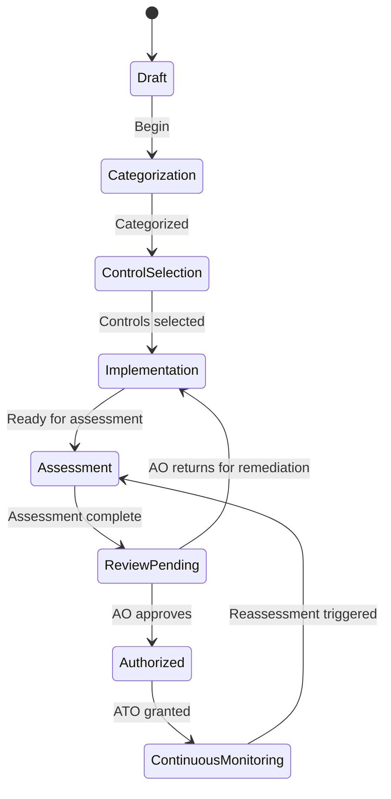

## Overview

A project in RMF represents a single system undergoing the ATO process. Each project contains its own set of controls, evidence artifacts, team assignments, and activity history. You can manage multiple projects simultaneously, each at different stages of the authorization lifecycle.

## Create a project

To create a new ATO project:

1. Click **New Project** on the RMF dashboard
2. Enter the project name and description
3. Select the system impact level (**Low**, **Moderate**, or **High**)
4. Set the target authorization date
5. Click **Create**

RMF automatically populates the project with the NIST 800-53 control baseline corresponding to the selected impact level. Higher impact levels include more controls.

| Impact level | Approximate control count | Use case |
|-------------|--------------------------|----------|
| **Low** | ~150 controls | Systems with limited impact if compromised |
| **Moderate** | ~325 controls | Most DoD systems, moderate impact |
| **High** | ~420 controls | High-value assets, national security systems |

You can also create a project programmatically through the API:

```bash
curl -X POST https://rmf.icbm.dev/api/v1/projects \
  -H "Authorization: Bearer $TOKEN" \
  -H "Content-Type: application/json" \
  -d '{
    "name": "Mission App ATO",
    "description": "ATO package for the Mission Application",
    "impact_level": "moderate",
    "target_date": "2026-09-30"
  }'
```

## ATO workflow states

Every project progresses through a series of workflow states. These states map to the RMF lifecycle and track where the project is in the authorization process.



| State | Description | Who advances |
|-------|-------------|-------------|
| **Draft** | Project created, not yet started | PM |
| **Categorization** | Determining system impact levels | PM, ISSM |
| **Control selection** | Selecting applicable controls from the baseline | ISSM |
| **Implementation** | Implementing controls and documenting evidence | ISSO, team |
| **Assessment** | SCA evaluating control effectiveness | SCA |
| **Review pending** | Authorization package submitted to AO | SCA |
| **Authorized** | ATO granted by the Authorizing Official | AO |
| **Continuous monitoring** | Ongoing monitoring and periodic reassessment | ISSO, ISSM |

<Info>
Only users with the appropriate role can advance a project to the next state. For example, only an AO can move a project from **Review pending** to **Authorized**. See [Roles and permissions](/rmf/roles-and-permissions) for the full permission matrix.
</Info>

## Team assignment

Each project has its own team roster. You assign users to one of five DoD-aligned roles that determine what actions they can perform within the project.

| Role | Abbreviation | Primary responsibilities |
|------|-------------|------------------------|
| Program Manager | PM | Project creation, team management, milestone tracking |
| Information System Security Manager | ISSM | Control oversight, evidence approval, policy review |
| Security Control Assessor | SCA | Independent assessment, validation, security testing |
| Information System Security Officer | ISSO | Day-to-day security, evidence upload, implementation |
| Authorizing Official | AO | Final authorization decisions |

To assign a team member:

1. Open the project and navigate to the **Team** tab
2. Click **Add Member**
3. Search for the user by name or email
4. Select their role from the dropdown
5. Click **Save**

<Tip>
A user can hold different roles on different projects. For example, someone may be an ISSO on one project and an ISSM on another.
</Tip>

## Activity tracking

RMF logs every user action within a project, creating a complete audit trail. Activities are recorded automatically — you do not need to enable or configure tracking.

Examples of tracked activities:

- Project creation and state changes
- Control status updates and implementation edits
- Evidence uploads, links, and approvals
- Team membership changes
- API token creation and revocation

### View project activities

Navigate to the **Activity** tab within a project to see the chronological activity log. Each entry shows:

- **Timestamp** — When the action occurred
- **User** — Who performed the action
- **Action** — What was done (e.g., "uploaded evidence", "updated control status")
- **Details** — Additional context about the change

You can also retrieve activities through the API:

```bash
curl https://rmf.icbm.dev/api/v1/projects/{id}/activities \
  -H "Authorization: Bearer $TOKEN"
```

### Retention

Activity records are retained based on the `ACTIVITY_RETENTION_DAYS` environment variable, which defaults to 365 days. For DoD systems, you should set this to match your records retention requirements.

<Warning>
Activity records are immutable. Once recorded, they cannot be edited or deleted by any user, including administrators. This ensures the integrity of the audit trail.
</Warning>

## Project dashboard

The project dashboard provides an at-a-glance view of your ATO progress:

- **Control completion** — Percentage of controls with implementation status
- **Evidence coverage** — Number of controls with linked evidence
- **Approval status** — Evidence pending review vs. approved
- **Timeline** — Project milestones and target dates
- **Recent activity** — Latest actions taken within the project

## Related pages

<CardGroup cols={2}>
  <Card title="Controls" icon="list-check" href="/rmf/controls">
    Work with the NIST 800-53 control catalog.
  </Card>
  <Card title="Evidence management" icon="file-circle-check" href="/rmf/evidence">
    Upload and approve evidence artifacts.
  </Card>
  <Card title="Roles and permissions" icon="users" href="/rmf/roles-and-permissions">
    Understand what each role can do within a project.
  </Card>
  <Card title="API reference" icon="code" href="/rmf/api-reference">
    Create and manage projects through the REST API.
  </Card>
</CardGroup>
