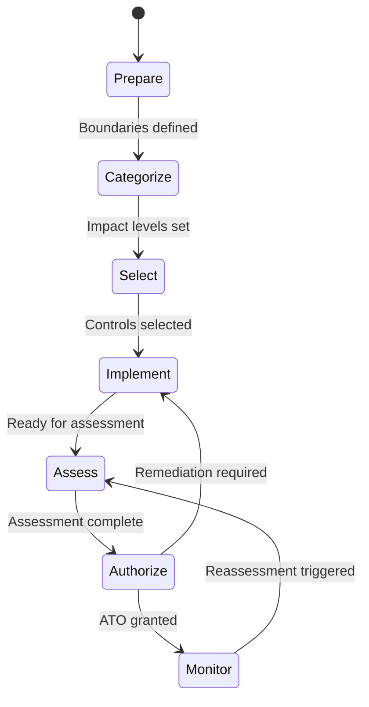

## Overview

A project in ezRMF represents a single system undergoing the ATO process. Each project contains its own set of controls, evidence artifacts, team assignments, inventory, POAM items, and activity history. You can manage multiple projects simultaneously, each at different stages of the authorization lifecycle.

## Create a project

To create a new ATO project:

1. Click **New Project** on the ezRMF dashboard
2. Enter the project name and description
3. Select the system impact level (**Low**, **Moderate**, or **High**)
4. Set the target authorization date
5. Click **Create**

ezRMF automatically populates the project with the NIST 800-53 control baseline corresponding to the selected impact level. Higher impact levels include more controls.

| Impact level | Approximate control count | Use case |
|-------------|--------------------------|----------|
| **Low** | ~150 controls | Systems with limited impact if compromised |
| **Moderate** | ~325 controls | Most DoD systems, moderate impact |
| **High** | ~420 controls | High-value assets, national security systems |

You can also create a project programmatically through the API:

```bash
curl -X POST https://rmf.icbm.dev/api/projects \
  -H "Authorization: Bearer $TOKEN" \
  -H "Content-Type: application/json" \
  -d '{
    "name": "Mission App ATO",
    "description": "ATO package for the Mission Application",
    "impact_level": "moderate",
    "target_date": "2026-09-30"
  }'
```

## Project panels

Each project provides 14 panels that cover the full RMF workflow:

| Panel | Description |
|-------|-------------|
| **Overview** | Dashboard with control completion, evidence coverage, and project status |
| **Controls** | NIST 800-53 control catalog with implementation tracking |
| **Inventory** | Hardware and software asset inventory |
| **BoE** | Body of Evidence — upload, classify, and preview evidence files |
| **POAM** | Plan of Action and Milestones — findings and remediation tracking |
| **Team** | Team roster and role assignments |
| **Framework** | Framework selection and baseline configuration |
| **Skills** | Agent skills — custom Markdown-based automation workflows |
| **Agents** | Agent configurations and session management |
| **Assess Combined** | Combined assessment view for internal and external assessments |
| **Integrations** | AWS Security Hub, GuardDuty, and third-party scanner connections |
| **Mindmap** | Visual relationship mapping between controls, evidence, and findings |
| **Audit Log** | Chronological record of all project activity |

## RMF pipeline

ezRMF tracks project progress through the seven-phase RMF pipeline. Each phase maps to the NIST SP 800-37 lifecycle.



| Phase | Description | Who advances |
|-------|-------------|-------------|
| **Prepare** | Define system boundaries and establish project | PM |
| **Categorize** | Determining system impact levels | PM, ISSM |
| **Select** | Selecting applicable controls from the baseline | ISSM |
| **Implement** | Implementing controls and documenting evidence | ISSO, Engineer |
| **Assess** | SCA/SCAR evaluating control effectiveness | SCA, SCAR |
| **Authorize** | Authorization package submitted to AO | AO |
| **Monitor** | Ongoing monitoring and periodic reassessment | ISSO, ISSM |

<Info>
Only users with the appropriate role can advance a project to the next phase. For example, only an AO can move a project from **Authorize** to **Monitor**. See [Roles and permissions](/rmf/roles-and-permissions) for the full permission matrix.
</Info>

## Team assignment

Each project has its own team roster. You assign users to one of seven DoD-aligned roles that determine what actions they can perform within the project.

| Role | Abbreviation | Primary responsibilities |
|------|-------------|------------------------|
| Program Manager | PM | Project creation, team management, milestone tracking |
| Information System Security Manager | ISSM | Control oversight, evidence approval, policy review |
| Information System Security Officer | ISSO | Day-to-day security, evidence upload, implementation |
| Security Control Assessor | SCA | Independent assessment, validation, security testing |
| Security Control Assessor Representative | SCAR | Assessment support under SCA direction |
| Authorizing Official | AO | Final authorization decisions |
| Engineer | Engineer | Technical implementation and security engineering |

To assign a team member:

1. Open the project and navigate to the **Team** panel
2. Click **Add Member**
3. Search for the user by name or email
4. Select their role from the dropdown
5. Click **Save**

<Tip>
A user can hold different roles on different projects. For example, someone may be an ISSO on one project and an ISSM on another.
</Tip>

## Activity tracking

ezRMF logs every user action within a project, creating a complete audit trail. Activities are recorded automatically — you do not need to enable or configure tracking.

Examples of tracked activities:

- Project creation and phase transitions
- Control status updates and implementation edits
- Evidence uploads, links, and approvals
- Team membership changes
- Agent conversations and tool executions
- POAM item creation and remediation updates

### View project activities

Navigate to the **Audit Log** panel within a project to see the chronological activity log. Each entry shows:

- **Timestamp** — When the action occurred
- **User** — Who performed the action
- **Action** — What was done (e.g., "uploaded evidence", "updated control status")
- **Details** — Additional context about the change

You can also retrieve activities through the API:

```bash
curl https://rmf.icbm.dev/api/projects/{id}/audit-log \
  -H "Authorization: Bearer $TOKEN"
```

### Retention

Activity records are retained based on the `ACTIVITY_RETENTION_DAYS` environment variable, which defaults to 365 days. For DoD systems, set this to match your records retention requirements.

<Warning>
Activity records are immutable. Once recorded, they cannot be edited or deleted by any user, including administrators. This ensures the integrity of the audit trail.
</Warning>

## Related pages

<CardGroup cols={2}>
  <Card title="Controls" icon="list-check" href="/rmf/controls">
    Work with the NIST 800-53 control catalog.
  </Card>
  <Card title="Evidence management" icon="file-circle-check" href="/rmf/evidence">
    Upload and approve evidence artifacts.
  </Card>
  <Card title="POAM" icon="clipboard-list" href="/rmf/poam">
    Track remediation items and export to eMASS.
  </Card>
  <Card title="Roles and permissions" icon="users" href="/rmf/roles-and-permissions">
    Understand what each role can do within a project.
  </Card>
</CardGroup>
