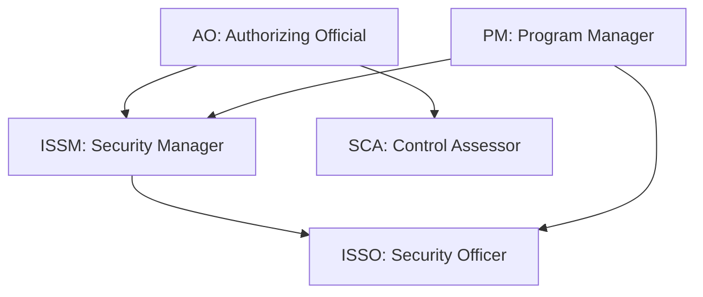
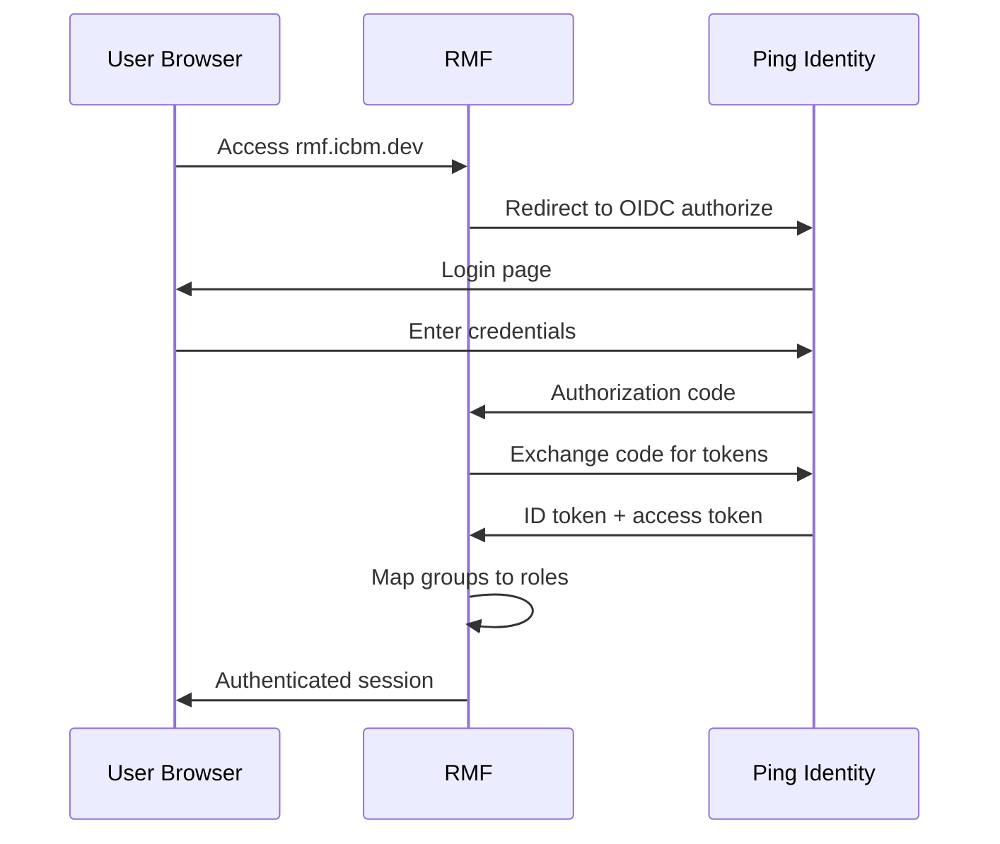

## Overview

RMF uses role-based access control (RBAC) with five DoD-aligned roles. Each role has specific permissions that determine what actions a user can perform within a project. Roles are assigned per project, so a user can hold different roles across different projects.

## Roles

| Role | Abbreviation | Description |
|------|-------------|-------------|
| **Program Manager** | PM | Manages the overall ATO project, creates projects, assigns team members, and tracks milestones |
| **Information System Security Manager** | ISSM | Oversees security controls, reviews and approves evidence, manages policies |
| **Security Control Assessor** | SCA | Independently assesses control implementation, validates evidence, conducts security testing |
| **Information System Security Officer** | ISSO | Handles day-to-day security operations, uploads evidence, documents control implementations |
| **Authorizing Official** | AO | Makes the final authorization decision based on the security package |

## Permission matrix

The following table shows which actions each role can perform. Permissions are enforced at the API level — the UI only displays actions available to the current user's role.

| Action | PM | ISSM | SCA | ISSO | AO |
|--------|:--:|:----:|:---:|:----:|:--:|
| Create project | Yes | No | No | No | No |
| Edit project settings | Yes | Yes | No | No | No |
| Assign team members | Yes | No | No | No | No |
| Advance project state | Yes | Yes | Yes | No | Yes |
| View controls | Yes | Yes | Yes | Yes | Yes |
| Edit control status | No | Yes | No | Yes | No |
| Edit implementation statements | No | Yes | No | Yes | No |
| Upload evidence | No | No | No | Yes | No |
| Review evidence (ISSM stage) | No | Yes | No | No | No |
| Review evidence (SCA stage) | No | No | Yes | No | No |
| Approve final authorization | No | No | No | No | Yes |
| View activity log | Yes | Yes | Yes | Yes | Yes |
| Create API tokens | Yes | Yes | Yes | Yes | No |
| Manage policies | No | Yes | No | No | No |
| Generate reports | Yes | Yes | Yes | No | Yes |

<Info>
The AO role is intentionally restricted from day-to-day operations like uploading evidence or editing controls. This maintains the separation of duties required by the RMF process — the AO makes authorization decisions based on the work of others, not their own.
</Info>

## Role assignment

Roles are assigned per project by the Program Manager (PM). A user must be added to a project team before they can access any project data.

### Assign a role

1. Open the project and navigate to the **Team** tab
2. Click **Add Member**
3. Search for the user by name or email
4. Select the role from the dropdown
5. Click **Save**

### Change a role

1. Open the **Team** tab
2. Find the team member and click **Edit**
3. Select the new role
4. Click **Save**

<Warning>
Changing a user's role takes effect immediately. Any actions they were in the process of performing that require the previous role's permissions will be blocked. Activity records from their previous role are retained.
</Warning>

### Remove a team member

1. Open the **Team** tab
2. Find the team member and click **Remove**
3. Confirm the removal

Removed users lose all access to the project. Their historical activity records remain in the audit log.

## Authentication with Ping Identity

RMF authenticates users through OIDC with Ping Identity. When you access RMF, you are redirected to Ping Identity for authentication. After successful login, Ping Identity returns an identity token that RMF uses to identify you and determine your role.

### Authentication flow

### Group-to-role mapping

RMF maps Ping Identity groups to RBAC roles. When a user authenticates, RMF reads their group memberships from the identity token and assigns the corresponding role within each project.

| Ping Identity group | RMF role |
|---------------------|----------|
| `rmf-pm` | PM |
| `rmf-issm` | ISSM |
| `rmf-sca` | SCA |
| `rmf-isso` | ISSO |
| `rmf-ao` | AO |

<Tip>
A user can belong to multiple Ping Identity groups if they hold different roles across different projects. The effective role is determined by the project-level team assignment, not solely by the Ping Identity group.
</Tip>

### JWT bearer tokens for API access

For programmatic access, RMF supports JWT bearer tokens. You can generate scoped API tokens from the RMF UI or through the API. See [API reference](/rmf/api-reference) for details on token creation and usage.

## Separation of duties

The RMF role model enforces separation of duties as required by DoD policy:

- The person who **implements** a control (ISSO) cannot **assess** it (SCA)
- The person who **assesses** a control (SCA) cannot **authorize** the system (AO)
- The person who **authorizes** the system (AO) does not perform operational tasks

This separation ensures that no single individual can implement, assess, and authorize a control without independent review.

## Related pages

<CardGroup cols={2}>
  <Card title="Getting started" icon="rocket" href="/rmf/getting-started">
    Configure OIDC and assign your first team.
  </Card>
  <Card title="Evidence management" icon="file-circle-check" href="/rmf/evidence">
    Understand the evidence approval workflow across roles.
  </Card>
  <Card title="API reference" icon="code" href="/rmf/api-reference">
    Create scoped API tokens for programmatic access.
  </Card>
  <Card title="Before you begin" icon="circle-check" href="/getting-started/before-you-begin">
    Ping Identity enrollment and platform prerequisites.
  </Card>
</CardGroup>
