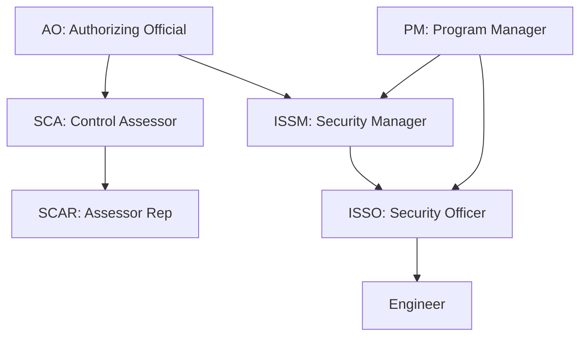

## Overview

ezRMF uses role-based access control (RBAC) with seven DoD-aligned roles. Each role has specific permissions that determine what actions a user can perform within a project. Roles are assigned per project, so a user can hold different roles across different projects.

## Roles

| Role | Abbreviation | Description |
|------|-------------|-------------|
| **Program Manager** | PM | Manages the overall ATO project, creates projects, assigns team members, and tracks milestones |
| **Information System Security Manager** | ISSM | Oversees security controls, reviews and approves evidence, manages policies |
| **Information System Security Officer** | ISSO | Handles day-to-day security operations, uploads evidence, documents control implementations |
| **Security Control Assessor** | SCA | Independently assesses control implementation, validates evidence, conducts security testing |
| **Security Control Assessor Representative** | SCAR | Supports the SCA in assessment activities under their direction |
| **Authorizing Official** | AO | Makes the final authorization decision based on the security package |
| **Engineer** | Engineer | Performs technical implementation and security engineering tasks |

## Permission matrix

The following table shows which actions each role can perform. Permissions are enforced at the API level — the UI only displays actions available to the current user's role.

| Action | PM | ISSM | ISSO | SCA | SCAR | AO | Engineer |
|--------|:--:|:----:|:----:|:---:|:----:|:--:|:--------:|
| Create project | Yes | No | No | No | No | No | No |
| Edit project settings | Yes | Yes | No | No | No | No | No |
| Assign team members | Yes | No | No | No | No | No | No |
| Advance project phase | Yes | Yes | No | Yes | No | Yes | No |
| View controls | Yes | Yes | Yes | Yes | Yes | Yes | Yes |
| Edit control status | No | Yes | Yes | No | No | No | Yes |
| Edit implementation statements | No | Yes | Yes | No | No | No | Yes |
| Upload evidence | No | No | Yes | No | No | No | Yes |
| Review evidence (ISSM stage) | No | Yes | No | No | No | No | No |
| Review evidence (SCA stage) | No | No | No | Yes | Yes | No | No |
| Approve final authorization | No | No | No | No | No | Yes | No |
| View audit log | Yes | Yes | Yes | Yes | Yes | Yes | Yes |
| Create API tokens | Yes | Yes | Yes | Yes | Yes | No | Yes |
| Manage policies | No | Yes | No | No | No | No | No |
| Generate reports | Yes | Yes | No | Yes | No | Yes | No |
| Use AI agent chat | Yes | Yes | Yes | Yes | Yes | No | Yes |
| Manage skills | No | Yes | Yes | No | No | No | Yes |
| Manage integrations | No | Yes | No | No | No | No | Yes |

<Info>
The AO role is intentionally restricted from day-to-day operations like uploading evidence or editing controls. This maintains the separation of duties required by the RMF process — the AO makes authorization decisions based on the work of others, not their own.
</Info>

## Role assignment

Roles are assigned per project by the Program Manager (PM). A user must be added to a project team before they can access any project data.

### Assign a role

1. Open the project and navigate to the **Team** panel
2. Click **Add Member**
3. Search for the user by name or email
4. Select the role from the dropdown
5. Click **Save**

### Change a role

1. Open the **Team** panel
2. Find the team member and click **Edit**
3. Select the new role
4. Click **Save**

<Warning>
Changing a user's role takes effect immediately. Any actions they were in the process of performing that require the previous role's permissions will be blocked. Activity records from their previous role are retained.
</Warning>

### Remove a team member

1. Open the **Team** panel
2. Find the team member and click **Remove**
3. Confirm the removal

Removed users lose all access to the project. Their historical activity records remain in the audit log.

## Authentication

ezRMF supports multiple authentication methods through OIDC.

| Provider | Description |
|----------|-------------|
| **Ping Identity** | Primary OIDC provider for DEDZED platform |
| **Cloudflare Access** | Zero-trust network access with OIDC |
| **Generic OIDC / SSO** | Any OIDC-compliant identity provider |

### Authentication flow

### Group-to-role mapping

ezRMF maps identity provider groups to RBAC roles. When a user authenticates, ezRMF reads their group memberships from the identity token and assigns the corresponding role within each project.

| Identity provider group | ezRMF role |
|-------------------------|------------|
| `rmf-pm` | PM |
| `rmf-issm` | ISSM |
| `rmf-isso` | ISSO |
| `rmf-sca` | SCA |
| `rmf-scar` | SCAR |
| `rmf-ao` | AO |
| `rmf-engineer` | Engineer |

<Tip>
A user can belong to multiple groups if they hold different roles across different projects. The effective role is determined by the project-level team assignment, not solely by the identity provider group.
</Tip>

## Separation of duties

The ezRMF role model enforces separation of duties as required by DoD policy:

- The person who **implements** a control (ISSO/Engineer) cannot **assess** it (SCA/SCAR)
- The person who **assesses** a control (SCA/SCAR) cannot **authorize** the system (AO)
- The person who **authorizes** the system (AO) does not perform operational tasks

This separation ensures that no single individual can implement, assess, and authorize a control without independent review.

## Related pages

<CardGroup cols={2}>
  <Card title="Getting started" icon="rocket" href="/rmf/getting-started">
    Configure authentication and assign your first team.
  </Card>
  <Card title="Evidence management" icon="file-circle-check" href="/rmf/evidence">
    Understand the evidence approval workflow across roles.
  </Card>
  <Card title="API reference" icon="code" href="/rmf/api-reference">
    Create scoped API tokens for programmatic access.
  </Card>
  <Card title="Projects" icon="folder-open" href="/rmf/projects">
    Manage ATO projects and team assignments.
  </Card>
</CardGroup>
