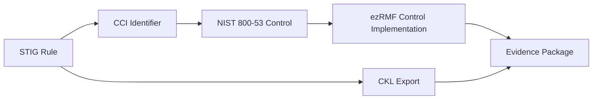

## Overview

STIGMATE exports scan results as CKL (Checklist) files — the standard format used by DISA's STIG Viewer application. CKL files contain all scan results, finding details, and host information in a structured XML format that auditors and assessment teams use to review compliance.

CKL export is the primary way to get STIGMATE results into your audit workflow. You can import CKL files into STIG Viewer for manual review, attach them to eMASS records, or use them as evidence artifacts in your [ezRMF project](/rmf/evidence).

## What is a CKL file?

A CKL file is an XML document that represents a completed STIG assessment for a single host. It contains:

| Section | Content |
|---------|---------|
| **Asset information** | Hostname, IP address, operating system, MAC address |
| **STIG metadata** | STIG title, version, release, benchmark date |
| **Vulnerabilities** | One entry per STIG rule with result status, finding detail, comments, and severity |
| **CCI mappings** | Control Correlation Identifiers linking each rule to NIST 800-53 controls |

Each vulnerability entry in the CKL records:

| Field | Description |
|-------|-------------|
| **Status** | The result code: `Open`, `NotAFinding`, `Not_Applicable`, or `Not_Reviewed` |
| **Finding Details** | The agent's description of what it found, including commands run and output |
| **Comments** | Additional context, manual override notes, or PPSM justification |
| **Severity Override** | If the CAT level was manually adjusted with justification |

## Export a CKL

### From the dashboard

After a scan completes, click **Export CKL** in the scan summary panel. The browser downloads a `.ckl` file named with the hostname and scan date (e.g., `rhel9-server-2026-02-28.ckl`).

### From the API

Export a CKL programmatically using the REST API:

```bash
curl -O http://localhost:3333/api/export/{hostname}/ckl
```

The response is the CKL XML file. The `Content-Disposition` header includes the suggested filename.

<Info>
CKL export is only available after a scan has completed. In-progress scans cannot be exported. Check the [scan status](/stigmate/scanning) before requesting an export.
</Info>

## Import into STIG Viewer

STIG Viewer is DISA's desktop application for reviewing and managing STIG checklists. Follow these steps to import your STIGMATE CKL:

<Steps>
  <Step title="Open STIG Viewer">
    Launch STIG Viewer on your workstation. You can download it from [DISA's STIG Viewer page](https://public.cyber.mil/stigs/srg-stig-tools/).
  </Step>

  <Step title="Import the checklist">
    Select **File > Import Checklist** and browse to the CKL file exported from STIGMATE. STIG Viewer loads the checklist with all results, finding details, and host information.
  </Step>

  <Step title="Review findings">
    Navigate through the checklist. Each rule shows the result status (Open, Not a Finding, Not Applicable, Not Reviewed) and the finding detail from the STIGMATE agent evaluation.

    Rules with manual overrides are marked with a comment indicating the original AI assessment and the override justification.
  </Step>

  <Step title="Add comments or overrides">
    You can modify results in STIG Viewer. Add comments, change result statuses, or apply severity overrides as needed for your assessment. Save the updated CKL for submission.
  </Step>
</Steps>

## CKL and ezRMF evidence

CKL files serve as compliance evidence in the RMF authorization process. When you generate a CKL from STIGMATE, you can attach it to your ezRMF project as evidence for the controls covered by the assessed STIG.

The workflow:

1. Run a STIGMATE scan against a target host
2. Export the CKL file
3. Import the CKL into your [ezRMF project](/rmf/evidence) as an evidence artifact
4. ezRMF maps CCI identifiers in the CKL to their corresponding NIST 800-53 controls
5. Each control with associated findings shows the compliance status from the scan

<Tip>
STIGMATE CKL files include CCI mappings for every rule. This means ezRMF can automatically associate findings with the correct security controls without manual mapping.
</Tip>

### Linking STIGMATE to ezRMF

The connection between STIGMATE and ezRMF flows through Control Correlation Identifiers (CCIs):



Each STIG rule maps to one or more CCIs, which in turn map to NIST 800-53 controls. When you import a CKL into your ezRMF project, the system uses these mappings to associate scan results with the appropriate controls, building your evidence package automatically.

## Partial scans

If a scan completes with some rules in **NR** (Not Reviewed) status, the CKL file still exports successfully. NR results appear in STIG Viewer as "Not Reviewed" — auditors can see which checks the AI could not determine and evaluate them manually.

<Warning>
A CKL with many NR results may not satisfy assessment requirements. Review Not Reviewed findings and manually evaluate them before submitting the CKL as evidence.
</Warning>

## Related pages

<CardGroup cols={2}>
  <Card title="Dashboard" icon="chart-kanban" href="/stigmate/dashboard">
    Kanban board and result management.
  </Card>
  <Card title="ezRMF evidence" icon="file-circle-check" href="/rmf/evidence">
    Attach CKL files as evidence in your ezRMF project.
  </Card>
  <Card title="Concepts" icon="book" href="/stigmate/concepts">
    CCI mappings, result codes, and STIG fundamentals.
  </Card>
  <Card title="API reference" icon="code" href="/stigmate/api-reference">
    CKL export endpoint documentation.
  </Card>
</CardGroup>
