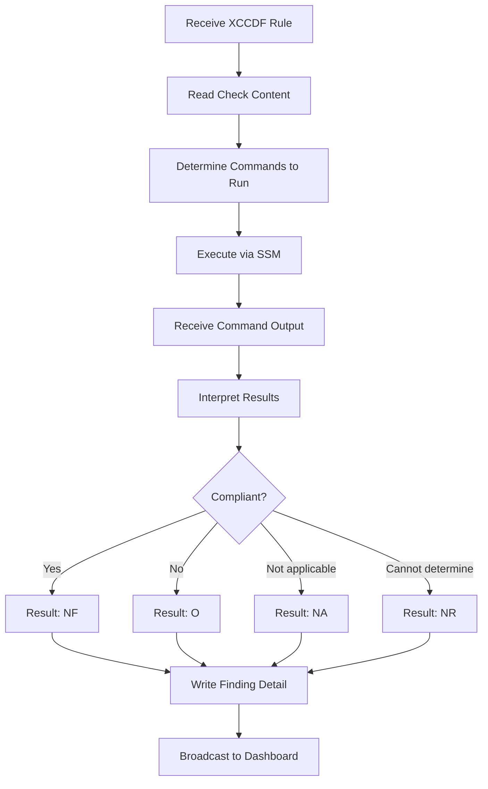

## What is a STIG?

A Security Technical Implementation Guide (STIG) is a configuration standard published by the Defense Information Systems Agency (DISA). STIGs define security requirements for operating systems, applications, network devices, and other IT components used in Department of Defense (DoD) environments.

Each STIG contains hundreds of individual rules. Every rule describes a specific security configuration, a procedure to check whether the system complies, and instructions to fix non-compliant settings. Organizations must assess their systems against applicable STIGs to obtain and maintain an Authority to Operate (ATO).

<Info>
DISA publishes new STIG revisions quarterly. STIGMATE ships with a library of 395+ benchmarks covering the most common platforms. See [Scanning](/stigmate/scanning) for details on the STIG library.
</Info>

## XCCDF format

STIGs are distributed as XCCDF (Extensible Configuration Checklist Description Format) XML files. XCCDF is a NIST standard for expressing security checklists in a machine-readable format. Each XCCDF file contains:

| Element | Description |
|---------|-------------|
| **Benchmark** | The top-level container with STIG metadata (title, version, release date) |
| **Group** | A logical grouping of related rules (typically one rule per group) |
| **Rule** | A single security requirement with severity, description, check content, and fix text |
| **Check** | The procedure to verify compliance — contains commands to run and expected output |
| **Fix** | Instructions to remediate a non-compliant finding |

STIGMATE parses the XCCDF file to extract each rule's check content and fix text, then passes them to Claude agents for automated evaluation.

## CCI mapping

Each STIG rule maps to one or more Control Correlation Identifiers (CCIs). CCIs are the bridge between STIG technical checks and NIST 800-53 security controls. This mapping allows you to trace a specific finding back to the control it satisfies.

For example:
- STIG rule V-261264 ("RHEL 9 must require authentication for single-user mode") maps to **CCI-000213**
- CCI-000213 maps to NIST 800-53 control **AC-3** (Access Enforcement)

This traceability is critical for RMF documentation. When you export a CKL from STIGMATE, the CCI mappings are included, allowing you to import the results directly as evidence in your [ezRMF project](/rmf/evidence).

## CAT severity levels

Every STIG rule is assigned a Category (CAT) severity level. CAT levels indicate the potential impact of a non-compliant finding:

| CAT level | Severity | CVSS equivalent | Impact |
|-----------|----------|-----------------|--------|
| **CAT 1** | Critical | High (7.0-10.0) | Direct, immediate threat to the system. Exploitation could result in loss of confidentiality, integrity, or availability. Must be remediated immediately. |
| **CAT 2** | High | Medium (4.0-6.9) | Significant security risk. Could degrade system security posture if exploited. Must be remediated or mitigated with a Plan of Action and Milestones (POA&M). |
| **CAT 3** | Medium | Low (0.1-3.9) | Moderate security concern. Represents a deviation from best practice. Should be addressed but lower priority than CAT 1 and CAT 2. |

<Warning>
CAT 1 findings are considered showstoppers for ATO. Any unmitigated CAT 1 finding will block authorization. Address these first when reviewing scan results.
</Warning>

## Result codes

When a Claude agent evaluates a STIG check, it assigns one of four result codes:

| Code | Name | Meaning |
|------|------|---------|
| **O** | Open | The system does not comply with the check. A vulnerability or misconfiguration exists that must be remediated. |
| **NF** | Not a Finding | The system complies with the check. The required configuration is in place. |
| **NA** | Not Applicable | The check does not apply to this system. For example, a rule about a service that is not installed. |
| **NR** | Not Reviewed | The agent could not determine compliance. This may occur when a check requires manual verification, the SSM command timed out, or the output was ambiguous. |

Each result includes a **finding detail** — the agent's explanation of what it found, what commands it ran, and why it assigned the given result code. This detail is included in the exported CKL file.

## AI evaluation flow

STIGMATE uses Claude agents to automate the evaluation process. Each agent follows a structured workflow:

The agent reads the check procedure from the XCCDF rule, determines what shell commands to execute, runs them on the target host via SSM, interprets the output, and assigns a result code with a detailed finding explanation.

### PPSM context

For checks involving network ports, protocols, and services, STIGMATE can inject Ports, Protocols, and Services Management (PPSM) context. This gives the agent knowledge of which ports are authorized for the environment, reducing false positives where an open port is intentional and approved. See [Scanning](/stigmate/scanning) for configuration details.

## Related pages

<CardGroup cols={2}>
  <Card title="Scanning" icon="magnifying-glass" href="/stigmate/scanning">
    Asset management, STIG library, and scan execution.
  </Card>
  <Card title="CKL export" icon="file-export" href="/stigmate/ckl-export">
    Export results to STIG Viewer format for audit evidence.
  </Card>
  <Card title="ezRMF concepts" icon="scale-balanced" href="/rmf/concepts">
    How CCI mappings connect STIG findings to NIST 800-53 controls.
  </Card>
  <Card title="STIGMATE overview" icon="clipboard-check" href="/stigmate/index">
    Product overview and scan lifecycle.
  </Card>
</CardGroup>
