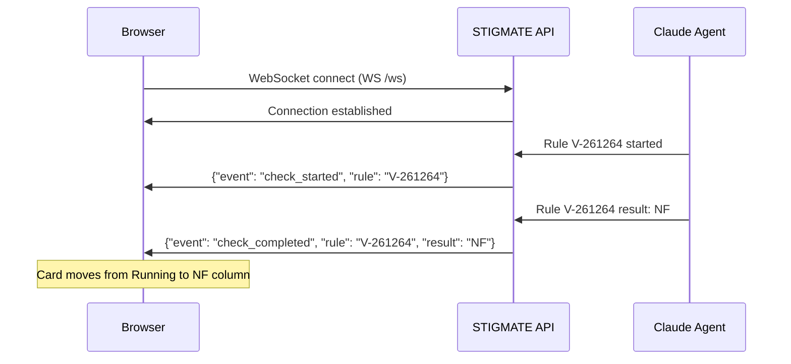
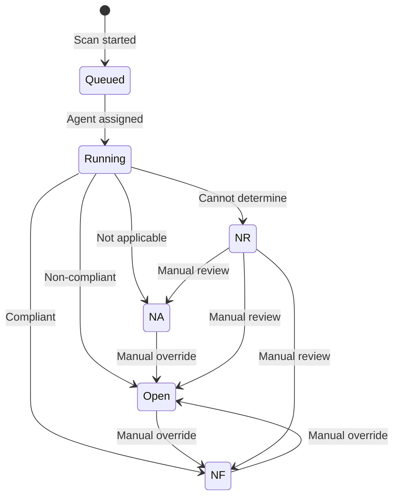

## Overview

The STIGMATE dashboard is a Vue.js web application that provides a real-time view of scan progress and results. It uses a kanban-style layout where each STIG check appears as a card that moves between columns as the scan progresses.

The dashboard connects to the STIGMATE API via WebSocket, so results appear immediately as each Claude agent completes its evaluation — no page refresh required.

## Kanban board

The kanban board organizes results into four columns:

| Column | Result code | Description |
|--------|-------------|-------------|
| **Running** | — | Checks currently assigned to an agent and actively being evaluated |
| **Open** | O | Non-compliant findings that require remediation or mitigation |
| **NF** | NF | Compliant checks — the system meets the STIG requirement (Not a Finding) |
| **NA** | NA | Checks that do not apply to the target system (Not Applicable) |

Checks that return **NR** (Not Reviewed) appear in a separate section below the kanban board for manual review.

### Result cards

Each result card on the kanban board displays:

| Field | Description |
|-------|-------------|
| **Rule ID** | The STIG rule identifier (e.g., `V-261264`) |
| **Title** | A short description of the security requirement |
| **CAT level** | Severity badge: CAT 1 (red), CAT 2 (orange), CAT 3 (yellow) |
| **Result code** | The compliance determination (O, NF, NA, NR) |
| **Finding detail** | The agent's explanation of what it found (click to expand) |

Click any card to expand it and view the full finding detail, including the commands the agent ran, the command output, and the agent's reasoning for its compliance determination.

## WebSocket updates

The dashboard establishes a WebSocket connection to the STIGMATE API at `WS /ws`. The server broadcasts events as each agent completes a check, enabling the following real-time behaviors:

- **Card creation** — when an agent starts evaluating a rule, a card appears in the Running column
- **Card movement** — when an agent completes evaluation, the card moves from Running to the appropriate result column
- **Progress counter** — the scan progress bar updates with each completed check
- **Summary statistics** — result code counts update in real time

<Info>
The WebSocket connection reconnects automatically if the connection drops. You do not need to refresh the page to resume receiving updates.
</Info>

## Result lifecycle

Each STIG check result transitions through a defined set of states during and after a scan:

### Manual overrides

You can manually override a result code after the scan completes. This is useful when:

- An agent marked a check as **O** (Open) but the finding is mitigated by a compensating control
- An agent marked a check as **NR** (Not Reviewed) and you can determine the result manually
- An agent misinterpreted the check procedure and assigned an incorrect result

To override a result, click the result card, select the correct result code, and add an explanation in the finding detail. Manual overrides are flagged in the CKL export so auditors can see which results were modified.

<Warning>
Manual overrides should include a clear justification. Auditors reviewing the CKL file will see that the result was changed from the original AI assessment.
</Warning>

## Filtering and sorting

The dashboard provides controls to filter and sort the kanban board:

| Control | Options |
|---------|---------|
| **Filter by CAT level** | Show only CAT 1, CAT 2, or CAT 3 findings |
| **Filter by result** | Show only specific result codes |
| **Sort by severity** | CAT 1 first, then CAT 2, then CAT 3 |
| **Sort by rule ID** | Numerical order by STIG rule identifier |
| **Search** | Filter cards by rule ID, title, or finding detail text |

<Tip>
Filter by CAT 1 findings first. These are the highest severity and must be addressed before any ATO review.
</Tip>

## Scan summary

When a scan completes, the dashboard displays a summary panel with:

- **Total rules** — number of checks in the selected STIG
- **Results breakdown** — count and percentage for each result code (O, NF, NA, NR)
- **CAT breakdown** — count of findings by severity level
- **Scan duration** — total elapsed time
- **Agent utilization** — number of agents used and average check time

## Related pages

<CardGroup cols={2}>
  <Card title="CKL export" icon="file-export" href="/stigmate/ckl-export">
    Export results to STIG Viewer format for audit evidence.
  </Card>
  <Card title="Scanning" icon="magnifying-glass" href="/stigmate/scanning">
    Asset management, STIG library, and scan execution.
  </Card>
  <Card title="API reference" icon="code" href="/stigmate/api-reference">
    WebSocket and REST API documentation.
  </Card>
  <Card title="Concepts" icon="book" href="/stigmate/concepts">
    Result codes, CAT levels, and STIG fundamentals.
  </Card>
</CardGroup>
