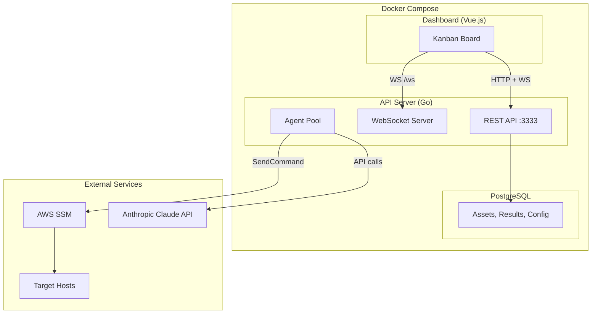

## Architecture

STIGMATE consists of three components deployed as Docker containers:

| Component | Technology | Purpose |
|-----------|-----------|---------|
| **API server** | Go | REST API, scan orchestration, Claude agent management, WebSocket server |
| **Dashboard** | Vue.js | Web-based kanban board for real-time scan monitoring |
| **Database** | PostgreSQL | Stores assets, scan results, and configuration |



## Docker Compose deployment

STIGMATE uses Docker Compose with Chainguard hardened base images. All containers run as non-root user `65532` for defense in depth.

### Container images

| Service | Base image | User | Exposed port |
|---------|-----------|------|-------------|
| `stigmate-api` | `cgr.dev/chainguard/go` | `65532` | `3333` |
| `stigmate-dashboard` | `cgr.dev/chainguard/nginx` | `65532` | `8080` |
| `stigmate-db` | `cgr.dev/chainguard/postgres` | `65532` | `5432` |

<Info>
Chainguard images are minimal, hardened container images with no shell, no package manager, and zero known CVEs at build time. This reduces the attack surface of the STIGMATE deployment.
</Info>

### Docker Compose configuration

```yaml
services:
  api:
    image: stigmate-api:latest
    container_name: stigmate-api
    ports:
      - "3333:3333"
    environment:
      - PORT=3333
      - DB_HOST=db
      - DB_NAME=stigmate
      - DB_USER=stigmate
      - DB_PASSWORD=${DB_PASSWORD}
      - AWS_REGION=${AWS_REGION}
      - ANTHROPIC_API_KEY=${ANTHROPIC_API_KEY}
      - MAX_CONCURRENT_AGENTS=${MAX_CONCURRENT_AGENTS:-5}
      - AGENT_SPAWN_DELAY=${AGENT_SPAWN_DELAY:-200}
      - STIGS_DIR=/stigs
      - LOG_LEVEL=${LOG_LEVEL:-info}
    volumes:
      - ./stigs:/stigs:ro
    depends_on:
      db:
        condition: service_healthy
    healthcheck:
      test: ["CMD", "/stigmate", "healthcheck"]
      interval: 30s
      timeout: 10s
      retries: 3

  dashboard:
    image: stigmate-dashboard:latest
    container_name: stigmate-dashboard
    ports:
      - "8080:8080"
    depends_on:
      - api

  db:
    image: cgr.dev/chainguard/postgres:latest
    container_name: stigmate-db
    environment:
      - POSTGRES_DB=stigmate
      - POSTGRES_USER=stigmate
      - POSTGRES_PASSWORD=${DB_PASSWORD}
    volumes:
      - stigmate-data:/var/lib/postgresql/data
    healthcheck:
      test: ["CMD", "pg_isready", "-U", "stigmate"]
      interval: 10s
      timeout: 5s
      retries: 5

volumes:
  stigmate-data:
```

## Environment variables

| Variable | Default | Required | Description |
|----------|---------|----------|-------------|
| `PORT` | `3333` | No | Port the API server listens on |
| `DB_HOST` | `localhost` | Yes | PostgreSQL hostname (use `db` within Docker Compose) |
| `DB_NAME` | `stigmate` | Yes | PostgreSQL database name |
| `DB_USER` | `stigmate` | Yes | PostgreSQL username |
| `DB_PASSWORD` | — | Yes | PostgreSQL password |
| `AWS_REGION` | `us-gov-west-1` | Yes | AWS region for SSM commands |
| `ANTHROPIC_API_KEY` | — | Yes | Anthropic API key for Claude agents |
| `MAX_CONCURRENT_AGENTS` | `5` | No | Maximum parallel Claude agents during a scan |
| `AGENT_SPAWN_DELAY` | `200` | No | Milliseconds between agent spawns to prevent rate limiting |
| `STIGS_DIR` | `./stigs` | No | Path to XCCDF benchmark files directory |
| `LOG_LEVEL` | `info` | No | Log verbosity: `debug`, `info`, `warn`, `error` |

<Warning>
Store sensitive values (`DB_PASSWORD`, `ANTHROPIC_API_KEY`) in a `.env` file or secrets manager. Do not commit credentials to version control.
</Warning>

## Health checks

STIGMATE includes health check endpoints for monitoring and container orchestration.

### API health check

| Property | Value |
|----------|-------|
| **Method** | `GET` |
| **Path** | `/health` |
| **Healthy response** | `200 OK` with JSON status |
| **Unhealthy response** | `503 Service Unavailable` |

```bash
curl http://localhost:3333/health
```

**Response:**

```json
{
  "status": "healthy",
  "database": "connected",
  "ssm": "available",
  "version": "1.0.0"
}
```

The health check verifies:

| Check | Description |
|-------|-------------|
| **Database** | PostgreSQL connection is active and responding |
| **SSM** | AWS SSM API is reachable with valid credentials |
| **STIG library** | STIGS_DIR is accessible and contains XCCDF files |

### Docker health check

The Docker Compose configuration includes a built-in health check for the API container. Docker marks the container as `healthy` only when the health endpoint returns `200 OK`. The database container uses `pg_isready` for its health check. The API container waits for the database to be healthy before starting.

## Reverse proxy configuration

In production, STIGMATE runs behind a reverse proxy (nginx or Caddy) that handles TLS termination and WebSocket upgrades.

### Nginx example

```nginx
server {
    listen 443 ssl;
    server_name stigmate.icbm.dev;

    ssl_certificate /etc/ssl/certs/stigmate.crt;
    ssl_certificate_key /etc/ssl/private/stigmate.key;

    location / {
        proxy_pass http://localhost:8080;
    }

    location /api/ {
        proxy_pass http://localhost:3333;
    }

    location /ws {
        proxy_pass http://localhost:3333;
        proxy_http_version 1.1;
        proxy_set_header Upgrade $http_upgrade;
        proxy_set_header Connection "upgrade";
        proxy_read_timeout 3600s;
    }
}
```

<Tip>
The WebSocket endpoint requires `proxy_http_version 1.1` and the `Upgrade`/`Connection` headers. Without these, WebSocket connections will fail and the dashboard will not receive real-time updates.
</Tip>

## AWS IAM requirements

STIGMATE requires IAM permissions to interact with AWS Systems Manager. The API server's IAM role or credentials must include:

| Permission | Resource | Purpose |
|------------|----------|---------|
| `ssm:DescribeInstanceInformation` | `*` | Discover SSM-managed instances during asset sync |
| `ssm:SendCommand` | Target instances | Execute commands on target hosts |
| `ssm:GetCommandInvocation` | `*` | Retrieve command output from target hosts |

```json
{
  "Version": "2012-10-17",
  "Statement": [
    {
      "Effect": "Allow",
      "Action": [
        "ssm:DescribeInstanceInformation",
        "ssm:SendCommand",
        "ssm:GetCommandInvocation"
      ],
      "Resource": "*"
    }
  ]
}
```

<Warning>
In production, scope the `ssm:SendCommand` resource to specific instance ARNs or use tag-based conditions rather than using `*`.
</Warning>

## Related pages

<CardGroup cols={2}>
  <Card title="Getting started" icon="rocket" href="/stigmate/getting-started">
    Quick start guide for deploying and running your first scan.
  </Card>
  <Card title="API reference" icon="code" href="/stigmate/api-reference">
    Complete REST API and WebSocket documentation.
  </Card>
  <Card title="Zero trust access" icon="shield" href="/knowledge-base/zero-trust">
    How DEDZED secures access to platform services.
  </Card>
  <Card title="STIGMATE overview" icon="clipboard-check" href="/stigmate/index">
    Product overview and scan lifecycle.
  </Card>
</CardGroup>
