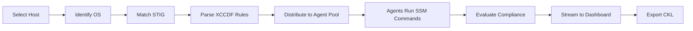

## Overview

STIGMATE is an automated STIG compliance scanner built on the DEDZED platform. It uses Claude AI agents to evaluate Security Technical Implementation Guide (STIG) checks against your hosts, replacing the manual process of running hundreds of individual checks with a parallel, AI-driven scanning pipeline.

STIGMATE connects to target hosts through AWS Systems Manager (SSM) — no SSH keys, no open ports, no agent installation. Each scan selects the appropriate STIG from a library of 395+ benchmarks, distributes checks across a pool of Claude agents, and streams results to a real-time kanban dashboard.

<Info>
STIGMATE is an internal service accessible at [https://stigmate.icbm.dev](https://stigmate.icbm.dev) from within a [Kasm session](/kasm-workspaces/working-within-kasm). See [Zero trust access](/knowledge-base/zero-trust) for details on the DEDZED network access model.
</Info>

## Capabilities

| Capability | Description |
|------------|-------------|
| **AI-powered evaluation** | Claude agents interpret check procedures, run commands via SSM, and determine compliance status |
| **395+ STIG library** | Pre-loaded XCCDF benchmarks covering operating systems, applications, and network devices |
| **Parallel scanning** | Configurable agent pool distributes checks across multiple concurrent Claude sessions |
| **Real-time dashboard** | WebSocket-driven kanban board shows results as each check completes |
| **CKL export** | Generate STIG Viewer-compatible checklist files for eMASS submission and ezRMF evidence |
| **PPSM context injection** | Inject Ports, Protocols, and Services Management context to reduce false positives |
| **SSM integration** | Connect to hosts through AWS Systems Manager without SSH or open firewall rules |
| **No agent installation** | Uses existing SSM agent on target hosts — no additional software required |

## Scan lifecycle

The scan lifecycle follows a linear pipeline:

1. **Select host** — choose a target from your synced AWS asset inventory.
2. **Identify OS** — STIGMATE runs `cat /etc/os-release` via SSM to determine the operating system and version.
3. **Match STIG** — the system selects the appropriate STIG benchmark from the library based on the detected OS.
4. **Parse XCCDF rules** — STIGMATE extracts individual check procedures, fix text, and metadata from the XCCDF XML file.
5. **Distribute to agent pool** — checks are distributed across a configurable pool of concurrent Claude agents.
6. **Agents run SSM commands** — each agent reads the check procedure, determines what commands to run, executes them via SSM, and interprets the output.
7. **Evaluate compliance** — the agent assigns a result code: Open (O), Not a Finding (NF), Not Applicable (NA), or Not Reviewed (NR).
8. **Stream to dashboard** — results broadcast via WebSocket to the kanban dashboard in real time.
9. **Export CKL** — download a STIG Viewer-compatible CKL file for audit evidence and eMASS submission.

## How it works

STIGMATE combines three technologies to automate STIG compliance:

- **AWS Systems Manager** provides secure, agentless command execution on target hosts. STIGMATE sends shell commands through SSM and receives output without needing SSH access or open ports.
- **STIG XCCDF benchmarks** define the check procedures. Each STIG contains hundreds of rules with machine-readable check content and human-readable fix text. STIGMATE parses these rules and converts them into tasks for the AI agents.
- **Claude AI agents** interpret each check procedure, determine what commands to run, execute them via SSM, analyze the output, and make a compliance determination. This replaces the manual process where an assessor reads each check, runs the commands, and records the finding.

<Tip>
STIGMATE works best when your hosts have the SSM agent installed and properly configured with IAM instance profiles. See [Deployment](/stigmate/deployment) for infrastructure requirements.
</Tip>

## Related pages

<CardGroup cols={2}>
  <Card title="Concepts" icon="book" href="/stigmate/concepts">
    STIG fundamentals, result codes, and CAT severity levels.
  </Card>
  <Card title="Getting started" icon="rocket" href="/stigmate/getting-started">
    Deploy STIGMATE and run your first scan.
  </Card>
  <Card title="Scanning" icon="magnifying-glass" href="/stigmate/scanning">
    Asset management, STIG library, and scan execution.
  </Card>
  <Card title="Dashboard" icon="chart-kanban" href="/stigmate/dashboard">
    Real-time kanban board and result management.
  </Card>
</CardGroup>
