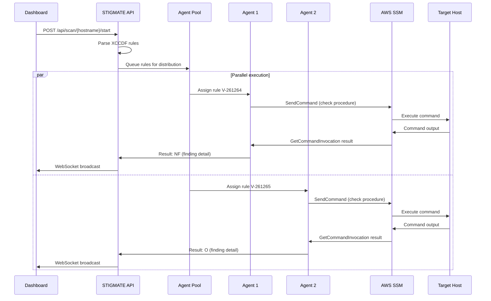

## Asset management

STIGMATE discovers target hosts by syncing with AWS Systems Manager. It pulls the inventory of EC2 instances that have the SSM agent online and are reachable in your configured AWS region.

### Sync assets

Click **Sync Assets** in the dashboard or call the sync API endpoint to refresh your asset inventory:

```bash
curl -X POST http://localhost:3333/api/aws/sync
```

STIGMATE stores the following information for each discovered instance:

| Field | Source | Description |
|-------|--------|-------------|
| **Hostname** | SSM inventory | The instance hostname or Name tag |
| **Instance ID** | SSM inventory | The EC2 instance ID (e.g., `i-0abc123def456`) |
| **Platform** | SSM inventory | Operating system platform (e.g., `Linux`) |
| **OS name** | `/etc/os-release` | Full OS name and version (e.g., `Red Hat Enterprise Linux 9.3`) |
| **SSM status** | SSM ping | Connection status (`Online` or `Offline`) |

<Info>
Only instances with SSM status `Online` can be scanned. If an instance appears offline, verify that its IAM instance profile includes the `AmazonSSMManagedInstanceCore` managed policy.
</Info>

### View assets

Retrieve the current asset inventory through the dashboard or the API:

```bash
curl http://localhost:3333/api/assets
```

## STIG library

STIGMATE ships with a library of 395+ XCCDF benchmark files covering operating systems, applications, databases, network devices, and middleware. The library is stored in the directory specified by the `STIGS_DIR` environment variable (default: `./stigs`).

### Supported platforms

| Category | Examples |
|----------|----------|
| **Operating systems** | RHEL 7/8/9, Ubuntu 20.04/22.04, Windows Server 2019/2022, SLES 12/15, Oracle Linux 8/9 |
| **Databases** | PostgreSQL 12-16, MySQL 8, Oracle 19c, SQL Server 2019 |
| **Web servers** | Apache 2.4, Nginx, IIS 10 |
| **Application servers** | JBoss EAP 7, Tomcat 9/10, WebSphere |
| **Network devices** | Cisco IOS XE, Palo Alto, Juniper SRX |
| **Containers** | Docker Enterprise, Kubernetes |
| **Middleware** | Apache Kafka, Red Hat AMQ |

### Automatic STIG selection

When you start a scan, STIGMATE runs `cat /etc/os-release` on the target host via SSM to determine the operating system and version. It then matches the detected OS against the STIG library to select the appropriate benchmark.

If STIGMATE cannot automatically match a STIG, you can manually select one from the library in the dashboard.

<Tip>
Keep your STIG library updated by downloading the latest benchmarks from [DISA's STIG page](https://public.cyber.mil/stigs/) and placing the XCCDF files in your `STIGS_DIR`.
</Tip>

## PPSM context injection

Ports, Protocols, and Services Management (PPSM) is a DoD process for documenting and approving network ports, protocols, and services used by a system. Many STIG checks evaluate whether specific ports are open or services are running. Without PPSM context, the agent may flag an authorized port as a finding.

STIGMATE allows you to inject PPSM context into agent evaluations. When PPSM context is provided, the agent considers authorized ports and services when making compliance determinations, reducing false positives.

### How PPSM injection works

1. You provide a PPSM document or list of authorized ports/protocols/services for the target system.
2. STIGMATE includes this context in the prompt sent to each Claude agent.
3. When evaluating a network-related check, the agent compares the system state against the PPSM authorizations.
4. If a port or service is open but authorized by the PPSM, the agent marks the check as **NF** (Not a Finding) rather than **O** (Open).

<Warning>
PPSM context does not override all findings. The agent still evaluates whether the service configuration meets the STIG requirement — it only prevents false positives for authorized ports and services.
</Warning>

## Scan execution

When you start a scan, STIGMATE orchestrates the following process:



### Agent pool configuration

The agent pool controls how many Claude agents run checks concurrently. Two environment variables govern pool behavior:

| Variable | Default | Description |
|----------|---------|-------------|
| `MAX_CONCURRENT_AGENTS` | `5` | Maximum number of parallel agents. Higher values complete scans faster but consume more API quota. |
| `AGENT_SPAWN_DELAY` | `200` | Milliseconds to wait between spawning each agent. Prevents Anthropic API rate limit errors. |

### Scan status

Monitor scan progress through the dashboard or the API:

```bash
curl http://localhost:3333/api/scan/{hostname}/status
```

The response includes:

| Field | Description |
|-------|-------------|
| `status` | Current scan state: `running`, `completed`, or `failed` |
| `total_rules` | Total number of XCCDF rules in the selected STIG |
| `completed_rules` | Number of rules evaluated so far |
| `results_summary` | Count of results by code (O, NF, NA, NR) |

## Starting a scan via the API

You can start a scan programmatically:

```bash
curl -X POST http://localhost:3333/api/scan/{hostname}/start
```

Replace `{hostname}` with the hostname of the target asset. STIGMATE handles OS detection, STIG selection, and agent orchestration automatically.

## Related pages

<CardGroup cols={2}>
  <Card title="Dashboard" icon="chart-kanban" href="/stigmate/dashboard">
    Real-time kanban board and WebSocket updates.
  </Card>
  <Card title="CKL export" icon="file-export" href="/stigmate/ckl-export">
    Export scan results to STIG Viewer format.
  </Card>
  <Card title="API reference" icon="code" href="/stigmate/api-reference">
    Complete REST API documentation.
  </Card>
  <Card title="Concepts" icon="book" href="/stigmate/concepts">
    STIG fundamentals, result codes, and CAT severity levels.
  </Card>
</CardGroup>
